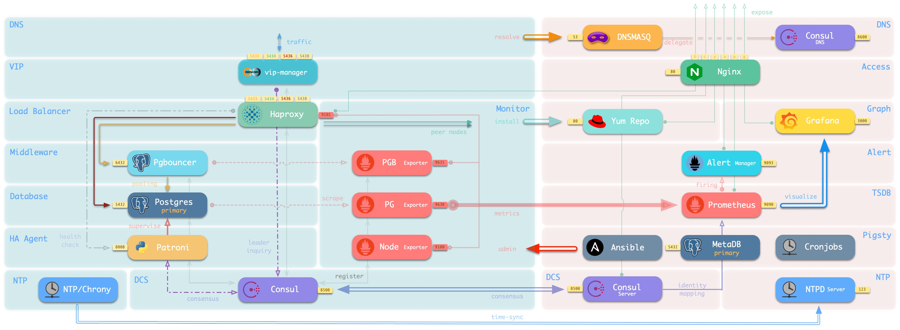

# Pigsty -- Open Source PostgreSQL Distribution

> [PIGSTY](http://pigsty.cc): Postgres in Graphic STYle

[Pigsty](https://pigsty.cc/zh/) is an open-source, battery-included PostgreSQL Distribution.

It delivers the **BEST** open source **monitoring** solution for PostgreSQL. Along with the **easiest provisioning** solution for large scale production-grade database clusters. 

It can be used both for large-scale pg clusters management in real-world prod-env, and for launching battery-included single pgsql sandbox for dev & data analysis & demo purpose in a simple and fast way.


Check [**OFFICIAL SITE**](https://pigsty.cc/en/  ) for more information：[**https://pigsty.cc/en/**](https://pigsty.cc/en/)   | CN中文站点：[**https://pigsty.cc/zh/**](](https://pigsty.cc/zh/))

> The latest stable version of pigsty is [v0.9.1](https://github.com/Vonng/pigsty/releases/tag/v0.9.1).
>
> Current master is @ **v1.0.0-beta1**


## Quick Start

Run on a fresh CentOS 7 node to install pigsty (nopass sudo required)  

```bash
VERSION=v1.0.0-beta1
cd ~ && curl -SLO https://github.com/Vonng/pigsty/releases/download/${VERSION}/pigsty.tgz && tar -xf pigsty.tgz && cd pigsty
make config    # CONFIGURE (interactive wizard)
make install   # INSTALL infrastructure on meta node
```

Or, run on your **Mac** to launch vagrant + virtualbox sandbox

```bash
make deps      # Install MacOS deps with homebrew
make dns       # Write static DNS
make start     # Pull-up vm nodes and setup ssh access  (start4 for 4-node demo)
make demo      # install pigsty on 'meta' as above      (demo4  for 4-node demo) 
```

Check [doc/quick-start](doc/quick-start.md) for more information.


## Highlights

* [Monitoring]() System based on prometheus & grafana &  [`pg_exporter`](https://github.com/Vonng/pg_exporter)
* [Provisioning](#provisioning) Solution based on ansible. Kubernetes style, scale at ease.
* [HA Deployment](#ha-deployment) based on patroni. Self-healing and failover in seconds
* [Service Discovery](#service-discovery) based on DCS (consul / etcd), maintenance made easy.
* [Offline Installation](#offline-installation) without Internet access. Fast and reliable.
* Infrastructure as Code. Fully configurable and customizable. 
* Based on PostgreSQL 13 and Patroni 2. Verified in proudction environment (CentOS 7, 200+nodes)


## Features

### Monitoring

Pigsty provides a battery-included [Monitoring System](https://pigsty.cc/en/docs/monitor/). Which is specially designed for managing large-scale PostgreSQL clusters, and consist of thousands of metrics and 30+ dashboards.


### Provisioning

PostgreSQL cluster comes before monitoring system. That's why pigsty is shipping with a  [Provisioning Solution](https://pigsty.cc/en/docs/concept/provision/).

It allows you to create, update, scale, and manage your postgres cluster in kubernetes style.

```bash
vi pigsty.yml                     # edit configuration to define new clusters
./infra.yml                       # provision infrastructure on meta node 
./pgsql.yml -l <cluster>          # provision new clusters/instasnces
```
Here is an example base on vagrant 4-node demo. The default configuration file is [`pigsty.yml`](pigsty.yml)

This [Vagrantfile](vagrant/Vagrantfile) defines four nodes: `meta` , `node-1` , `node-2`, `node-3`. Check [Architecture Overview](https://pigsty.cc/en/docs/concepts/architecture/) for more information.



And you can also mange cluster with pigsty [CLI](https://github.com/Vonng/pigsty-cli) & GUI (beta)

<details>
<summary>Pigsty GUI (beta)</summary>


</details>


### High Availability

Pigsty has HA Deployment powered by [Patroni 2.0](https://github.com/zalando/patroni). 

Pigsty is a database **[provisioning](https://pigsty.cc/en/docs/concept/provision/) solution** that can create [**HA**](https://pigsty.cc/en/docs/concept/provision/ha/) pgsql clusters on demand. Pigsty can automatically perform failover, with read-only traffic intact; the impact of read-write traffic is usually limited in seconds.


Each instance is **idempotent**, Pigsty uses a 'NodePort' approach to expose different kind of [**services**](https://pigsty.cc/en/docs/concept/provision/service/). 

| service | port | usage                      | comment                          |
| ------- | ---- | -------------------------- | -------------------------------- |
| primary | 5433 | read-write/non-interactive | route to primary pgbouncer 6432  |
| replica | 5434 | read-only/non-interactive  | route to replicas pgbouncer 6432 |
| default | 5436 | read-write/interactive     | direct to primary 5432           |
| offline | 5438 | read-only/interactive      | direct to offline 5432           |


### Infrastructure as Code

Define infrastructure and new database clusters with declarative configurations. 

Creating a new database cluster `pg-test` with three nodes only require 6 lines config and 1 line command.

```yaml
pg-test:
  # - cluster members - #
  hosts:
    10.10.10.11: {pg_seq: 1, pg_role: primary}
    10.10.10.12: {pg_seq: 2, pg_role: replica}
    10.10.10.13: {pg_seq: 3, pg_role: offline}

  # - cluster config - #
  vars: { pg_cluster: pg-test }  # cluster name
```

<details>
<summary>Complex One</summary>

```yaml
#-----------------------------
# cluster: pg-meta
#-----------------------------
# pg-meta is a single-node pgsql cluster deployed on meta node (10.10.10.10)
pg-meta:
  # - cluster members - #
  hosts:
    10.10.10.10: {pg_seq: 1, pg_role: primary, pg_offline_query: true}

  # - cluster configs - #
  vars:
    pg_cluster: pg-meta                 # define actual cluster name
    pg_version: 13                      # define installed pgsql version
    node_tune: tiny                     # tune node into oltp|olap|crit|tiny mode
    pg_conf: tiny.yml                   # tune pgsql into oltp|olap|crit|tiny mode
    patroni_mode: pause                 # enter maintenance mode, {default|pause|remove}
    patroni_watchdog_mode: off          # disable watchdog (require|automatic|off)
    pg_lc_ctype: en_US.UTF8             # enabled pg_trgm i18n char support

    # - defining business users - #
    pg_users:
      # default production read-write user dbuser_meta
      - name: dbuser_meta                              # user's name is required
        password: md5d3d10d8cad606308bdb180148bf663e1  # md5 password is acceptable
        pgbouncer: true                                # add user to pgbouncer userlist
        roles: [dbrole_readwrite]                      # grant roles to user
        comment: default production read-write user for meta database

      # default production read-only user for grafana direct access
      - name: dbuser_grafana
        password: DBUser.Grafana
        pgbouncer: true
        roles: [dbrole_readonly]
        comment: default readonly access for grafana datasource

      # complete example of user/role definition
      - name: dbuser_pigsty             # pigsty user have admin access (DDL|DML)
        password: DBUser.Pigsty         # example user's password, can be md5 encrypted
        login: true                     # can login, true by default (should be false for role)
        superuser: false                # is superuser? false by default
        createdb: false                 # can create database? false by default
        createrole: false               # can create role? false by default
        inherit: true                   # can this role use inherited privileges?
        replication: false              # can this role do replication? false by default
        bypassrls: false                # can this role bypass row level security? false by default
        pgbouncer: true                 # add this user to pgbouncer? false by default (true for production user)
        connlimit: -1                   # connection limit, -1 disable limit
        expire_in: 3650                 # now + n days when this role is expired (OVERWRITE expire_at)
        expire_at: '2030-12-31'         # 'timestamp' when this role is expired (OVERWRITTEN by expire_in)
        comment: pigsty admin user      # comment on user/role
        roles: [dbrole_admin]           # dbrole_{admin,readonly,readwrite,offline}
        parameters:                     # additional role level parameters with ALTER ROLE SET
          search_path: pigsty,public    # add pigsty schema into search_path

    # - defining business databases - #
    pg_databases:
      - name: meta                      # name is the only required field for a database
        baseline: metadb/schema.sql     # pigsty meta database baseline
        owner: postgres                 # optional, database owner
        template: template1             # optional, template1 by default
        encoding: UTF8                  # optional, UTF8 by default , must same as template database, leave blank to set to db default
        locale: C                       # optional, C by default , must same as template database, leave blank to set to db default
        lc_collate: C                   # optional, C by default , must same as template database, leave blank to set to db default
        lc_ctype: C                     # optional, C by default , must same as template database, leave blank to set to db default
        tablespace: pg_default          # optional, 'pg_default' is the default tablespace
        allowconn: true                 # optional, true by default, false disable connect at all
        revokeconn: false               # optional, false by default, true revoke connect from public # (only default user and owner have connect privilege on database)
        pgbouncer: true                 # optional, add this database to pgbouncer list? true by default
        comment: pigsty meta database   # optional, comment string for database
        connlimit: -1                   # optional, connection limit, -1 or none disable limit (default)
        schemas: [pigsty]               # optional, create additional schema
        extensions:                     # optional, extension name and which schema to create
          - {name: adminpack, schema: pg_catalog}
        parameters:                       # optional, extra parameters with ALTER DATABASE
          search_path: 'pigsty,public'    # add pigsty to search_path
          log_min_duration_statement: 10  # log all action on meta database

    pg_default_database: meta           # default database will be used as primary monitor target
    vip_mode: l2                        # none|l2|l4, l2 vip are used in sandbox demo
    vip_address: 10.10.10.2             # virtual ip address
    vip_cidrmask: 8                     # cidr network mask length
    vip_interface: eth1                 # interface to add virtual ip

```


And run [playbooks](https://pigsty.cc/en/docs/deploy/playbook/) to *instanlize* that cluster:

```bash
./pgsql.yml -l pg-test
```

</details>


There are 160+ [parameters](http://pigsty.cc/en/docs/config/entry/) that controls every aspect of Pigsty. Check [configuration guide](https://pigsty.cc/en/docs/config/)  for more information.


<details>
<summary>Configuration Entries</summary>

|  No  |                           Category                           | Function                                                     |
| :--: | :----------------------------------------------------------: | ------------------------------------------------------------ |
|  1   |     [connect](http://pigsty.cc/en/docs/config/1-connect)     | Connection parameters and proxy setting                      |
|  2   |        [repo](http://pigsty.cc/en/docs/config/2-repo)        | local yum and offline installation                           |
|  3   |        [node](http://pigsty.cc/en/docs/config/3-node)        | common setup for all nodes                                   |
|  4   |        [meta](http://pigsty.cc/en/docs/config/4-meta)        | infrastructure on meta nodes                                 |
|  5   |         [dcs](http://pigsty.cc/en/docs/config/5-dcs)         | dcs service (consul/etcd)                                    |
|  6   |  [pg-install](http://pigsty.cc/en/docs/config/6-pg-install)  | install postgres, extensions, users, directories, scripts, utils |
|  7   | [pg-provision](http://pigsty.cc/en/docs/config/7-pg-provision) | bootstrap postgres cluster and identity assignment           |
|  8   | [pg-template](http://pigsty.cc/en/docs/config/8-pg-template) | customize postgres cluster template                          |
|  9   |     [monitor](http://pigsty.cc/en/docs/config/9-monitor)     | install monitoring components                                |
|  10  |    [service](http://pigsty.cc/en/docs/config/10-service)     | expose database service                                      |


</details>


### Service Discovery

Pigsty is integrated with [Service Discovery](https://pigsty.cc/en/docs/concept/monitor/identity/) based on DCS (consul/etcd). All service are automatically register to DCS. Which eliminate lots of manual maintenance work. And you can check health status about all nodes and service in an intuitive way. 

<details>
<summary>Consul SD Implementation</summary>

Consul is the only DCS that is currently supported. You can use consul as DNS service provider to achieve DNS based traffic routing. 


Pigsty can also use static file discovery for prometheus, which would eliminate the need of consul for monitoring.

</details>


### GUI Tools

Pigsty have a simple [cli/gui](cli/gui) tool which provide an easier interface for beginers.


### Visualization Support

Pigsty can be used for data analysis and visualization.


###  Offline Installation

Pigsty supports offline installation. It is especially useful for environment that has no Internet access.

Pigsty comes with a local Yum repo that includes all required packages and its dependencies. You can download [pre-packed offline packages](https://github.com/Vonng/pigsty/releases) or make it on your own in another node that have internet or proxy access. Check [Offline Installation](https://pigsty.cc/en/docs/deploy/prepare/offline/) for detail.


## Specification

<details>
<summary>specification</summary>

**System Requirement**

* CentOS 7 / Red Hat 7 / Oracle Linux 7
* CentOS 7.8.2003 x86_64 is highly recommend (fully tested under production)

**Minimal setup**

* Self-contained, single meta node, singleton pgsql cluster `pg-meta`
* Minimal requirement: 1 CPU Core & 2 GB RAM

**Demo setup ( TINY mode, vagrant demo)**

* 4 Node, including single meta node, singleton database cluster `pg-meta` and 3-instances pgsql cluster `pg-test`
* Spec:  2Core/4GB for meta controller node, 1Core/1GB for database node (x3)

**Production setup (OLTP/OLAP/CRIT mode)**

* 200+ nodes,  3 meta nodes , 100+ database clusters
* Verified Spec: Dell R740 / 64 Core / 400GB Mem / 3TB PCI-E SSD

</details>


## Contribution

Check [doc/contribution.md](doc/contribution.md) for more information.


## About

Author：[Vonng](https://vonng.com) (rh@vonng.com)

[Apache Apache License Version 2.0](LICENSE)
