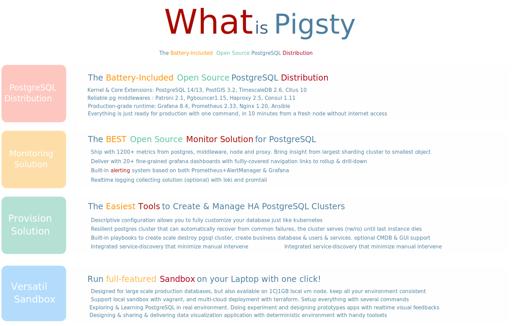
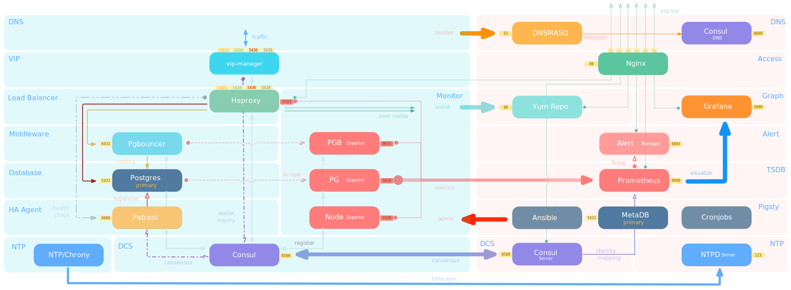
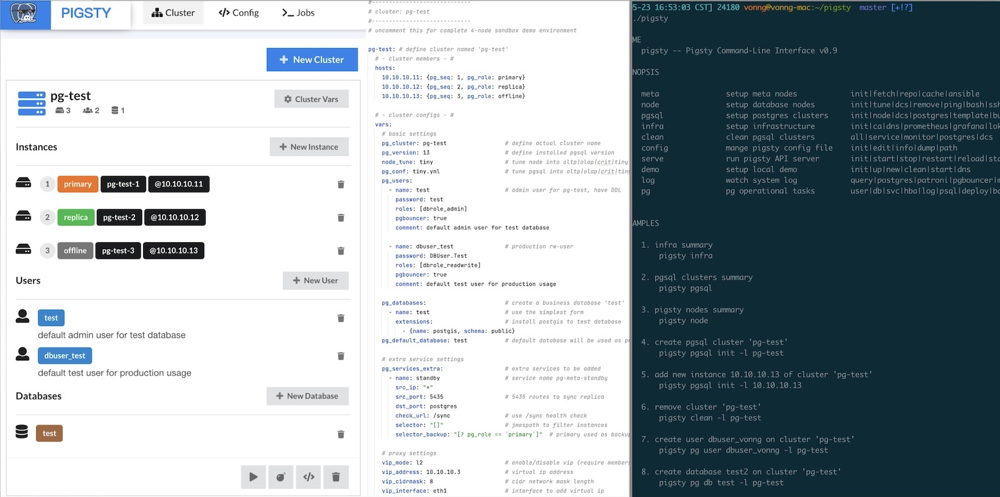
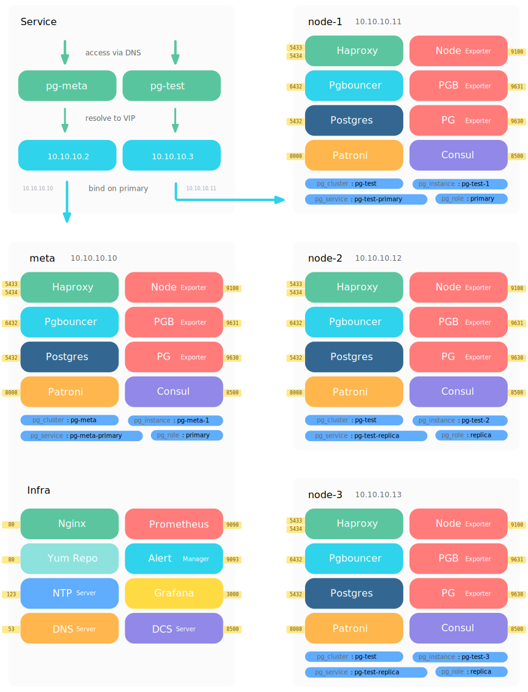
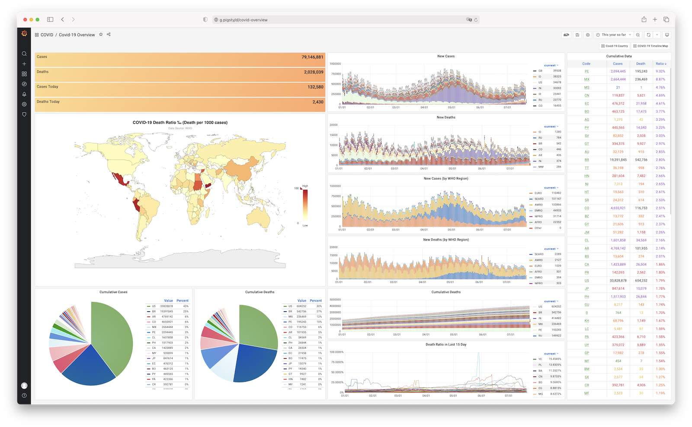
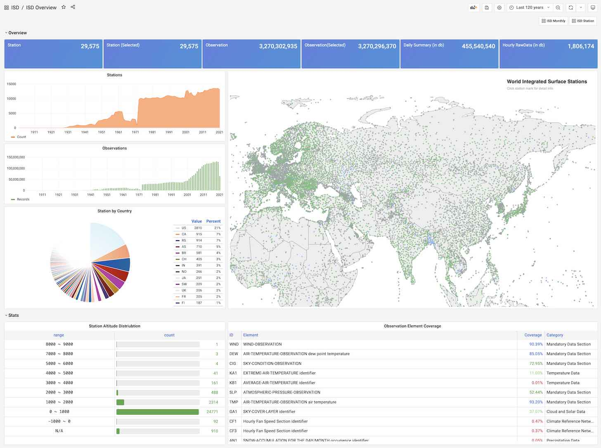

# Pigsty

## 

**Battery-Included Open-Source PostgreSQL Distribution**

> Latest Version: [1.4.0](https://github.com/Vonng/pigsty/releases/tag/v1.4.0)  |  [Demo](http://home.pigsty.cc)
>
> Documentation: [Docs](https://pigsty.cc/) | [中文文档](https://pigsty.cc/#/zh-cn/) | [Github Pages](https://vonng.github.io/pigsty/#/)
> 
> Run `make doc` to serve [EN Docs](docs/) & [ZH Docs](docs/zh-cn/) on your localhost



* Pigsty is the battery-included open-source PostgreSQL [distribution](#distribution)

* Pigsty is a powerful & professional PostgreSQL [monitoring](#monitoring) system

* Pigsty is a handy & reliable [provisioning](#provisioning) solution for [HA](#ha-clusters) Postgres clusters

* Pigsty is a versatile local [sandbox](#sandbox) for demo, dev, test, data [analysis](#analysis) and visualization

Pigsty can be used both for large-scale pg clusters management in real-world prod-env, and for launching versatile local pgsql sandbox for dev, test, demo & data analysis purpose.


## TL;DR

Get a new Linux x86_64 CentOS 7.8 node. with nopass `sudo` & `ssh` access, then:

```bash
bash -c "$(curl -fsSL http://download.pigsty.cc/get)"  # get latest pigsty source
cd ~/pigsty && ./configure                             # pre-check and config templating 
./infra.yml                                            # install pigsty on current node
``` 

Check [public demo](http://demo.pigsty.cc) for what you will get, check [Get Started](#get-started) for more detail.


## Highlights

* **Battery-Included** : deliver all you need to run production-grade databases with one-click.
* **Monitoring System** based on [prometheus](https://prometheus.io/) & [grafana](https://grafana.com/) &  [pg_exporter](https://github.com/Vonng/pg_exporter)
* **Provisioning Solution** based on [ansible](https://docs.ansible.com/ansible/latest/index.html) in kubernetes style. scale at ease.
* **HA Architecture** based on [patroni](https://patroni.readthedocs.io/) and [haproxy](https://www.haproxy.org/). Self-healing and auto-failover in seconds
* **Service Discovery** and leader election based on [consul](https://www.consul.io/) (or etcd), maintenance made easy.
* **Offline Installation** without Internet access. Fast, secure, and reliable.
* **Flexible Design** makes pigsty fully configurable & customizable & extensible.
* **Reliable Performance** verified in real-world production env (200+nodes, 1PB Data)
* **Open Source** under Apache License 2.0
* Support for Redis & MatrixDB (Greenplum7) Added!


## Distributions


**Distribution** refers to the overall solution consisting of a kernel and peripheral software packages. For example, Linux is an OS kernel, while RedHat, Debian, and SUSE are OS distributions based on Linux kernel.

Pigsty is an entire **solution** for using postgres in your production environment. It will setup everything for your with one-click:
creating & scaling clusters, switchover & auto failover. manage databases, users, roles, hbas, schemas, hbas with configuration, connection pooling, load balancing, monitoring & logging & alerting, service discovery, etc...





## Monitoring

PostgreSQL is the most advanced open source relational database, but its ecosystem lacks a open source monitoring system which is **good enough**. Pigsty aims to solve this by delivering the best **Open Source Monitoring Solution for PostgreSQL**.


Pigsty comes with a professional-grade PostgreSQL monitoring system which is specially designed for large-scale postgres cluster management. Including 1200+ metrics, 20+ Dashboards, thousands of panels which covering detailed information from the biggest overview to the smallest individual object. Which brings irreplaceable value for professional users.

Pigsty consists of three monitor apps: `pgsql`, which focus on time-series metrics. `pgcat`, which explores database catalog directly. And `pglog`, which collect realtime logs from postgres, patroni and pgbouncer, and visualize csvlog samples. More will come later.

Pigsty is build upon popular open source components such as Prometheus & Grafana. There's no vendor locking, and the infra can be easily reused for other purpose.


## Provisioning

PostgreSQL cluster comes before monitoring system. That's why pigsty is shipping with a handy **Provisioning Solution**.
It allows you to create, update, scale, and manage your postgres cluster in kubernetes style: Describe what your want and pigsty will just do that for ya.

For example, creating a one-leader-with-two-replica cluster `pg-test` on three nodes requires only a few lines of configuration, and one command `pgsql.yml -l pg-test` to instantiate it.


```yaml
pg-test:
  hosts:
    10.10.10.11: {pg_seq: 1, pg_role: primary}
    10.10.10.12: {pg_seq: 2, pg_role: replica}
    10.10.10.13: {pg_seq: 3, pg_role: replica}
  vars: 
    pg_cluster: pg-test
    vip_address: 10.10.10.3
```


<details>
<summary>Full Example of Cluster Customization</summary>



```yaml
#----------------------------------#
# cluster: pg-test (3-node)        #
#----------------------------------#
pg-meta:                                # required, ansible group name , pgsql cluster name. should be unique among environment
  hosts:                                # `<cluster>.hosts` holds instances definition of this cluster
    10.10.10.11: {pg_seq: 1, pg_role: primary}   # primary instance, leader of cluster
    10.10.10.12: {pg_seq: 2, pg_role: replica}   # replica instance, follower of leader
    10.10.10.13: {pg_seq: 3, pg_role: offline}   # offline instance, replica that allow offline access

    #---------------
    # mandatory                         # all configuration above (`ip`, `pg_seq`, `pg_role`) and `pg_cluster` are mandatory
    #---------------
  vars:                                 # `<cluster>.vars` holds CLUSTER LEVEL CONFIG of this pgsql cluster
    pg_cluster: pg-meta                 # required, pgsql cluster name, unique among cluster, used as namespace of cluster resources

    #---------------
    # optional                          # all configuration below are OPTIONAL for a pgsql cluster (Overwrite global default)
    #---------------
    pg_version: 13                      # pgsql version to be installed (use global version if missing)
    node_tune: tiny                     # node optimization profile: {oltp|olap|crit|tiny}, use tiny for vm sandbox
    pg_conf: tiny.yml                   # pgsql template:  {oltp|olap|crit|tiny}, use tiny for sandbox
    patroni_mode: pause                 # entering patroni pause mode after bootstrap  {default|pause|remove}
    patroni_watchdog_mode: off          # disable patroni watchdog on meta node        {off|require|automatic}
    pg_lc_ctype: en_US.UTF8             # use en_US.UTF8 locale for i18n char support  (required by `pg_trgm`)

    #---------------
    # biz databases                     # Defining Business Databases (Optional)
    #---------------
    pg_databases:                       # define business databases on this cluster, array of database definition
      # define the default `meta` database
      - name: meta                      # required, `name` is the only mandatory field of a database definition
        baseline: cmdb.sql              # optional, database sql baseline path, (relative path among ansible search path, e.g files/)
        # owner: postgres               # optional, database owner, postgres by default
        # template: template1           # optional, which template to use, template1 by default
        # encoding: UTF8                # optional, database encoding, UTF8 by default. (MUST same as template database)
        # locale: C                     # optional, database locale, C by default.  (MUST same as template database)
        # lc_collate: C                 # optional, database collate, C by default. (MUST same as template database)
        # lc_ctype: C                   # optional, database ctype, C by default.   (MUST same as template database)
        # tablespace: pg_default        # optional, default tablespace, 'pg_default' by default.
        # allowconn: true               # optional, allow connection, true by default. false will disable connect at all
        # revokeconn: false             # optional, revoke public connection privilege. false by default. (leave connect with grant option to owner)
        # pgbouncer: true               # optional, add this database to pgbouncer database list? true by default
        comment: pigsty meta database   # optional, comment string for this database
        connlimit: -1                   # optional, database connection limit, default -1 disable limit
        schemas: [pigsty]               # optional, additional schemas to be created, array of schema names
        extensions:                     # optional, additional extensions to be installed: array of schema definition `{name,schema}`
          - {name: adminpack, schema: pg_catalog}    # install adminpack to pg_catalog and install postgis to public
          - {name: postgis, schema: public}          # if schema is omitted, extension will be installed according to search_path.

      # define an additional database named grafana & prometheus (optional)
      - { name: grafana,    owner: dbuser_grafana    , revokeconn: true , comment: grafana    primary database }
      - { name: prometheus, owner: dbuser_prometheus , revokeconn: true , comment: prometheus primary database }

    #---------------
    # biz users                         # Defining Business Users (Optional)
    #---------------
    pg_users:                           # define business users/roles on this cluster, array of user definition
      # define admin user for meta database (This user are used for pigsty app deployment by default)
      - name: dbuser_meta               # required, `name` is the only mandatory field of a user definition
        password: md5d3d10d8cad606308bdb180148bf663e1  # md5 salted password of 'DBUser.Meta'
        # optional, plain text and md5 password are both acceptable (prefixed with `md5`)
        login: true                     # optional, can login, true by default  (new biz ROLE should be false)
        superuser: false                # optional, is superuser? false by default
        createdb: false                 # optional, can create database? false by default
        createrole: false               # optional, can create role? false by default
        inherit: true                   # optional, can this role use inherited privileges? true by default
        replication: false              # optional, can this role do replication? false by default
        bypassrls: false                # optional, can this role bypass row level security? false by default
        pgbouncer: true                 # optional, add this user to pgbouncer user-list? false by default (production user should be true explicitly)
        connlimit: -1                   # optional, user connection limit, default -1 disable limit
        expire_in: 3650                 # optional, now + n days when this role is expired (OVERWRITE expire_at)
        expire_at: '2030-12-31'         # optional, YYYY-MM-DD 'timestamp' when this role is expired  (OVERWRITTEN by expire_in)
        comment: pigsty admin user      # optional, comment string for this user/role
        roles: [dbrole_admin]           # optional, belonged roles. default roles are: dbrole_{admin,readonly,readwrite,offline}
        parameters: {}                  # optional, role level parameters with `ALTER ROLE SET`
        # search_path: public         # key value config parameters according to postgresql documentation (e.g: use pigsty as default search_path)
      - {name: dbuser_view , password: DBUser.Viewer  ,pgbouncer: true ,roles: [dbrole_readonly], comment: read-only viewer for meta database}

      # define additional business users for prometheus & grafana (optional)
      - {name: dbuser_grafana    , password: DBUser.Grafana    ,pgbouncer: true ,roles: [dbrole_admin], comment: admin user for grafana database }
      - {name: dbuser_prometheus , password: DBUser.Prometheus ,pgbouncer: true ,roles: [dbrole_admin], comment: admin user for prometheus database }
```

</details>

<details>
<summary>Example of Redis Cluster/Sentinel/Standalone</summary>

```yaml
#----------------------------------#
# redis sentinel example           #
#----------------------------------#
redis-meta:
  hosts:
    10.10.10.10:
      redis_node: 1
      redis_instances:  { 6001 : {} ,6002 : {} , 6003 : {} }
  vars:
    redis_cluster: redis-meta
    redis_mode: sentinel
    redis_max_memory: 128MB

#----------------------------------#
# redis cluster example            #
#----------------------------------#
redis-test:
  hosts:
    10.10.10.11:
      redis_node: 1
      redis_instances: { 6501 : {} ,6502 : {} ,6503 : {} ,6504 : {} ,6505 : {} ,6506 : {} }
    10.10.10.12:
      redis_node: 2
      redis_instances: { 6501 : {} ,6502 : {} ,6503 : {} ,6504 : {} ,6505 : {} ,6506 : {} }
  vars:
    redis_cluster: redis-test           # name of this redis 'cluster'
    redis_mode: cluster                 # standalone,cluster,sentinel
    redis_max_memory: 64MB              # max memory used by each redis instance
    redis_mem_policy: allkeys-lru       # memory eviction policy

#----------------------------------#
# redis standalone example         #
#----------------------------------#
redis-common:
  hosts:
    10.10.10.13:
      redis_node: 1
      redis_instances:
        6501: {}
        6502: { replica_of: '10.10.10.13 6501' }
        6503: { replica_of: '10.10.10.13 6501' }
  vars:
    redis_cluster: redis-common         # name of this redis 'cluster'
    redis_mode: standalone              # standalone,cluster,sentinel
    redis_max_memory: 64MB              # max memory used by each redis instance
```

</details>


## HA Clusters


The clusters created by Pigsty are **distributive** HA postgres database cluster powered by Patroni & HAProxy.
As long as any instance in the cluster survives, the cluster serves. Each instance is idempotent from application's point of view.


## Sandbox

Pigsty is designed for real world production env with hundreds of high spec nodes, but it can also run inside a tiny 1C|1GB vm node.
Which is great for developing, testing, demonstrating, data analysing & visualizing and other purposes.

Pigsty sandbox can be pulled up with one command on your Macbook, powered by virtualbox & vagrant.
There are two specs of sandbox: 1 node (the default) and 4 node (full sandbox)



<details>
<summary>Sandbox Specification</summary>

**System Requirement**

* CentOS 7 / Red Hat 7 / Oracle Linux 7 or equivalent
* CentOS 7.8.2003 x86_64 is highly recommend (fully tested under production)

**Minimal Spec**

* Self-contained, single meta node, singleton pgsql cluster `pg-meta`
* Minimal requirement: 1 CPU Core & 2 GB RAM

**Demo setup ( TINY mode, vagrant demo)**

* 4 Node, including single meta node, singleton database cluster `pg-meta` and 3-instances pgsql cluster `pg-test`
* Spec:  2Core/4GB for meta controller node, 1Core/1GB for database node (x3)

**Production setup (OLTP/OLAP/CRIT mode)**

* 3 meta nodes , up to 100+ database clusters or 400~500 nodes
* Verified Spec: Dell R740 / 64 Core / 400GB Mem / 3TB PCI-E SSD

</details>


## Analysis

Pigsty ships with handy tools such as Jupyterlab, PostgreSQL, Grafana, Echarts. Which is great for data analysis & visualization.
You can turn pigsty sandbox into an IDE for making data-intensive applications and demos: Processing data with SQL & Python, Visualize with Grafana & Echarts.

Pigsty comes with two example apps:  [`covid`](http://demo.pigsty.cc/d/covid-overview) for covid-19 data visualization, and [`isd`](http://demo.pigsty.cc/d/isd-overview) for visualizing global surface weather station data.






## Get Started

If you are interested in Pigsty, check [Getting-Started: Introduction](docs/s-intro.md) for what's next.

It takes 3 commands to pull up pigsty: **download**, **configure**, **install**


Get a fresh Linux x86_64 CentOS 7.8 node. with nopass `sudo` & `ssh` access, then:

```bash
curl -SL https://github.com/Vonng/pigsty/releases/download/v1.4.0/pigsty.tgz | gzip -d | tar -xC ~
cd pigsty && ./configure
make install
```

Check [Quick Start](docs/s-install.md) for detail.

If you don't have vm nodes, considering launch pigsty [sandbox](docs/s-sandbox.md) on your Macbook:

```bash
make deps      # Install MacOS deps with homebrew
make dns       # Write static DNS
make start     # Pull-up vm nodes and setup ssh access  (start4 for 4-node demo)
make demo      # install pigsty on 'meta' as above      (demo4  for 4-node demo) 
```


## License

[Apache Apache License Version 2.0](LICENSE)


## About

> Pigsty (/ˈpɪɡˌstaɪ/) is the abbreviation of "PostgreSQL In Graphic STYle"

Author: [Vonng](https://vonng.com/en) ([rh@vonng.com](mailto:rh@vonng.com))

License: [Apache 2.0 License](LICENSE)

Copyright 2018-2022 rh@vonng.com(Vonng)

Beian: [浙ICP备15016890-2号](https://beian.miit.gov.cn/)