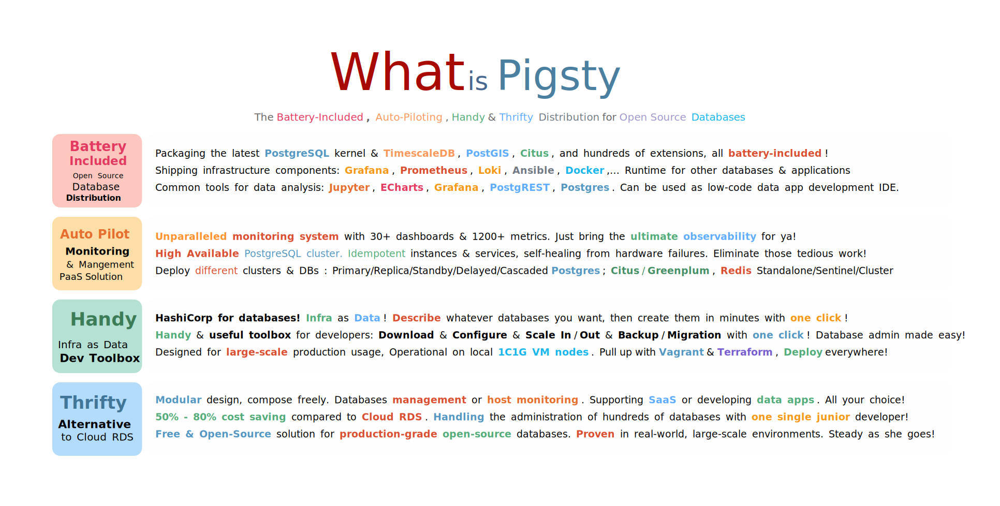
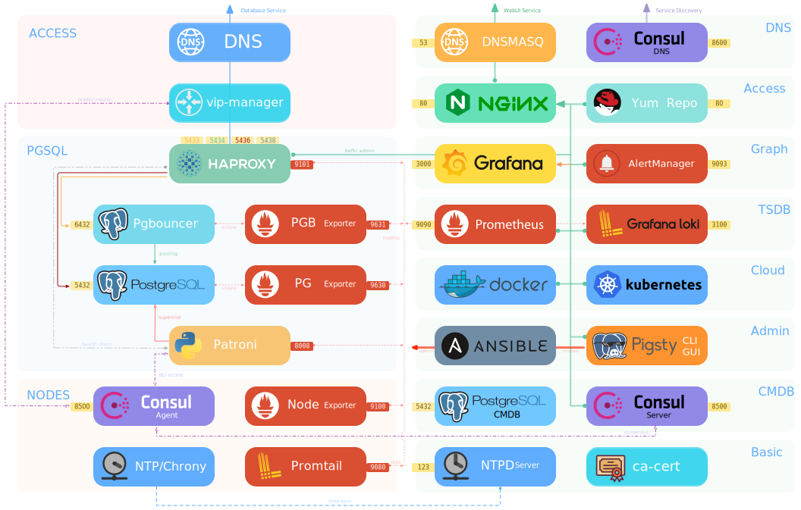
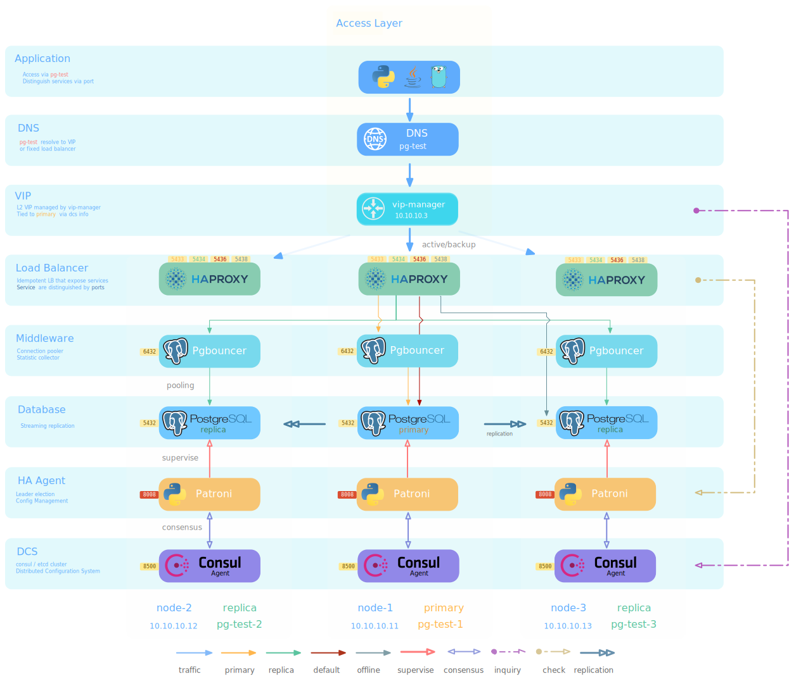

# Pigsty

## 

**Battery-Included Open-Source PostgreSQL Distribution**

> Latest Version: [1.4.1](https://github.com/Vonng/pigsty/releases/tag/v1.4.1)  |  [Demo](http://demo.pigsty.cc)
>
> Documentation: [Docs](https://pigsty.cc/) | [中文文档](https://pigsty.cc/#/zh-cn/) | [Github Pages](https://vonng.github.io/pigsty/#/)
> 
> Run `make doc` to serve [EN Docs](docs/) & [ZH Docs](docs/zh-cn/) on your localhost


## What is Pigsty?

* [**Battery-Included Distribution**](#Distribution): PostgreSQL, PostGIS, TimescaleDB, Citus, Redis/GP, United in One!
* [**Unparalleled Monitoring**](#Observability): Grafana, Prometheus, Loki, AlertManager, bring the ultimate observability!
* [**High-Available**](#High-Available): Auto-Pilot Postgres with idempotent instances & services, self-healing from failures!
* [**Infra as Data**](#infra-as-data): Describe & Create: Primary/Replica/Standby/Delayed/Offline/Cascade/Citus in minutes!
* [**Ubiquitous**](#Ubiquitous): Prod env or 1C1G VM sandbox, with vagrant/terraform, all deployed with one click!
* [**Versatile**](#versatile):  Databases management or host monitoring. Supporting SaaS or developing data apps.
* [**Open Source & Free**](#Specification): 50% - 80% cost saving versus Cloud RDS. Proven in real-world, large-scale env.

[](docs/s-feature.md)

Check [Features](docs/s-feature.md) & [Highlights](#highlights) for Detail.


## TL; DR

Get a new Linux x86_64 CentOS 7.8 node. with nopass `sudo` & `ssh` access, then:

```bash
bash -c "$(curl -fsSL http://download.pigsty.cc/get)"  # get latest pigsty source
cd ~/pigsty && ./configure                             # pre-check and config templating 
./infra.yml                                            # install pigsty on current node
```

Now you have a battery-included Postgres on port **5432**, and infra web services available on port **80**.

Check [Installation](docs/s-install.md) & [Demo](http://demo.pigsty.cc) for details.


<details><summary>Download Packages Directly</summary>

Pigsty source & software packages can be downloaded directly via `curl` in case of no Internet connection:

```bash
curl -SL https://github.com/Vonng/pigsty/releases/download/v1.4.1/pkg.tgz -o /tmp/pkg.tgz
curl -SL https://github.com/Vonng/pigsty/releases/download/v1.4.1/pigsty.tgz | gzip -d | tar -xC
```

</details>


<details><summary>Mange More Nodes</summary>


You can add more nodes to Pigsty with [`nodes.yml`](docs/p-nodes.md#nodes), after meta node is installed with [`infra.yml`](docs/p-infra.md#infra). 


```bash
./nodes.yml  -l pg-test      # init 3 nodes of cluster pg-test
```

</details>


<details><summary>Define Postgres Cluster</summary>

You can define a HA Postgres Cluster with streaming replication in a few lines of code:

```yaml
pg-test:
  hosts:
    10.10.10.11: {pg_seq: 1, pg_role: primary} 
    10.10.10.12: {pg_seq: 2, pg_role: replica}
    10.10.10.13: {pg_seq: 3, pg_role: replica}
  vars: 
    pg_cluster: pg-test
```

You can create Postgres with different [roles](docs/d-pgsql.md) by declaring them: primary, replica, standby, delayed, offline, cascade, etc...

</details>

<details><summary>Deploy Databases Clusters</summary>

You can deploy different types of databases & clusters with corresponding playbooks.

* [`pgsql.yml`](docs/p-pgsql.md#pgsql): Deploy PostgreSQL HA clusters.
* [`redis.yml`](docs/p-redis.md#redis): Deploy Redis clusters.
* [`pgsql-matrix.yml`](docs/p-pgsql.md#pgsql-matrix): Deploy matrixdb data warehouse (greenplum7).


```bash
./pgsql.yml         -l pg-test      # init 1-primary-2-replica pgsql cluster
./redis.yml         -l redis-test   # init redis cluster redis-test
./pigsty-matrix.yml -l mx-*         # init MatrixDB cluster mx-mdw,mx-sdw .....
```

</details>


## Highlights


### Distribution

> Just like RedHat for Linux!

Packaging the latest PostgreSQL kernel & TimescaleDB, PostGIS, Citus, and hundreds of extensions, all battery-included!

It Also ships infrastructure components: Grafana, Prometheus, Loki, Ansible, Docker,… can be used as a runtime for other databases & applications

It also includes common tools for data analysis: Jupyter, ECharts, Grafana, PostgREST, and Postgres. Which can be used as a low-code data app development IDE, too.




### Observability

> You can't manage you don't measure

Unparalleled monitoring system with 30+ dashboards & 1200+ metrics. Just bring the ultimate observability for ya!

Pigsty comes with a professional-grade PostgreSQL monitoring system which is specially designed for large-scale PostgreSQL cluster management. Which supports: PGSQL monitoring, Redis monitoring, Nodes monitoring & self-monitoring. 

It is built upon popular open-source components such as Prometheus & Grafana. There's no vendor locking, and the infra can be easily reused for other purposes, e.g: data-visualization platforms.


### High-Available

> Auto-Piloting & Self-Healing

**High** **Available** PostgreSQL cluster. Idempotent instances & services, self-healing from hardware failures. 

The clusters created by Pigsty are **distributive** HA clusters powered by Patroni & HAProxy. Each instance is idempotent from the application's point of view. As long as any instance in the cluster survives, the cluster serves. 





### Infra as Data

> HashiCorp for Database!

Pigsty follows the philosophy of **"Infra as Data"**, just like Kubernetes. Describe the database you want and pull them up in one click. 

You can create a common primary-replica replication PGSQL cluster with several lines. and assign different roles among it: primary, replica, standby, offline, delayed, cascade. 

You can also create a horizontal sharding cluster with Citus, or just deploy a time-series data warehouse MatrixDB. Redis standalone/sentinel/cluster are also supported!


<details>
<summary>Minimal PostgreSQL Config</summary>

```yaml
pg-test:
  hosts:
    10.10.10.11: {pg_seq: 1, pg_role: primary}
    10.10.10.12: {pg_seq: 2, pg_role: replica}
    10.10.10.13: {pg_seq: 3, pg_role: replica}
  vars: 
    pg_cluster: pg-test
```

</details>

<details>
<summary>Complete PostgreSQL Config</summary>

```yaml
# EXAMPLE pg-meta is the default SINGLE-NODE pgsql cluster deployed on meta node (10.10.10.10)
pg-meta:                          # [REQUIRED], ansible group name , pgsql cluster name. should be unique among environment
  hosts:                          # `<cluster>.hosts` holds instances definition of this cluster
    10.10.10.10:                  # [REQUIRED]: ip address is the key. values are instance level config entries (dict)
      pg_seq: 1                   # [REQUIRED], unique identity parameter (+integer) among pg_cluster
      pg_role: primary            # [REQUIRED], pg_role is mandatory identity parameter, primary|replica|offline
      pg_offline_query: true      # instance with `pg_offline_query: true` will take offline traffic (saga, etl,...)
      # pg_upstream: x.x.x.x      # some other variables can be overwritten on instance level. e.g: pg_upstream, pg_weight, etc...
      # pg_weight: 100            # load balance weight for this instance

  vars:                           # `<cluster>.vars` holds CLUSTER LEVEL CONFIG of this pgsql cluster
    pg_cluster: pg-meta           # [REQUIRED], pgsql cluster name, unique among cluster, used as namespace of cluster resources

    # all vars below are [OPTIONAL] (overwrite global default)
    pg_version: 14                # pgsql version to be installed (use global version if missing)
    node_tune: tiny               # node optimization profile: {oltp|olap|crit|tiny}, use tiny for vm sandbox
    pg_conf: tiny.yml             # pgsql template:  {oltp|olap|crit|tiny}, use tiny for sandbox
    patroni_mode: default         # entering patroni pause mode after bootstrap  {default|pause|remove}
    patroni_watchdog_mode: off    # disable patroni watchdog on meta node        {off|require|automatic}
    pg_lc_ctype: en_US.UTF8       # use en_US.UTF8 locale for i18n char support  (required by `pg_trgm`)

    # define business database meta , used as CMDB & default database for single-node setup
    pg_databases:                       # define business databases on this cluster, array of database definition
      - name: meta                      # required, `name` is the only mandatory field of a database definition
        baseline: cmdb.sql              # optional, database sql baseline path, (relative path among ansible search path, e.g files/)
        # owner: postgres               # optional, database owner, postgres by default
        # template: template1           # optional, which template to use, template1 by default
        # encoding: UTF8                # optional, database encoding, UTF8 by default. (MUST same as template database)
        # locale: C                     # optional, database locale, C by default.  (MUST same as template database)
        # lc_collate: C                 # optional, database collate, C by default. (MUST same as template database)
        # lc_ctype: C                   # optional, database ctype, C by default.   (MUST same as template database)
        # tablespace: pg_default        # optional, default tablespace, 'pg_default' by default.
        # allowconn: true               # optional, allow connection, true by default. false will disable connect at all
        # revokeconn: false             # optional, revoke public connection privilege. false by default. (leave connect with grant option to owner)
        # pgbouncer: true               # optional, add this database to pgbouncer database list? true by default
        comment: pigsty meta database   # optional, comment string for this database
        connlimit: -1                   # optional, database connection limit, default -1 disable limit
        schemas: [pigsty]               # optional, additional schemas to be created, array of schema names
        extensions:                     # optional, additional extensions to be installed: array of schema definition `{name,schema}`
          - { name: adminpack, schema: pg_catalog }    # install adminpack to pg_catalog
          - { name: postgis, schema: public }          # if schema is omitted, extension will be installed according to search_path.
          - { name: timescaledb }                      # some extensions are not relocatable, you can just omit the schema part

      # define an additional database named grafana & prometheus (optional)
      # - { name: grafana,    owner: dbuser_grafana    , revokeconn: true , comment: grafana primary database }
      # - { name: prometheus, owner: dbuser_prometheus , revokeconn: true , comment: prometheus primary database , extensions: [{ name: timescaledb }]}

    # define business users for this cluster
    pg_users:                           # define business users/roles on this cluster, array of user definition
      # define admin user for meta database (This user are used for pigsty app deployment by default)
      - name: dbuser_meta               # required, `name` is the only mandatory field of a user definition
        password: md5d3d10d8cad606308bdb180148bf663e1  # md5 salted password of 'DBUser.Meta'
        # optional, plain text and md5 password are both acceptable (prefixed with `md5`)
        login: true                     # optional, can login, true by default  (new biz ROLE should be false)
        superuser: false                # optional, is superuser? false by default
        createdb: false                 # optional, can create database? false by default
        createrole: false               # optional, can create role? false by default
        inherit: true                   # optional, can this role use inherited privileges? true by default
        replication: false              # optional, can this role do replication? false by default
        bypassrls: false                # optional, can this role bypass row level security? false by default
        pgbouncer: true                 # optional, add this user to pgbouncer user-list? false by default (production user should be true explicitly)
        connlimit: -1                   # optional, user connection limit, default -1 disable limit
        expire_in: 3650                 # optional, now + n days when this role is expired (OVERWRITE expire_at)
        expire_at: '2030-12-31'         # optional, YYYY-MM-DD 'timestamp' when this role is expired  (OVERWRITTEN by expire_in)
        comment: pigsty admin user      # optional, comment string for this user/role
        roles: [dbrole_admin]           # optional, belonged roles. default roles are: dbrole_{admin,readonly,readwrite,offline}
        parameters: {}                  # optional, role level parameters with `ALTER ROLE SET`
        # search_path: public         # key value config parameters according to postgresql documentation (e.g: use pigsty as default search_path)
      - {name: dbuser_view , password: DBUser.Viewer  ,pgbouncer: true ,roles: [dbrole_readonly], comment: read-only viewer for meta database}
      # define additional business users for prometheus & grafana (optional)
      - {name: dbuser_grafana    , password: DBUser.Grafana    ,pgbouncer: true ,roles: [dbrole_admin], comment: admin user for grafana database }
      - {name: dbuser_prometheus , password: DBUser.Prometheus ,pgbouncer: true ,roles: [dbrole_admin], comment: admin user for prometheus database , createrole: true }

    # defining extra HBA rules on this cluster
    pg_hba_rules_extra:                                 # Extra HBA rules to be installed on this cluster
      - title: reject grafana non-local access          # required, rule title (used as hba description & comment string)
        role: common                                    # required, which roles will be applied? ('common' applies to all roles)
        rules:                                          # required, rule content: array of hba string
          - local   grafana         dbuser_grafana                          md5
          - host    grafana         dbuser_grafana      127.0.0.1/32        md5
          - host    grafana         dbuser_grafana      10.10.10.10/32      md5

    # default l2 vip fro this cluster
    vip_mode: l2                        # setup a level-2 vip for cluster pg-meta
    vip_address: 10.10.10.2             # virtual ip address that binds to primary instance of cluster pg-meta
    vip_cidrmask: 8                     # cidr network mask length
    vip_interface: eth1                 # interface to add virtual ip
```

</details>


<details>
<summary>Example of Redis Native Cluster</summary>

```yaml
redis-test:
  hosts:
    10.10.10.11:
      redis_node: 1
      redis_instances: { 6501 : {} ,6502 : {} ,6503 : {} ,6504 : {} ,6505 : {} ,6506 : {} }
    10.10.10.12:
      redis_node: 2
      redis_instances: { 6501 : {} ,6502 : {} ,6503 : {} ,6504 : {} ,6505 : {} ,6506 : {} }
  vars:
    redis_cluster: redis-test           # name of this redis 'cluster'
    redis_mode: cluster                 # standalone,cluster,sentinel
    redis_max_memory: 64MB              # max memory used by each redis instance
    redis_mem_policy: allkeys-lru       # memory eviction policy

```

</details>

<details>
<summary>Example of MatrixDB Data Warehouse</summary>

```yaml
#----------------------------------#
# cluster: mx-mdw (gp master)
#----------------------------------#
mx-mdw:
  hosts:
    10.10.10.10: { pg_seq: 1, pg_role: primary , nodename: mx-mdw-1 }
  vars:
    gp_role: master          # this cluster is used as greenplum master
    pg_shard: mx             # pgsql sharding name & gpsql deployment name
    pg_cluster: mx-mdw       # this master cluster name is mx-mdw
    pg_databases:
      - { name: matrixmgr , extensions: [ { name: matrixdbts } ] }
      - { name: meta }
    pg_users:
      - { name: meta , password: DBUser.Meta , pgbouncer: true }
      - { name: dbuser_monitor , password: DBUser.Monitor , roles: [ dbrole_readonly ], superuser: true }

    pgbouncer_enabled: true                # enable pgbouncer for greenplum master
    pgbouncer_exporter_enabled: false      # enable pgbouncer_exporter for greenplum master
    pg_exporter_params: 'host=127.0.0.1&sslmode=disable'  # use 127.0.0.1 as local monitor host

#----------------------------------#
# cluster: mx-sdw (gp master)
#----------------------------------#
mx-sdw:
  hosts:
    10.10.10.11:
      nodename: mx-sdw-1        # greenplum segment node
      pg_instances:             # greenplum segment instances
        6000: { pg_cluster: mx-seg1, pg_seq: 1, pg_role: primary , pg_exporter_port: 9633 }
        6001: { pg_cluster: mx-seg2, pg_seq: 2, pg_role: replica , pg_exporter_port: 9634 }
    10.10.10.12:
      nodename: mx-sdw-2
      pg_instances:
        6000: { pg_cluster: mx-seg2, pg_seq: 1, pg_role: primary , pg_exporter_port: 9633  }
        6001: { pg_cluster: mx-seg3, pg_seq: 2, pg_role: replica , pg_exporter_port: 9634  }
    10.10.10.13:
      nodename: mx-sdw-3
      pg_instances:
        6000: { pg_cluster: mx-seg3, pg_seq: 1, pg_role: primary , pg_exporter_port: 9633 }
        6001: { pg_cluster: mx-seg1, pg_seq: 2, pg_role: replica , pg_exporter_port: 9634 }
  vars:
    gp_role: segment               # these are nodes for gp segments
    pg_shard: mx                   # pgsql sharding name & gpsql deployment name
    pg_cluster: mx-sdw             # these segment clusters name is mx-sdw
    pg_preflight_skip: true        # skip preflight check (since pg_seq & pg_role & pg_cluster not exists)
    pg_exporter_config: pg_exporter_basic.yml                             # use basic config to avoid segment server crash
    pg_exporter_params: 'options=-c%20gp_role%3Dutility&sslmode=disable'  # use gp_role = utility to connect to segments
```

</details>


### Ubiquitous

> Local **sandbox** or multi-cloud deployment, It's all the same!


Pigsty is designed for large-scale production usage, but can also be operational on a local 1C1G VM node. 

You can run the complete 4-node sandbox on your laptop with vagrant with one command `make up`. Or prepare cloud ECS/VPC with Terraform with the exact same procedure.

 Everything is described in the [`pigsty.yml`](https://github.com/Vonng/pigsty/blob/master/pigsty.yml) config file, it's the only difference between different envs: prod, staging/UAT, dev/test sandbox.


### Versatile

> Data apps, SaaS, Database & Host monitoring, Analysis or Visualization, it's all your choice! 

**SaaS with Docker**

Pigsty has docker installed on meta nodes by default. You can pull up all kinds of SaaS applications with one command： Gitlab, Jira, Confluence, Mastodon, Discourse, Odoo, Kingdee, etc...

You can also pull up stateless parts, and use external databases by changing their connection string, to acquire production-grade durability.

Other handy tools such as Jupyter lab server, PGWeb CLI tools, PGAdmin4, pgbadger, ByteBase, PostgREST can also be served with docker. Check [Tutorial: Docker Applications](docs/t-docker.md) for details.

**Analysis**

Pigsty ships with handy tools such as Jupyterlab, PostgreSQL, Grafana, ECharts. Which is great for data analysis & visualization.

You can turn pigsty sandbox into an IDE for making data-intensive applications and demos: Processing data with SQL & Python, Backend API auto-gen with PostGREST. Visualize with Grafana & ECharts. 

Pigsty comes with some example apps:  [`covid`](http://demo.pigsty.cc/d/covid-overview) for covid-19 data visualization, and [`isd`](http://demo.pigsty.cc/d/isd-overview) for visualizing global surface weather station data.

* PG CSV Log Sample Analysis: [`pglog`](http://demo.pigsty.cc/d/pglog-overview)
* COVID-19 WHO Data Query [`covid`](http://demo.pigsty.cc/d/covid-overview)
* NOAA ISD Surface Station Weather Data Query: [`isd`](http://demo.pigsty.cc/d/isd-overview) 
* DB-Engine Popularity Trending [`dbeng`](http://demo.pigsty.cc/d/dbeng-overview) 

[](http://demo.pigsty.cc/d/covid-overview)

Check [Tutorial: Pigsty Applications](docs/t-application.md) for details.


### Specification

> 50% - 80% cost saving using Cloud ECS/Bare-Metal against Cloud RDS.

**System Requirement**

* CentOS 7 / Red Hat 7 / Oracle Linux 7 or equivalent
* CentOS 7.8.2003 x86_64 is highly recommended, it is fully tested under production env!

**Minimal Spec**

* Self-contained, single meta node, singleton pgsql cluster `pg-meta`
* Minimal requirement: 1 CPU Core & 2 GB RAM

**Demo setup ( TINY mode, vagrant demo)**

* 4 Nodes, singleton meta node with `pg-meta`, and 3-instances pgsql cluster `pg-test`
* Spec:  1Core/2GB for meta controller node, 1Core/1GB for database node (x3)

**Production setup (OLTP/OLAP/CRIT mode)**

* 3 meta nodes, up to hundreds of database clusters
* Verified Size: Dell R740 / 64 Core / 400 GB Mem / 3TB NVME SSD x 240

 


## About

  
Author: [Vonng](https://vonng.com/en) ([rh@vonng.com](mailto:rh@vonng.com))

License: [Apache 2.0 License](LICENSE)

Copyright 2018-2022 rh@vonng.com (Vonng)

[](https://star-history.com/#Vonng/pigsty&Date)

Beian: [浙ICP备15016890-2号](https://beian.miit.gov.cn/)l