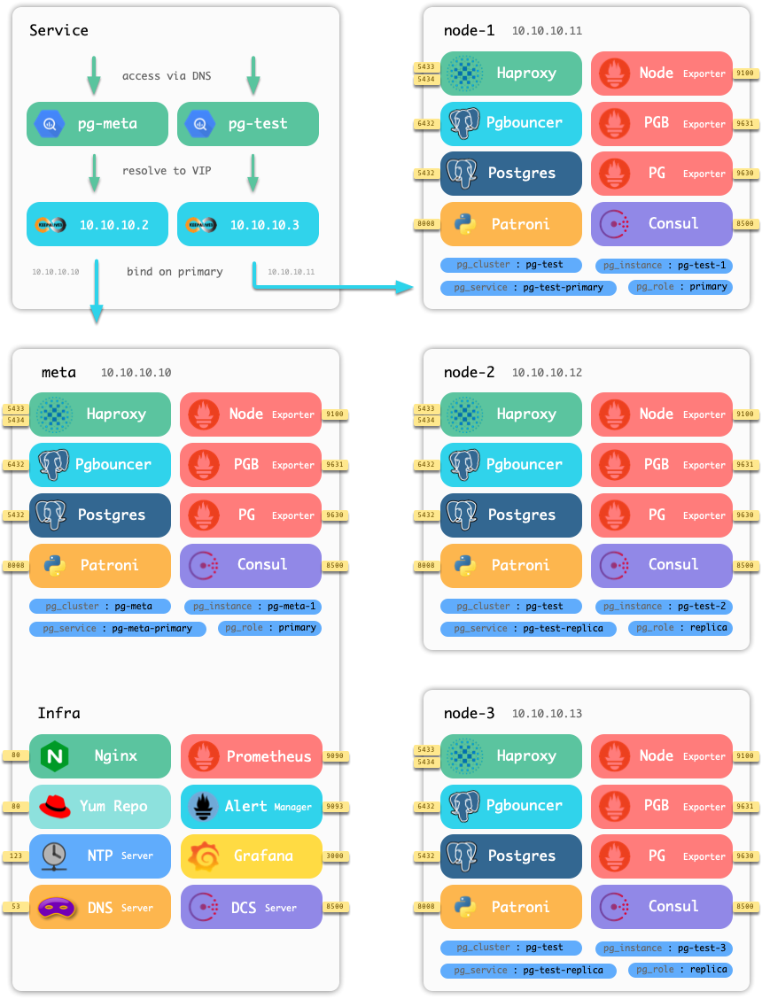

# Pigsty -- PostgreSQL in Graphic Style

> [PIGSTY](http://pigsty.cc): Postgres in Graphic STYle

[Pigsty](https://pigsty.cc/en/) is a monitoring system that is specially designed for large scale PostgreSQL clusters.Along with a production-grade HA PostgreSQL cluster provisioning solution.


Check [official site](https://pigsty.cc/en/  ) for more information：https://pigsty.cc/en/  

[中文站点](https://pigsty.cc/zh/)：https://pigsty.cc/zh/


## Highlights

* [Monitoring](#monitoring) System based on prometheus & grafana &  [`pg_exporter`](https://github.com/Vonng/pg_exporter)
* [Provisioning](#provisioning) Solution based on ansible. Kubernetes style, scale at ease.
* [HA Deployment](#ha-deployment) based on patroni. Self-healing and failover in seconds
* [Service Discovery](#service-discovery) based on DCS (consul / etcd), maintainence made easy.
* [Offline Installataion](#offline-installation) without Internet access. Fast and reliable.
* Infrastructure as Code. Fully configurable and customizable. 
* Based on PostgreSQL 13 and Patroni 2. Tested under CentOS 7


## Quick Start

If you already have [vagrant](https://www.vagrantup.com/), [virtualbox](https://www.virtualbox.org/) and [ansible](https://docs.ansible.com/) installed. Try local sandbox with one-click.
Clone this repo. And run following commands under project directory, pigsty will setup everything for you.

```bash
# run under pigsty home dir
make up          # pull up all vagrant nodes
make ssh         # setup vagrant ssh access
make init        # init infrastructure and databaes clusters
sudo make dns    # write static DNS record to your host (sudo required)
make mon-view    # monitoring system home page (default: admin:admin) 
```
> Verified Environment:: MacOS 11, Vagrant 2.2.14, Virtualbox 6.1.16

Check [Quick Start](https://pigsty.cc/en/docs/getting-started/) for more inforamtion


## Features

### Monitoring

Pigsty provides a battery-included [Monitoring System](https://pigsty.cc/en/docs/monitoring/). Which is specially designed for managing large-scale PostgreSQL clusters, and consist of thousands of metrics and 30+ dashboards.


### Provisioning

PostgreSQL cluster comes before monitoring system. That's why pigsty is shipping with a  [Provisioning Solution](https://pigsty.cc/en/docs/tutorials/). It allows you to create, update, scale your postgres cluster in kubernetes style.

```bash
# most common database cluster management operations:
vi conf/all.yml             # declare cluster status (check configuration guide for detail)
./pgsql-add.yml  -l <host>  # setup new instance / adjust instance according to config
./pgsql-del.yml  -l <host>  # remove instance on host
```
Here is an example base on vagrant 4-node demo. [Vagrantfile](vagrant/Vagrantfile) define four nodes: `meta` , `node-1` , `node-2`, `node-3`. Check [Architecture Overview](https://pigsty.cc/en/docs/concepts/architecture/) for more information.



### High Availability

Pigsty has HA Deployment powered by [Patroni 2.0](https://github.com/zalando/patroni). 

Failover and switchover are extremely simple and fast. It can be completed in seconds without affecting any standby traffics (PG13). 


One-line failover, and complete in seconds

```bash
# run as postgres @ any member of cluster `pg-test`
$ pt failover
Candidate ['pg-test-2', 'pg-test-3'] []: pg-test-3
Current cluster topology
+ Cluster: pg-test (6886641621295638555) -----+----+-----------+-----------------+
| Member    | Host        | Role    | State   | TL | Lag in MB | Tags            |
+-----------+-------------+---------+---------+----+-----------+-----------------+
| pg-test-1 | 10.10.10.11 | Leader  | running |  1 |           | clonefrom: true |
| pg-test-2 | 10.10.10.12 | Replica | running |  1 |         0 | clonefrom: true |
| pg-test-3 | 10.10.10.13 | Replica | running |  1 |         0 | clonefrom: true |
+-----------+-------------+---------+---------+----+-----------+-----------------+
Are you sure you want to failover cluster pg-test, demoting current master pg-test-1? [y/N]: y
+ Cluster: pg-test (6886641621295638555) -----+----+-----------+-----------------+
| Member    | Host        | Role    | State   | TL | Lag in MB | Tags            |
+-----------+-------------+---------+---------+----+-----------+-----------------+
| pg-test-1 | 10.10.10.11 | Replica | running |  2 |         0 | clonefrom: true |
| pg-test-2 | 10.10.10.12 | Replica | running |  2 |         0 | clonefrom: true |
| pg-test-3 | 10.10.10.13 | Leader  | running |  2 |           | clonefrom: true |
+-----------+-------------+---------+---------+----+-----------+-----------------+
```

### Service Discovery

Pigsty is intergreted with [Service Discovery](https://pigsty.cc/en/docs/concepts/discovery/) based on DCS (consul/etcd). All service are automatically registed to DCS. Which eliminate lots of manual maintenance work. And you can check health status about all nodes and service in an intuitive way.

Consul is the only DCS that is supported (etcd will be added further). You can use consul as DNS service provider to achieve DNS based traffic routing.


###  Offline Installation

Pigsty supports offline installation. It is especially useful for environment that has poor network condition.

Pigsty comes with a local Yum repo that includes all required packages and its dependencies. You can download [pre-packed offline packages](https://github.com/Vonng/pigsty/releases) or make it on your own in another node that have internet or proxy access. Check [Offline Installation](https://pigsty.cc/en/docs/tutorials/prepare/offline-installation/) for detail.


## Sepcification

**System Requirement**

* CentOS 7 / Red Hat 7 / Oracle Linux 7
* CentOS 7.6/7.8 is highly recommened (Fully tested under minimal installtion)

**Minimal setup**

* Self-contained single node, singleton database `pg-meta`
* Minimal requirement: 1 CPU Core & 2 GB RAM

**Standard setup ( TINY mode, vagrant demo)**

* 4 Node, including single meta node, singleton databaes cluster `pg-meta` and 3-instances database cluster `pg-test`
* Recommend Spec: 2Core/4GB for meta controller node, 1Core/1GB for database node 

**Production setup (OLTP/OLAP/CRIT mode)**

* 200+ nodes,  3 meta nodes , 100+ database clusters
* Verified Spec: Dell R740 / 64 Core / 400GB Mem / 3TB PCI-E SSD


## Support

[Business Support](https://pigsty.cc/en/docs/business/) for pigsty is available.


## Roadmap

[Roadmap](https://pigsty.cc/en/docs/business/roadmap/)


## About

Author：Vonng ([fengruohang@outlook.com](mailto:fengruohang@outlook.com))

[Apache Apache License Version 2.0](LICENSE)