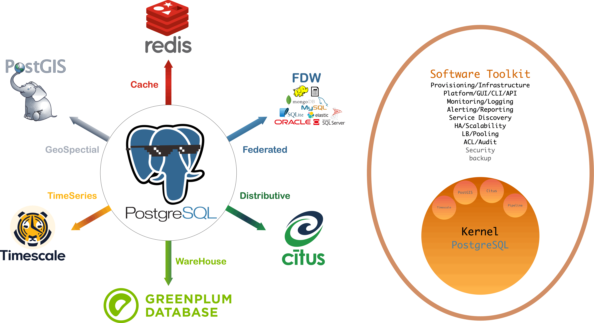
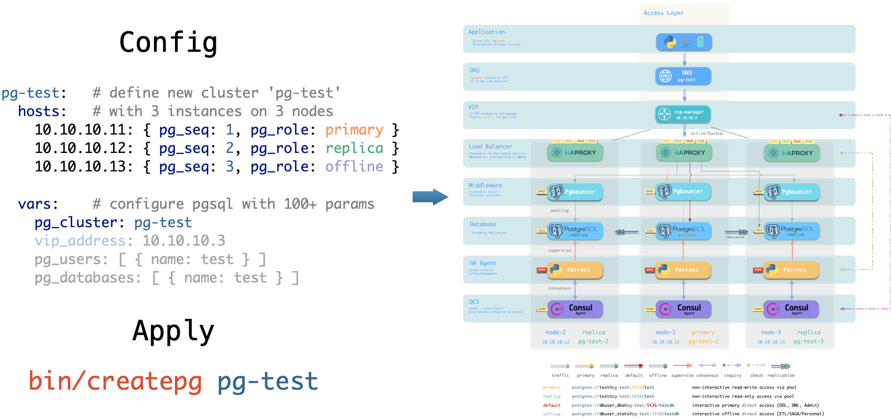

# Pigsty

## 

**Battery-Included Open-Source PostgreSQL Distribution**

> Latest Version: [v1.6.0-b2](https://github.com/Vonng/pigsty/releases/tag/v1.6.0-b2) | Stable Version: [v1.5.1](https://github.com/Vonng/pigsty/releases/tag/v1.5.1)  |  [Demo](http://demo.pigsty.cc)
>
> Documentation: [Docs](https://pigsty.cc/en/) | [中文文档](https://pigsty.cc/zh/) | [Github Pages](https://vonng.github.io/pigsty/#/)
> 
> Run `make doc` to serve [EN Docs](docs/) & [ZH Docs](docs/zh-cn/) on your localhost


## What is Pigsty?

[](docs/s-feature.md)

Check [**FEATURES**](docs/s-feature.md) for detail.


* [**Postgres Distribution**](docs/s-feature.md#PostgreSQL-Distribution): PostgreSQL, PostGIS, TimescaleDB, Citus, Redis/GP, United in One!
* [**SRE/PaaS Solution**](docs/s-feature.md#SRE-Solution): Grafana, Prometheus, Loki, AlertManager, Docker, run whatever you want!
* [**Developer Toolbox**](docs/s-feature.md#Developer-Toolbox): : Describe & Create: Primary/Replica/Standby/Delayed/Offline/Cascade/Citus in minutes!
* [**Open Source RDS**](docs/s-feature.md#open-source-rds): Safe & Cost-Saving Open-Source alternative to public cloud RDS!
* [**High-Availability**](docs/s-feature.md#High-Availability): Auto-Pilot Postgres with idempotent instances & services, self-healing from failures!
* [**Ultimate Observability**](docs/s-feature.md#Ultimate-Observability): Unparalleled monitoring system based on modern open-source best-practice!!
* [**Easy to Use**](docs/s-feature.md#Handy-Toolbox): Setup everything in minutes without Internet access, scale/backup/migration with one click!
* [**Database as Code**](docs/s-feature.md#Database-as-Code): Describe & Create: Primary/Replica/Standby/Delayed/Offline/Cascade/Citus in minutes!
* [**Ubiquitous Deploy**](docs/s-feature.md#Ubiquitous-Deployment): Prod env or 1C1G VM sandbox, solve IaaS provisioning with vagrant / terraform!
* [**Versatile Scenario**](docs/s-feature.md#Versatile-Scenario):  Databases management or host monitoring. Supporting SaaS or developing data apps.
* [**Safety & Thrifty**](docs/s-feature.md#Safty-and-Thrifty): 50% - 80% cost saving versus Cloud RDS. Proven in real-world, large-scale env.


<details><summary>Distribution</summary>

[](docs/c-infra.md#Overview)

</details>

<details><summary>Observability</summary>

[](http://demo.pigsty.cc)

</details>

<details><summary>High Availability</summary>

[](docs/c-pgsql.md#High-Availability)

</details>

<details><summary>Architecture</summary>

[](docs/c-arch.md)

</details>

<details><summary>Sandbox</summary>

[](docs/d-sandbox.md)

</details>

<details><summary>Provisioning</summary>

[](docs/d-deploy.md)

</details>

<details><summary>User Interface</summary>

[](docs/s-install.md)

</details>

<details><summary>Application</summary>

[](docs/t-application.md)

</details>


## TL; DR

Get a new Linux x86_64 EL7+ node. with nopass `sudo` & `ssh` access, then:

```bash
bash -c "$(curl -fsSL http://download.pigsty.cc/get)"  
cd ~/pigsty     # get latest pigsty source
./bootstrap     # download bootstrap pkgs
./configure     # pre-check and config templating 
./install.yml   # install pigsty according to pigsty.yml
```

> Tested OS: centos7.9, rocky8.6, rocky9.0, rhel7, rhel8, rhel9. Oracle/Alma should be fine too. 

Now you have a battery-included Postgres on port **5432** and infra web services available on port **80**.

Check [Quick Start](s-install.md) & [Demo](http://demo.pigsty.cc) for details.


<details><summary>Download Packages Directly</summary>
Pigsty source & software packages can be downloaded directly via `curl` in case of no Internet connection:

```bash
curl -SL https://github.com/Vonng/pigsty/releases/download/v1.6.0-b2/pigsty-v1.6.0-b2.tgz | gzip -d | tar -xC ~
# choose according to your el version
curl -SL https://github.com/Vonng/pigsty/releases/download/v1.6.0-b1/pigsty-pkg-v1.6.0-b1.el7.x86_64.tgz -o /tmp/pkg.tgz
curl -SL https://github.com/Vonng/pigsty/releases/download/v1.6.0-b1/pigsty-pkg-v1.6.0-b1.el8.x86_64.tgz -o /tmp/pkg.tgz
curl -SL https://github.com/Vonng/pigsty/releases/download/v1.6.0-b1/pigsty-pkg-v1.6.0-b1.el9.x86_64.tgz -o /tmp/pkg.tgz
```

</details>

<details><summary>Mange More Nodes</summary>
You can add more nodes to Pigsty with [`nodes.yml`](p-nodes.md#nodes) after installing the meta node with [`infra.yml`](p-infra.md#infra).

```bash
./nodes.yml  -l pg-test      # init 3 nodes of cluster pg-test
```

</details>

<details><summary>Define Postgres Cluster</summary>
You can define a HA Postgres Cluster with streaming replication in a few lines of code:

```yaml
pg-test:
  hosts:
    10.10.10.11: {pg_seq: 1, pg_role: primary} 
    10.10.10.12: {pg_seq: 2, pg_role: replica}
    10.10.10.13: {pg_seq: 3, pg_role: replica}
  vars: 
    pg_cluster: pg-test
```

You can create Postgres with different [roles](d-pgsql.md) by declaring them: primary, replica, standby, delayed, offline, cascade, etc...

</details>


<details><summary>Deploy Databases Clusters</summary>
You can deploy different types of databases & clusters with corresponding playbooks.

* [`pgsql.yml`](docs/p-pgsql.md#pgsql): Deploy HA PostgreSQL clusters.
* [`redis.yml`](docs/p-redis.md#redis): Deploy Redis clusters.
* [`pigsty-matrixdb.yml`](docs/p-pgsql.md#pgsql-matrix): Deploy matrixdb data warehouse (greenplum7).

```bash
./pgsql.yml         -l pg-test      # init 1-primary & 2-replica pgsql cluster
./redis.yml         -l redis-test   # init redis cluster redis-test
./pigsty-matrixdb.yml -l mx-*         # init MatrixDB cluster mx-mdw,mx-sdw .....
```

</details>


## About


Author: [Vonng](https://vonng.com/en) ([rh@vonng.com](mailto:rh@vonng.com))

License: [Apache 2.0 License](LICENSE)

Copyright 2018-2022 rh@vonng.com (Vonng)

[](https://star-history.com/#Vonng/pigsty&Date)

Beian: [浙ICP备15016890-2号](https://beian.miit.gov.cn/)
