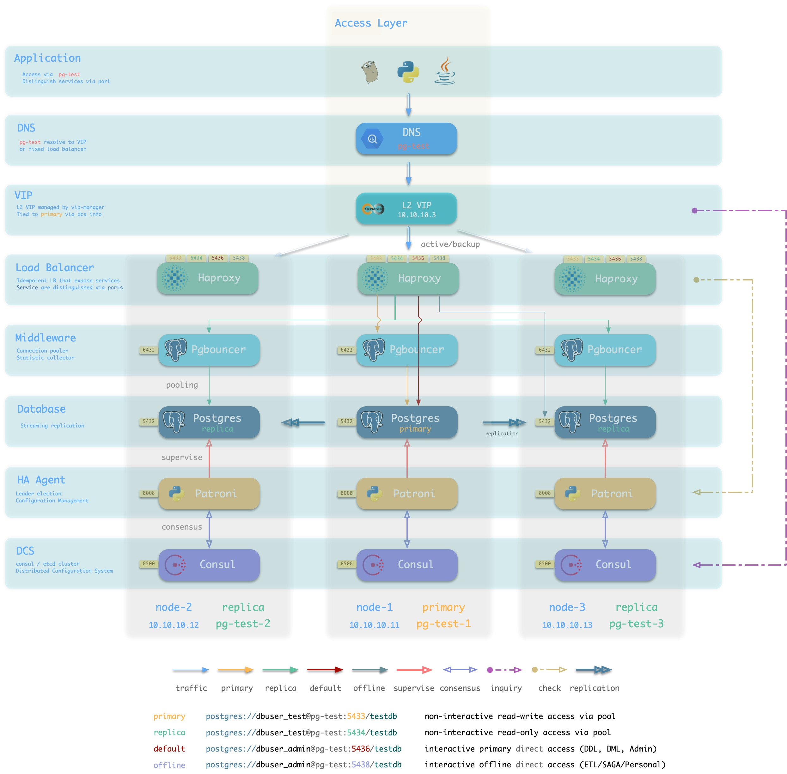

# Pigsty -- 开箱即用的PostgreSQL发行版

> [PIGSTY](http://pigsty.cc): Postgres in Graphic STYle

[Pigsty](https://pigsty.cc/zh/) 是**开箱即用**的**开源PostgreSQL发行版**。带有**全面专业**的**监控系统**，**稳定可靠**的**部署方案**；提供**简单省心**的**用户界面**，与**灵活开放**的**扩展机制**。采用**免费友好**的Apache License 2.0协议**开源**。

Pigsty可以用于大规模生产数据库的监控部署与管理；也可以在本地1核1GB的虚拟机中运行，用于学习，开发，测试与数据分析等场景。


 [**官方网站**](https://pigsty.cc/en/  ) 提供了关于Pigsty的详细信息：[**https://pigsty.cc/zh/**](](https://pigsty.cc/zh/))

> 最新的Pigsty稳定版本为[v0.9.1](https://github.com/Vonng/pigsty/releases/tag/v0.9.1).
>
> master目前位于 v1.0.0-beta1


## 快速上手

准备一台安装有CentOS 7.8的全新机器，您需要拥有sudo或root权限，并可以通过ssh登陆。

```bash
curl -fsSL https://pigsty.cc/pigsty.tgz | gzip -d | tar -xC ~; cd ~/pigsty  # 下载源码
make config    # 配置环境
make install   # 安装软件
```

如需运行本地沙箱，可运行以下命令（MacOS）

```bash
make deps   # 安装homebrew，并通过homebrew安装vagrant与virtualbox（需重启）
make dns    # 向本机/etc/hosts写入静态域名 (需sudo输入密码)
make start  # 使用Vagrant拉起单个meta节点 （start4则为4个节点）
make demo   # 使用单节点Demo配置并安装    （demo4则为4节点demo）
```

参考 [**快速上手**](https://pigsty.cc/zh/docs/quick-start/) 获取详细说明。

## 亮点特性

* 全面专业的[**监控系统**](#监控系统)，基于Grafana & Prometheus & [`pg_exporter`](https://github.com/Vonng/pg_exporter)
* 稳定可靠的[**部署方案**](#部署方案)，基于Ansible的物理机/虚拟机部署。
* 简单省心的安装方式与用户界面，开箱即用的沙箱环境，降低使用门槛。
* 高可用数据库集群架构，基于Patroni实现，具有秒级故障自愈能力。
* 基于DCS的服务发现与配置管理，维护管理自动化，智能化。
* 无需互联网访问与代理的离线安装模式，快速且可靠。
* 代码定义的基础设施，可配置，可定制。
* 基于PostgreSQL 13 （14beta现已支持！）与Patroni 2.0，享受最新特性。
* 长时间的大规模生产环境验证（200+ node x 64C|400GB|3TB）


## 功能介绍

### 监控系统

Pigsty带有一个针对大规模数据库集群管理而设计的专业级PostgreSQL监控系统。包括约1200**类**指标，20+监控面板，上千个监控仪表盘，覆盖了从全局大盘到单个查询的详细信息。面向专业用户，提供不可替代的价值点。

Pigsty监控系统基于业内最佳实践，采用Prometheus、Grafana作为监控基础设施。开源开放，定制便利，可复用，可移植，没有厂商锁定。可与各类已有数据库实例集成。


### 部署方案

数据库是管理数据的软件，管控系统是管理数据库的软件。

Pigsty内置了一套以Ansible为核心的数据库管控方案。并基于此封装了命令行工具与图形界面。它集成了数据库管理中的核心功能：包括数据库集群的创建，销毁，扩缩容；用户、数据库、服务的创建等。Pigsty采纳“Infra as Code”的设计哲学使用了声明式配置，通过大量可选的配置选项对数据库与运行环境进行描述与定制，并通过幂等的预置剧本自动创建所需的数据库集群，提供近似私有云般的使用体验。


Pigsty吸纳了Kubernetes架构设计中的精髓，采用声明式的配置方式与幂等的操作剧本。用户只需要描述“自己想要什么样的数据库”，而无需关心Pigsty如何去创建它，修改它。Pigsty会根据用户的配置文件清单，在几分钟内从裸机节点上创造出所需的数据库集群。


<details>
<summary>Configuration Entries</summary>


|  No  |                           Category                           | Function                                                     |
| :--: | :----------------------------------------------------------: | ------------------------------------------------------------ |
|  1   |     [connect](http://pigsty.cc/en/docs/config/1-connect)     | Connection parameters and proxy setting                      |
|  2   |        [repo](http://pigsty.cc/en/docs/config/2-repo)        | local yum and offline installation                           |
|  3   |        [node](http://pigsty.cc/en/docs/config/3-node)        | common setup for all nodes                                   |
|  4   |        [meta](http://pigsty.cc/en/docs/config/4-meta)        | infrastructure on meta nodes                                 |
|  5   |         [dcs](http://pigsty.cc/en/docs/config/5-dcs)         | dcs service (consul/etcd)                                    |
|  6   |  [pg-install](http://pigsty.cc/en/docs/config/6-pg-install)  | install postgres, extensions, users, directories, scripts, utils |
|  7   | [pg-provision](http://pigsty.cc/en/docs/config/7-pg-provision) | bootstrap postgres cluster and identity assignment           |
|  8   | [pg-template](http://pigsty.cc/en/docs/config/8-pg-template) | customize postgres cluster template                          |
|  9   |     [monitor](http://pigsty.cc/en/docs/config/9-monitor)     | install monitoring components                                |
|  10  |    [service](http://pigsty.cc/en/docs/config/10-service)     | expose database service                                      |


</details>


### 高可用

Pigsty创建的数据库集群是**分布式**、**高可用**的数据库集群。Pigsty创建的数据库基于DCS、Patroni、Haproxy实现了高可用。数据库集群中的每个数据库实例在**使用**上都是**幂等**的，任意实例都可以通过内建负载均衡组件提供完整的读写服务，提供分布式数据库的使用体验。数据库集群可以自动进行故障检测与主从切换，普通故障能在几秒到几十秒内自愈，且期间只读流量不受影响。故障时。集群中只要有任意实例存活，就可以对外提供完整的服务。

Pigsty的架构方案经过审慎的设计与评估，着眼于以最小复杂度实现所需功能。**该方案经过长时间，大规模的生产环境验证**，已经被多个行业内的组织所使用。



### 用户界面

Pigsty旨在降低PostgreSQL的使用门槛，因此在易用性上做了大量工作。

Pigsty的部署分为三步：下载源码，配置环境，执行安装，均可通过一行命令完成。遵循经典的软件安装模式，并提供了配置向导。您需要准备的只是一台CentOS7.8机器及其root权限。管理新节点时，Pigsty基于Ansible通过ssh发起管理，无需安装Agent，即使是新手也可以轻松完成部署。

在管理与使用上，Pigsty提供了不同层次的用户界面，以满足不同用户的需求。新手用户可以使用一键拉起的本地沙箱与图形用户界面，而开发者则可以选择使用`pigsty-cli`命令行工具与配置文件的方式进行管理。经验丰富的DBA、运维与架构师则可以直接通过Ansible原语对执行的任务进行精细控制。


### 服务发现

Pigsty提供了可选的服务发现机制，基于DCS（Consul/Etcd）实现。监控系统将自动从服务注册中心发现所有的监控对象，而Patroni则使用DCS作为集中的配置存储。Consul提供DNS可用作客户端服务发现机制，而UI可以让您对环境中的服务一览无余。


### 沙箱环境

Pigsty既可以在生产环境中管理成百上千个高规格的生产节点，也可以独立运行于本地1核1GB虚拟机中，作为开箱即用的数据库实例使用。在本地计算机上使用时，Pigsty提供基于Vagrant与Virtualbox的**沙箱**。可以一键拉起与生产环境一致的数据库环境，用于学习，开发，测试数据分析，数据可视化等场景。


###  离线安装

Pigsty支持**离线安装**，对于没有互联网访问的环境尤为方便。Pigsty的离线安装包中带有监控系统，数据库以及所有相关的依赖。您可以通过向导自动下载，或从Github Release页面或CDN手工下载离线安装包。

### 数据分析

Pigsty提供了一种名为“Datalet”的扩展机制，允许用户和开发者对Pigsty进行进一步的定制，将其用到意想不到的地方，例如数据分析与可视化。Pigsty集成了Echarts，以及常用地图底图等，可以方便地实现高级可视化需求。比起Julia，Matlab，R这样的传统科学计算语言/绘图库而言，PG + Grafana + Echarts的组合允许您以极低的成本制作出**可分享**，**可交付**，**标准化**的数据应用或可视化作品。


所有Pigsty高级专题监控面板都会以Datalet的方式发布。Pigsty也自带了一些的[Datalet案例](https://github.com/Vonng/datalets)：Redis监控系统，新冠疫情数据分析，七普人口数据分析，PG日志挖掘等。


## About

作者：[冯若航](https://vonng.com) (rh@vonng.com)

[Apache Apache License Version 2.0](LICENSE)