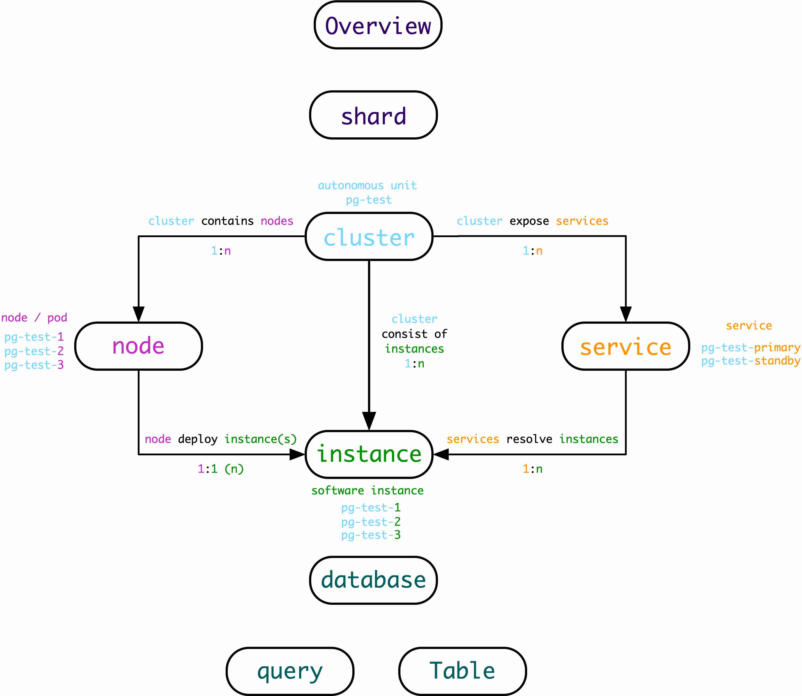

# Architecture Overview [DRAFT]

## Entity and Concept

## Overview

Take standard demo cluster as an example, this cluster consist of four nodes: `meta` , `node-1` , `node-2`, `node-3`. 

* 节点运行有`postgres`, `pgbouncer`, `patroni`, `haproxy`, `node_exporter`, `pg_exporter`, `pgbouncer_exporter`,`consul`等服务
* 集群中有两套数据库集群：`pg-meta` 与 `pg-test`。其中`pg-test`为一主两从结构，`pg-meta`为单主结构。
* `meta`节点上运行有基础设施服务：`nginx`, `repo`, `ntp`, `dns`, `consul server/etcd`, `prometheus`, `grafana`, `alertmanager`等
* 接入层使用DNS与VIP对外暴露服务，将流量导引至对应的服务节点（可选）。

## Service Overview

Pigsty provides multiple ways to connect to database:

* L2: via virtual IP address that are bond to primary instance
* L4: via haproxy load balancer that runs symmetrically on all nodes among cluster
* L7: via DNS (`pg-test`, `primary.pg-test`, `replica.pg-test`)

And multiple ways to route (read-only/read-write) traffic:

* Distinguish primary and replica service by DNS  (`pg-test`, `pg-test-primary`, `pg-test-replica`)
* Distinguish primary and replica service by Port (5433 for primary, 5434 for replica)
* Direct instance access
* Smart Client (`target_session_attrs=read-write`)

Lot's of configurable parameters items, refer to [Proxy Configuration Guide](doc/proxy-configuration.md) for more detail.

[Database Access Guide](database-access.md) provides information about how to connect to database.

