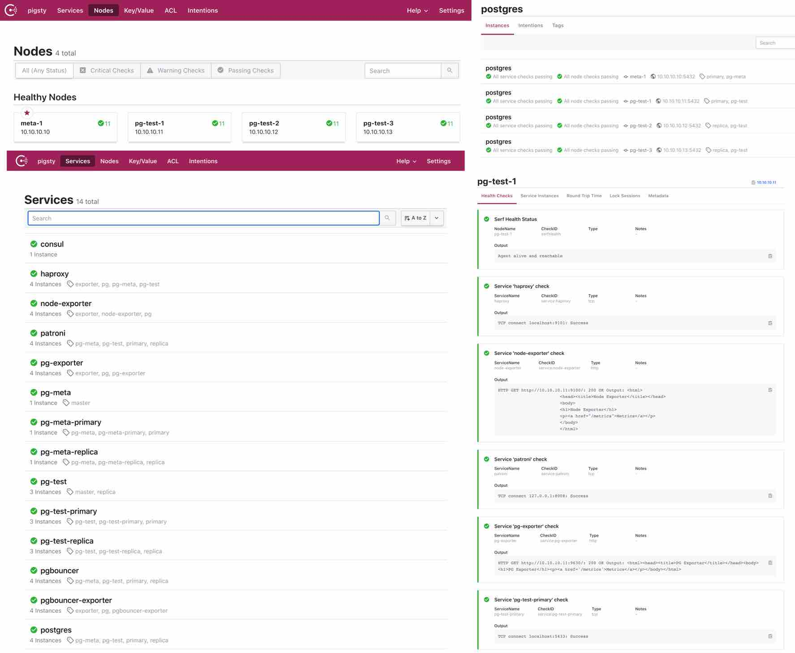

# Service Discovery [DRAFT]

### Service Overview

Pigsty is intergreted with DCS based [Service Discovery](doc/service-discovery.md). All service are automatically registed to DCS. Which eliminate manual maintenance work on monitoring system. And you can see health status about all nodes and service in an intuitive way.

Consul is the only DCS that is supported (etcd will be added further). You can use consul as DNS service provider to achieve DNS based traffic routing.



###  

### Service Register

Service are registered by consul agent.

Service are defined in json format, put in `/etc/consul.d/`

each service have a json file named as `svc-<service>.json`

Take postgres service as an example:

```json
{
  "service": {
    "name": "postgres",
    "port": {{ pg_port }},
    "tags": [
      "{{ pg_role }}",
      "{{ pg_cluster }}"
    ],
    "meta": {
      "type": "postgres",
      "role": "{{ pg_role }}",
      "seq": "{{ pg_seq }}",
      "instance": "{{ pg_instance }}",
      "service": "{{ pg_service }}",
      "cluster": "{{ pg_cluster }}",
      "version": "{{ pg_version }}"
    },
    "check": {
      "tcp": "127.0.0.1:{{ pg_port }}",
      "interval": "15s",
      "timeout": "1s"
    }
  }
}
```


### Service Discovery

Prometheus can discover service from consul directly

```yaml
  - job_name: pg
    # https://prometheus.io/docs/prometheus/latest/configuration/configuration/#consul_sd_config
    consul_sd_configs:
      - server: localhost:8500
        refresh_interval: 5s
        tags:
          - pg
          - exporter
```


### Service Maintenance

Sometimes service metadata may change, it requires a `consul reload` to take effect.

Anti-Entropy script `/pg/bin/pg-register` will periodically check and fix postgres role. And it will be triggered when failover occurs. 

blah blah


# 服务发现

Pigsty内置了基于DCS的配置管理与自动服务发现，用户可以直观地察看系统中的所有节点与服务信息，以及健康状态。Pigsty中的所有服务都会自动注册至DCS中，因此创建、销毁、修改数据库集群时，元数据会自动修正，监控系统能够自动发现监控目标，无需手动维护配置。

目前仅支持Consul作为DCS，用户亦可通过Consul提供的DNS与服务发现机制，实现基于DNS的自动流量切换。

