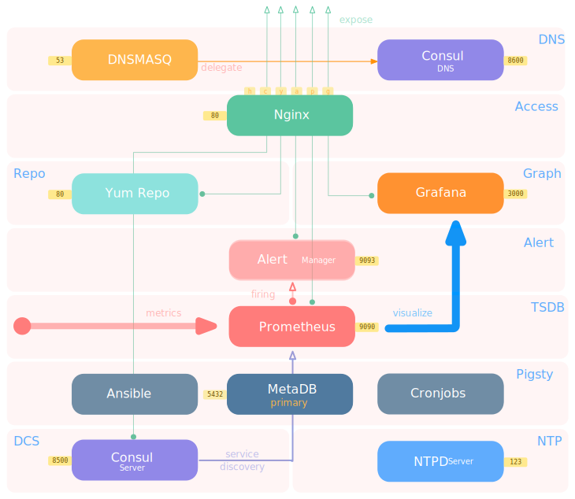
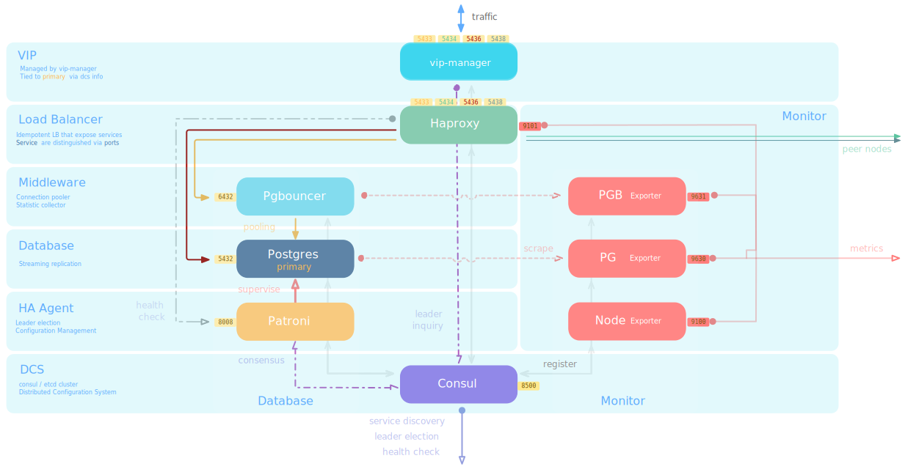

# Architecture

> Pigsty consists of several [modules](#modules), which can be composed freely for different scenarios.
>


## Modules

Pigsty now consists of 4 modules which can be freely composed for different scenarios

The whole system is decoupled into 4 independent modules, which can be maintained independently and freely arranged and combined for use.

* **`INFRA`** is the infrastructure part of Pigsty, including monitoring/alerting/visualization/logging/DNS/NTP and other public components.
* **`NODES`** is the host node management module, which is used to configure nodes, install software, and collect monitoring metrics and logs.
* [**`PGSQL`**](d-pgsql.md) is a PostgreSQL database deployment control module, including various types of PG cluster deployment and monitoring.
* [**`REDIS`**](d-redis.md) is the Redis database  control module, including Redis standalone/native cluster/sentinel [deployment](d-redis.md) and monitoring


If you want to use Pigsty as a standalone out-of-the-box PostgreSQL distribution, then install the **INFRA**, **NODES**, **PGSQL** modules in sequence on **one machine** and you will have an immediately available, self-monitoring managed database instance.

If you want a large-scale host monitoring system for a production environment, then install the **INFRA** module on one machine and the **NODES** module on all managed nodes. All nodes will be configured with yum repo sources, install packages, setup DNS, NTP, monitoring, logging agent collection, and DCS Agent as components required for a production environment. Host nodes that are integrated into Pigsty management come with detailed monitoring information and can be used to further deploy a variety of database modules.

If you want to deploy and manage a large number of PostgreSQL clusters, it is easy to add the **PGSQL** module to these Pigsty-managed nodes. You can deploy a wide variety of PGSQL clusters with a single click: single instance, one master-n-slave high availability clusters, synchronous clusters, synchronous clusters with quorum commits, clusters with offline ETL roles, offsite disaster recovery backup clusters, deferred replication clusters, Citus distributed clusters, TimescaleDB clusters, MatrixDB data warehouse clusters. If you want to deploy and monitor and manage many Redis clusters, you can also simply add the **REDIS** module to the nodes hosted by Pigsty. Support for new types of databases will be added gradually on demand: **KAFKA**, **MINIO**.


## Architecture

Pigsty has two typical use cases:: **Singleton Meta** vs. **Cluster Mange**.

* **Singleton Meta**: Install Pigsty on the current node and use it as a battery-included Postgres distribution.
* **Cluster Manage**: Deploy, monitor, and manage other nodes & databases

Pigsty executes the [`infra.yml`](p-infra.md#infra) playbook to deploy infrastructure with a single node PostgreSQL database cluster on that node when installing Pigsty on a node. For individual users, simple scenarios, and small and micro businesses, PG is battery-included. The node where Pigsty is fully installed is called [ Meta Node](#Meta-Node)(Meta).

Pigsty can also be used to monitor and manage additional nodes. You can initiate control from the meta nodes and include other nodes in Pigsty via the `nodes.yml` playbook to gain host monitoring capabilities. A wide variety of databases and applications can also be deployed and managed on these nodes: for example, creating a highly available PostgreSQL cluster with `pgsql.yml`, creating a master-slave, clustered, sentinel-mode Redis cluster with `redis.yml`, and deploying a Greenplum/MatrixDB data warehouse with `pigsty-matrix.yml`. 


**A Pigsty Deployment is architecturally divided into two parts: one infrastructure, and multiple database clusters.** With the default single-node installation mode, the infrastructure is fully deployed on the current node along with a single battery-included Postgres ins.

* **[Infrastructure](#infrastructure) (Infra)**: Deployed on **meta nodes**, monitoring, DNS, NTP, DCS, Yum repos, and other **basic services**.
* **[Database Clusters](#PGSQL-cluster) (PgSQL)**: Deployed on **Database Nodes**, providing **Database Services** to the outside world as a cluster.

Infrastructure and database clusters are **loosely coupled**, removing infrastructure will not affect the operation of the database cluster (except DCS).

DCS is used for fault detection and master selection to support high database availability. **Stopping DCS services in default mode will cause all database clusters to reject writes**, so be sure to ensure the reliability of DCS services (increase the number of meta nodes, or use an external, independently maintained, highly available DCS cluster).

Nodes (physical machines, virtual machines, Pods) are divided into two categories too:

* [Meta Nodes](#meta-node) (Meta): deploys the infrastructure, performs the control logic, and requires at least one meta node per Pigsty deployment.
* [Database Node](#database-node) (Node): used to deploy database clusters/instances, PG instances usually correspond to nodes one by one.

**The meta node can also be reused as a common database node**, on meta nodes, there is a PostgreSQL cluster named `pg-meta` running by default.
Provides additional extensions: CMDB, inspection reports, extended applications, log analysis, data analysis, processing, etc.

Taking the four-node sandbox environment that comes with Pigsty as an example, the distribution of components on the nodes is shown in the following figure.


The sandbox consists of one [meta node](#meta-node) with four [database nodes](#database-node) (the meta node is also reused as a database node), deployed with one set of [infrastructure](#infrastructure) and two sets of [database clusters](#PGSQL-cluster). `meta` is a meta-node, deployed with **infrastructure** components, also multiplexed as a common database node, deployed with a single master database cluster `pg-meta`. `node-1`, `node-2`, and `node-3` are normal database nodes, deployed with database cluster `pg-test`.


----------


## Infrastructure

In every Pigsty **Deployment** set, there is some infrastructure required to make the whole system work properly.

The infrastructure is usually handled by a dedicated Ops team or cloud vendor, but Pigsty, as a battery-included product solution, integrates the basic infrastructure into the provisioning solution.

* Domain infrastructure: Dnsmasq (some requests are forwarded to Consul DNS for processing)
* Time infrastructure: NTP
* Monitoring infrastructure: Prometheus
* Alarm infrastructure: AlterManager
* Visualization infrastructure: Grafana
* Local repo infrastructure: Yum/Nginx
* Distributed Config Storage: etcd/consul
* Meta-database/CMDB: `pg-meta`
* Remote node control component: Ansible
* Data analysis visualization suite: Jupyterlab, Echarts, etc.
* Other: timed tasks, patrol scripts, backup scripts, command-line tools, config GUI, other extended apps.

The main relationships between the infrastructures are as follows.

* Nginx externally **exposes** all web services and forwards them differently by the domain name.
* Dnsmasq provides DNS **resolution** services within the env
  * DNS services are optional and can use existing DNS servers
  * Partial DNS resolution will be **forwarded** by Consul DNS
* Yum Repo is the default server for Nginx, providing the ability to install software offline for all nodes in the env.
* Grafana is the carrier for the Pigsty monitoring system, used to **visualize** data in Prometheus and CMDB.
* Prometheus is the chronological database for monitoring.
  * Prometheus obtains monitoring objects by default through local static file service discovery and associates identity info for them.
  * Prometheus can optionally use Consul service discovery to get monitoring objects automatically.
  * Prometheus pulls monitoring indicator data from Exporter, precomputes and processes it, and then stores it in its own TSDB.
  * Prometheus calculates alarm rules and sends the alarm events to Alertmanager for processing.
* Consul Server is used to save the status of DCS, reach consensus, and provide meta-data query service.
* NTP Service is used to synchronize the time of all nodes in the env (external NTP service is optional)
* Pigsty-related components:
  * Meta-DB for supporting various advanced features (also a standard database cluster, pulled up by Ansible)
  * Ansible for executing playbooks, initiating control, and accessing CMDB when using dynamic Inventory
  * Timed task controller (supports backup, cleanup, statistics, patrol, etc.), which accesses CMDB
  * Command-line tool pigsty-cli will call Ansible Playbook



The infrastructure is deployed on a [meta-node](#meta-node). A set of envs containing one or more meta nodes for infrastructure deployment.
All infrastructure components are deployed replica-style, except for **Distributed Config Storage (DCS)**.

If multiple meta nodes are configured, the DCSs (etcd/consul) on the meta nodes act together as a cluster of DCS servers.


## Meta Node

In each environment, **Pigsty requires at least one meta node, which will act as the control center** for the entire env. The meta node is responsible for various administrative tasks: saving state, managing config, initiating tasks, collecting metrics, and so on. The infrastructure components of the entire env, Nginx, Grafana, Prometheus, Alertmanager, NTP, DNS Nameserver, and DCS, will be deployed on the meta node.

The meta node will also be used to deploy the meta-database (Consul or Etcd), and users can also use existing **external DCS clusters**. If deploying DCS to the meta nodes, it is recommended that 3 meta nodes be used in a **production env** to fully guarantee the availability of DCS services. Infrastructure components outside of DCS will be deployed as peer-to-peer copies on all meta nodes. The number of meta nodes requires a minimum of 1, recommends 3, and recommends no more than 5.

The default services running on the meta nodes are shown below.

| Component | Port | Default Domain | Description |
| :-----------: | :--: | :----------: | ------------------------------- |
| Nginx | 80 | `pigsty` | Entry proxy for all services |
| Grafana | 3000 | `g.pigsty` | Pigsty Monitoring System GUI |
| Prometheus | 9090 | `p.pigsty` | Monitoring Timing Database |
| AlertManager | 9093 | `a.pigsty` | Alarm aggregation management component |
| Consul | 8500 | `c.pigsty` | Distributed Config Management, Service Discovery |
| Consul DNS | 8600 | - | Consul-provided DNS services |
| Yum Repo | 80 | `yum.pigsty` | Local Yum repos |
| NTP | 123 | `n.pigsty` | The NTP time server used uniformly by the env |
| Dnsmasq | 53 | - | The DNS name resolution server used by the env |
| Loki | 3100 | - | Real-time log collection infrastructure (optional) |
| PgWeb | 8081 | `cli.pigsty` | Web GUI Postgres client (optional) |
| Jupyter | 8888 | `lab.pigsty` | Jupyter Lab Python env (optional) |


## PGSQL Cluster

The production env's databases are organized in **clusters**,
which is a **logical entity** consisting of a set of database **instances** associated with **master-slave replication**. Each **database cluster** is an autonomous business unit consisting of at least one **database instance**.

Clusters are the basic business service units, and the following diagram shows the replication topology in a sandbox env.
Where `pg-meta-1` alone constitutes a database cluster `pg-meta`,
while `pg-test-1`, `pg-test-2`, and `pg-test-3` together constitute another logical cluster `pg-test`.

```
pg-meta-1
(primary)

pg-test-1 -------------> pg-test-2
(primary)      |         (replica)
               |
               ^-------> pg-test-3
                         (replica)
```

The following figure rearranges the location of related components in the `pg-test` cluster from the perspective of a database cluster.


Pigsty is a database provisioning solution that creates **highly available database clusters** on-demand. Pigsty can **automatically failover**, with business-side read-only traffic unaffected; the impact of reading and write traffic is usually in the range of a few seconds to tens of seconds, depending on the specific config and load.

In Pigsty, each "database instance" is **idempotent**, using a NodePort-like approach to expose [**service**](c-service.md) to the public. By default, Port 5433 of **any instance** routes to the primary, and port 5434 routes the replicas. You can also access the database with different approaches, refer to [**Database Access**](c-service.md#Access-Method) for details.


## Database Node

A **database node** is responsible for running **database instances**. In PG instances are fixed using **exclusive deployment**, where there is one and only one instance on a node, so nodes and instances can be uniquely identified with each other (IP address and instance name).

A typical service running on a database node is shown below.

| component | port | description |
| :------------------: | :--: | ----------------------------------------------------- |
| Postgres | 5432 | Postgres Database Service |
| Pgbouncer | 6432 | Pgbouncer Connection Pooling Service |
| Patroni | 8008 | Patroni High Availability Components |
| Consul | 8500 | Distributed Config Management, Local Agent for Service Discovery Component Consul |
| Haproxy Primary | 5433 | Cluster read and write service (primary connection pool) agent |
| Haproxy Replica | 5434 | Cluster Read-Only Service (Slave Connection Pool) Agent |
| Haproxy Default | 5436 | Cluster Master Direct Connect Service (for management, DDL/DML changes) |
| Haproxy Offline | 5438 | Cluster Offline Read Service (directly connected offline instances, for ETL, interactive queries) |
| Haproxy `service` | 543x | *Additional custom services provided by the cluster will be assigned ports in sequence* |
| Haproxy Admin | 9101 | Haproxy Monitoring Metrics and Traffic Management Page |
| PG Exporter | 9630 | Postgres Monitoring Metrics Exporter |
| PGBouncer Exporter | 9631 | Pgbouncer Monitoring Metrics Exporter |
| Node Exporter | 9100 | Machine Node Monitoring Metrics Exporter |
| promtail | 9080 | Real-time collection of Postgres, Pgbouncer, Patroni logs (optional) |
| Consul DNS | 8600 | Consul-provided DNS service |
| vip-manager | x | Bind VIPs to the cluster master |




The main interactions are as follows:

* vip-manager obtains cluster master information by **querying** Consul and binds the cluster-specific L2 VIP to the master node (default sandbox access scheme).
* Haproxy is the database **traffic** portal for exposing services to the outside world, using different ports (543x) to distinguish different services.
  * Haproxy port 9101 exposes Haproxy's internal monitoring metrics, while providing an Admin interface to control traffic.
  * Haproxy port 5433 points to the cluster master connection pool port 6432 by default
  * Haproxy port 5434 points to the cluster slave connection pool port 6432 by default
  * Haproxy 5436 port points directly to the cluster master 5432 port by default
  * Haproxy 5438 port defaults to point directly to the cluster offline instance port 5432
* Pgbouncer for **pooling** database connections, buffering failure shocks, and exposing additional metrics.
  * Production services (high frequency non-interactive, 5433/5434) must be accessed through Pgbouncer.
  * Directly connected services (management and ETL, 5436/5438) must bypass the Pgbouncer direct connection.
* Postgres provides the actual database service, which constitutes a master-slave database cluster via stream replication.
* Patroni is used to **oversee** the Postgres service and is responsible for master-slave election and switchover, health checks, and config management.
  * Patroni uses Consul to reach a **consensus** as to the basis for cluster leader election.
* Consul Agent is used to store configs, accept service registrations, service discovery, and provide DNS queries.
  * All process services using the port are **registered** with Consul.
* PGB Exporter, PG Exporter, and Node Exporter are used to **expose** database, connection pool, and node monitoring metrics, respectively
* Promtail is an optional log collection component that sends captured PG, PGB, and Patroni logs to infrastructure Loki.


## Interaction

Here is an example of a single [meta node](#meta-node) and a single [database node](#database-node). The architecture is shown in the following figure:


The interaction between the meta nodes and the database nodes mainly consists of:
* The domain name of the database cluster/node depends on the Nameserver of the meta node for **resolution** (optional).
* Database node software **installation** requires the use of Yum Repo on the meta node.
* Prometheus will collect database cluster/node monitoring metrics on the meta node.
* Logs from Postgres, Patroni, and Pgbouncer in the database cluster will be collected by Promtail and sent to Loki.
* Pigsty will initiate **administration** of database nodes from the meta node:
  * Perform cluster creation, expansion, and contraction, instance/cluster recycling
  * Creating business users, business databases, modifying services, and HBA modifications.
  * Performing log collection, garbage cleanup, backup, patrol, etc.
* Consul of database node will synchronize locally registered services to DCS of meta node and proxy state read/write operations.
* Database node will synchronize time from meta node (or other NTP server).
