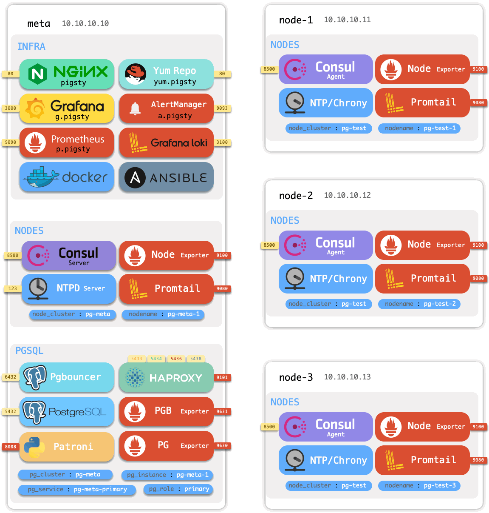

# Architecture

> Pigsty consists of several [modules](#Module) that can be combined according to different scenarios.

## Module

Pigsty currently offers four modules.

* [`INFRA`](c-infra.md) is Pigsty's infrastructure module, including monitoring/alerting/visualization/logging/DNS/NTP components.
* [`NODES`](c-nodes.md) is the node management module for configuring nodes, installing software, and collecting metrics and logs.
* [`PGSQL`](c-pgsql.md) is a PostgreSQL deployment management module, including various PG cluster deployments and monitoring.
* [`REDIS`](c-redis.md) is the Redis deployment management module, including Redis standalone/native cluster/sentinel [deployment](d-redis.md) and monitoring.

| [Module](c-arch.md#module) |   [Conecpt](c-concept.md)    |    [Deploy](d-deploy.md)    |    [Config](v-config.md)    |   [Playbook](p-playbook.md)   |
| :------------------------: | :--------------------------: | :-------------------------: | :-------------------------: | :---------------------------: |
|          `INFRA`           | [Concept: INFRA](c-infra.md) | [Deploy: INFRA](d-infra.md) | [Config: INFRA](v-infra.md) | [Playbook: INFRA](p-infra.md) |
|          `NODES`           | [Concept: NODES](c-nodes.md) | [Deploy: NODES](d-nodes.md) | [Config: NODES](v-nodes.md) | [Playbook: NODES](p-nodes.md) |
|          `PGSQL`           | [Concept: PGSQL](c-pgsql.md) | [Deploy: PGSQL](d-pgsql.md) | [Config: PGSQL](v-pgsql.md) | [Playbook: PGSQL](p-pgsql.md) |
|          `REDIS`           | [Concept: REDIS](c-redis.md) | [Deploy: REDIS](d-redis.md) | [Config: REDIS](v-redis.md) | [Playbook: REDIS](p-redis.md) |

## Usage

> You can choose which modules to enable on which nodes based on different requirements.

Pigsty will perform a singleton installation by default, initializing the node as a [meta-node](c-nodes.md#meta-node) with **INFRA**, **NODES**, & **PGSQL**.

You can join other [nodes](c-nodes.md#nodes) and install different databases.

### Singleton Deploy

If you want to use Pigsty as a battery-included **singleton PostgreSQL distribution**, install the **INFRA**, **NODES**, & **PGSQL** modules sequentially on a node.

Execute [`infra.yml`](p-infra.md) playbook to install Pigsty on a singleton meta, deploy **infrastructure** on the node, and pull up a singleton PostgreSQL [database cluster](#database-cluster). The node with Pigsty fully installed is called a [meta-node](c-nodes.md#meta-node).

Pigsty is capable of more than that. It can monitor and manage more nodes and databases.

### Host Monitoring

If you want to create a large-scale **Host Monitoring System**, just install the **INFRA** module on one node and the **NODES** module on all the monitored nodes. All nodes will be configured with software sources, software packages, DNS, NTP, node monitoring, log collection, and DCS Agent components. Nodes that are included in Pigsty management will come with detailed metrics and can be deployed with various database modules.

Use [`nodes.yml`](p-nodes.md#nodes) playbook to install the **NODES** module on meta nodes for more nodes to be included in Pigsty management.

### Database Cluster

After incorporating the nodes into Pigsty, these nodes can be further deployed with various **database clusters**.

If you want to **manage many PostgreSQL clusters**, install the PGSQL module again on those nodes included in Pigsty management. You can [deploy](d-pgsql.m) various PGSQL clusters with one click: singleton, one primary & n replica HA cluster, sync standby cluster, quorum commit cluster, offline replica, standby cluster, delayed replica cluster, Citus cluster, TimescaleDB cluster, MatrixDB data warehouse.

If you want to manage many Redis clusters, install the **REDIS** module on the included nodes in Pigsty management.

Use [`pgsql.yml`](p-pgsql.md#pgsql) to create a HA PostgreSQL cluster, [`redis.yml`](p-redis.md#redis) to develop standalone, native, sentinel Redis clusters, and [`pigsty-matrix.yml `](p-pgsql.md#pgsql-matrix) to deploy the Greenplum/MatrixDB data warehouse.

Pigsty will subsequently add new types of database modules on demand: **KAFKA**, **MINIO**, **MONGO**, etc.

## Model

A complete Pigsty system can be called a **Deployment** or **Environment**.

> For example, production environment, test environment, pre-distribution environment, etc.

**A Pigsty deployment consists of two parts: an infra set & multiple clusters**, both described by an [Inventory](v-config.md#config file).

* [Infra](c-infra.md): deployed on [meta-nodes](c-nodes.md#meta-nodes), monitoring, DNS, NTP, DCS, Yum repos, etc. 
* [Database Cluster](#database-cluster): autonomous (database) service unit deployed on [nodes](c-nodes.md#nodes).

The cluster contains **nodes**, **instances**, and **services** three core resources: a cluster contains multiple instances deployed on multiple [nodes](c-nodes.md#nodes), providing various [services](c-service.md). Each database instance will have a more subdivided ER model.

