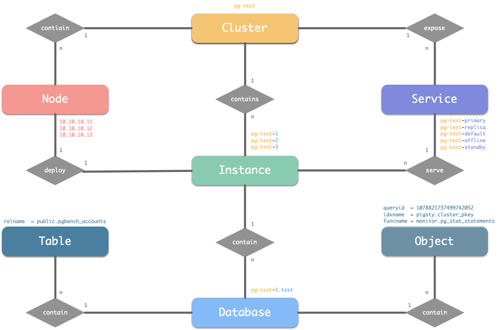
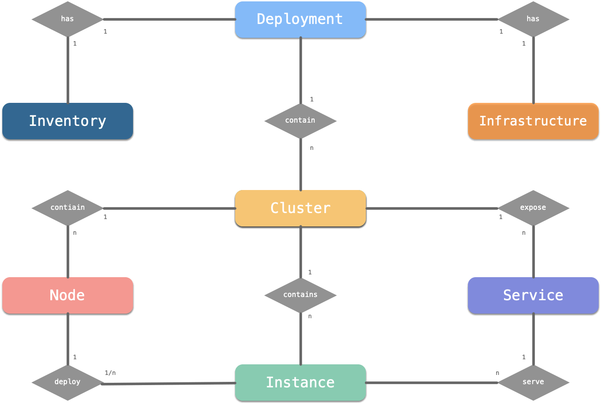

# Entity & Identity

This article introduces the concept of entities in Pigsty and their naming pattern.


-------------

## Core Model

Pigsty has four core entities: **[PGSQL Cluster](c-arch.md#PGSQL-cluster)**, **[PGSQL Service](c-service.md)**, **[Instance](#instance)**, and **[PGSQL Node](c-arch.md#database-node)**.
Hereafter referred to as Cluster, Service, Instance, and Node.




**Description**

* **Cluster** is the basic autonomous unit, uniquely identified by **user designation**, expressing business meaning, and serving as a top-level namespace.
* The clusters contain a series of **Nodes** at the hardware level, i.e., physical machines and VMs (or Pods) that IP can uniquely identify.
* The cluster contains a series of **Instances** at the software level, i.e., software servers, which can be uniquely identified by **IP: Port**.
* The cluster contains a series of **Services** at the service level, i.e., accessible domains and ports that can be uniquely identified by **domains**.

**Naming Pattern**

* Cluster naming can use any name that satisfies the DNS domain name specification, not with a dot ( `[a-zA-Z0-9-]+`).
* Node naming uses the cluster name as a prefix, followed by `-`and an ordinal integer number.
* Instance naming can be consistent with the node naming, i.e., `${cluster}-${seq}`.
* Service naming also uses the cluster name as the prefix, followed by `-` to connect the service specifics, such as `primary`, ` replica`, `offline`, `delayed`, etc.

**Naming Example**

Take the test database cluster `pg-test` for a sandbox as an example.

* One cluster: The database cluster for testing is named `pg-test`".
* Two roles: `primary` and `replica`.
* Three instances: The cluster consists of three database instances: `pg-test-1`, `pg-test-2`, `pg-test-3`.
* Three nodes: The cluster is deployed on three nodes: `10.10.10.11`, `10.10.10.12`, and `10.10.10.13`.
* Four services: read-write service `pg-test-primary`, read-only service `pg-test-replica`, directly connected management service `pg-test-default`, offline read service `pg-test-offline`.


-------------

## Full Model

The four entity models can be expanded.



**Description**

* **Environment** or **Deployment** is a complete Pigsty system.
* Each environment has a [config](v-config.md) with a set of [infra](c-arch.md#infrastructure) that manages multiple [PGSQL clusters](c-arch.md#PGSQL-clusters).
* There are several [**business databases**](c-pgdbuser.md) on each database instance that serve as the top-level namespace at the logical level.
* Each database has various **Database objects**, such as tables, indexes, sequence numbers, functions, etc.

**Identifiers**

* For each set of **environments**, represented by a custom identifier, Pigsty uses the environment identifier `pgsql` by default. 
* **A horizontal sharding cluster** is currently not an entity hierarchy natively supported by Pigsty, but you can emulate this hierarchy with a cluster naming pattern. Use the uniform naming pattern: `xxx-shard/d+`.
* **Database** naming is recommended to use the same pattern as the cluster name, e.g., `test`, `meta`, `grafana`.
* **Database objects** are recommended to use the same pattern as the cluster name. Pigsty uses the full name with the pattern name to identify the object, e.g., `public.cluster`.


-------------

## Identity

Entity and identity is a conceptual model, and the specific implementation in Pigsty is described below.

The most representative implementation of Pigsty identities is the **Label** for temporal data in Prometheus. 

| Entity       | Identity  | Example                              | Label                      |
| ------------ | --------- | ------------------------------------ | -------------------------- |
| Environment  | **`job`** | `pgsql`, `redis`, `staging`          | `{job}`                    |
| Shard        |           | `pg-test-shard\d+`                   | `{job, cls*}`              |
| **Cluster**  | **`cls`** | `pg-meta`, `pg-test`                 | `{job, cls}`               |
| Service      |           | `pg-meta-primary`, `pg-test-replica` | `{job, cls}`               |
| **Instance** | **`ins`** | `pg-meta-1`, `pg-test-1`             | `{job, cls, ins}`          |
| Database     |           | `test`                               | `{..., datname}`           |
| Object       |           | `public.pgbench_accounts`            | `{..., datname, <object>}` |

The most critical **cluster identities (cls)** and **instance identities (ins)** are automatically generated via [identity parameters](#Identity) in the cluster configuration.

| Name | Attribute | Description | Example |
| :-----------------------------------------: | :----------------: | :------: | :------------------: |
| [`pg_cluster`](v-pgsql.md#pg_cluster) | **MUST**, cluster level | cluster name | `pg-test` |
| [`pg_role`](v-pgsql.md#pg_role) | **MUST**, instance level | instance role | `primary`, `replica` |
| [`pg_seq`](v-pgsql.md#pg_seq) | **MUST**, instance level | serial number | `1`, `2`, `3`,`... ` |

The identity parameters are the **smallest set of mandatory parameters** that define the database cluster. The core identity parameters **must be explicitly specified**.

- `pg_cluster` (`cls`): Identities the name of the cluster, configured at the cluster level, and serves as the top-level namespace for cluster sources.
- `pg_instance` (`ins`): Uniquely identity a database instance consisting of `pg_cluster` and `pg_seq` spelled by `-`.
- `pg_seq`: Identity an instance in a cluster, usually an integer incrementing from 0 or 1, and will not be changed once assigned.
- `pg_service` (`svc`): Uniquely identities a service in the cluster consisting of `pg_cluster` and `pg_role` spelled by `-`.
- `pg_role`: Identifies the role of the instance in the cluster, configured at the instance level, with optional values including:
  - `primary`: the **unique Primary** in the cluster, providing writing service.
  - `replica`: the **ordinary Replica** in the cluster, providing read-only traffic service.
  - `offline`: the **Offline replica** in the cluster accepts ETL/SAGA/personal user/interactive/analytical queries.
  - `standby`: the **Standby** in the cluster, with synchronous replication and no replication latency.
  - `delayed`: the **Delayed** in the cluster with specified replication delay for performing backtracking queries and data salvage.


-------------


## **Cluster**

**A cluster** is the basic autonomous business unit, which means that the cluster can provide services as a whole. Note that cluster here is a software-level concept, not to be confused with PG Cluster (database set cluster, i.e., a data directory containing multiple PGs of a singleton) or Node Cluster (machine cluster).

A cluster is one of the basic management units, and an organizational unit is used to unify various sources. A PG cluster may include.

* Three physical machine nodes
* One primary instance provides database read and writes services to.
* Two replica instances provide read-only copies of the database.
* Two exposed services: read-write service, and read-only copy service.

### **Naming Pattern**

Each cluster has a unique identity. In this case, a database cluster named `pg-test` is defined.

The cluster name is similar to the role of a namespace. All sources belonging to this cluster will use this namespace.

The **cluster identity** (`cls`) must be unique within a set of environments, and naming patterns that conform to the DNS standard [RFC1034](https://tools.ietf.org/html/rfc1034) is recommended.

A good cluster name should use only lowercase letters, numbers, and the hyphen `-`, and use letter starters. 

```c
cluster_name := [a-z][a-z0-9-]*
```

Cluster naming should not include the **dot`. `** A popular naming pattern uses dot-separated hierarchical identities, such as `com.foo.bar`. This naming is simple, but the number of domain hierarchies is not controllable. The most intuitive example is Pods in Kubernetes, where Pod naming patterns do not allow`. `

**Connotation of cluster naming** is recommended by-separated two-paragraph and three-paragraph names.

```bashba s
<cluster type>-<business>-<business line>
```

Typical cluster names include: `pg-meta`, `pg-test-fin`, `pg-infrastructure-biz`.


-------------

## Instance

An instance refers to **a specific database server**, which can be a single process, a group of processes, or several associated containers within a Pod. The critical elements of an instance are.

* Can be uniquely identified by the **instance identity** (`ins`).
* Can handle requests (regardless of whether the request is received from a database, a connection pool, or a load balancer).

### Naming Pattern

Instances belong to clusters, and each instance has its unique identity within the cluster. The instance identity `ins` is recommended to use a naming pattern consistent with Kubernetes Pods: i.e., cluster name linked to an ordinal integer number in increments from 0/1 `<cls>-<seq>`.

By default, Pigsty names the database instances in a cluster, increasing order starting from 1. For example, the database cluster `pg-test` has three database instances: `pg-test-1`, `pg-test-2`, and `pg-test-3`.

Once the instance name `ins` is assigned immutable, the instance will be used for the entire lifetime of the cluster.

In addition, with a singleton deployment, the database instance and the machine node can use each other's identities.


-------------

## Node

**A Node** is an abstraction of a hardware resource, usually referring to a working machine, whether a physical machine (bare metal), a VM, or a Pod in Kubernetes.

?> Note that Node in Kubernetes is an abstraction of hardware sources, but in reality, the concept of Node is similar to the concept of Pod in Kubernetes.

The key features of a Node are.

* Nodes are abstractions of hardware sources that can run software services and deploy database instances.
* **Nodes can use IP as unique identities**.

### Naming Pattern

Pigsty uses `ip` as the node's unique identity. If the machine has more than one IP, the actual access IP specified in the inventory will prevail. The hostname `nodename`, database instance identity `ins`, and node identity `ip` correspond to each other in Pigsty and can be cross-used as identities for database instances, machine nodes, and HAProxy load balancers.

The node naming is consistent with the database instance and remains the same throughout the cluster's life.


-------------

## Service

A [service](c-service.md) is a **named abstraction** of a software service (e.g., Postgres, Redis). Services have various implementations, but the key elements are:

* **An addressable and accessible service name** for providing access:
  * A DNS domain name (`pg-test-primary`)
  * An Nginx/Haproxy Port
* **Service traffic routing and load balancing mechanism** for deciding which instance handles requests:
  * DNS L7: DNS resolution records
  * HTTP Proxy: Nginx/Ingress L7: Nginx Upstream Config 
  * TCP Proxy: Haproxy L4: Haproxy Backend Config
  * Kubernetes: Ingress: **Pod Selector**.
  * The service also needs to decide which component will handle the request: the connection pool, or the database itself.

For more information about services, see the chapter [Services](c-service.md).

### Naming Pattern

**The service identity** (`svc`) consists of `cls` as a namespace and (`role`) as the service bearer.

In a PostgreSQL cluster, instances have different identities: primary, replica, standby, offline, and delayed. Different instances will provide different services; direct connection to the database and access to the database through connection pools are services of varying nature. It is common to use the role of the service target to identify the service, e.g., in the database cluster `pg-test`.

* A service that points to an instance of the primary connection pool (`primary`) role is called `pg-test-primary`.
* A service that points to a replica connection pool (`replica`) role is called `pg-test-replica`.
* A service that points to an (`offline`) is called `pg-test-offline`.
* A service that points to a (`standby`) is called `pg-test-standby`.

Note that **services are not enough to divide pairs of instances**. The same service can point to multiple instances. However, the same instance can also handle requests from different services.
