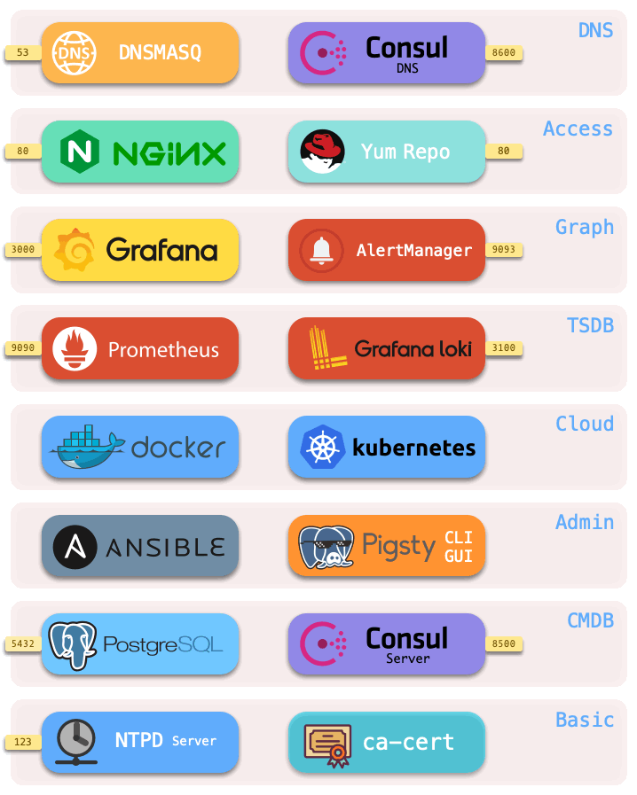

# Infrastructure

> Pigsty provides a complete, battery-included PaaS infra.

Pigsty, as a battery-included PaaS solution, will integrate the basic infra into the provisioning solution.


## Overview

Pigsty deploys a complete set of infra on [meta-nodes](c-nodes.md#meta-nodes) (the currently installed node), including:

|     Component     | Port |   Default Domain   | Description             |
| :----------: | :--: | :----------: | --------------------------- |
| [Nginx](#Nginx) |  80  |   `pigsty`   | Web Service Portal |
| [Yum Repo](#Yum-Repo) |  80  | `yum.pigsty` | LocalYum Repo |
| [Grafana](#Grafana) | 3000 |  `g.pigsty`  | Monitoring System/Visualization Platform |
| [AlertManager](#AlertManager) | 9093 |  `a.pigsty`  | Alert aggregation management component |
| [Prometheus](#Prometheus) | 9090 |  `p.pigsty`  | Monitoring Time Series Database |
| [Loki](#Loki) | 3100 |  `l.pigsty`  | Log Collection |
| [Consul](#Consul) | 8500 |  `c.pigsty`  | Distributed Configuration Management and Service Discovery |
| [Docker](#Docker) | 2375 |      -       | Container Platform |
| [PostgreSQL](#PostgreSQL) | 5432 |      -       | Pigsty CMDB                 |
| [Ansible](#Ansible) |  -   |      -       | Initiate management commands |
| [Consul DNS](#Consul) | 8600 |      -       | DNS Service（Optional） |
| [Dnsmasq](#Dnsmasq) |  53  |      -       | DNS Server（Optional） |
| [NTP](#NTP) | 123  |      -       | NTP Time Server（Optional） |



A set of environments contains one or more [meta nodes](c-nodes.md#meta-node) for infra deployment. All infrastructure components are deployed replica-style, except for **DCS**.

?> If multiple meta nodes are configured, the DCSs (etcd/consul) on the meta nodes act together as a cluster of DCS servers.


## Nginx

Nginx is the portal for all Pigsty's WebUI services, default port 80.

Many infra components with WebUIs are exposed for service through Nginx, such as Grafana, Prometheus, AlertManager, Consul, and HAProxy traffic management pages.
In addition, static file sources such as YumRepo, document, and execution plan visualizers are also served through Nginx.

Nginx forwards access requests to the corresponding upstream component via **domain name** based on the contents of [`nginx_upstream`](v-infra.md).
Pigsty strongly recommends using domain names to access the Pigsty UI system for several reasons:

* Some components only listen to 127.0.0.1 by default.
* Access via domain name allows you to use Nginx, audit all requests, and facilitate the integration of authentication mechanisms.
* Domain names are easier to remember and more flexible to configure.

If you do not have an Internet domain name or local DNS resolution, you can add a local static resolution record in `/etc/hosts` or `C:\Windows\System32\drivers\etc\hosts`.

Nginx configuration parameters are located at [Config: INFRA - NGINX](v-infra.md#NGINX).


## Yum Repo

Pigsty will first build a LocalYum repo, which is served by Nginx and is located at `/www/pigsty` and is available at `http://yum.pigsty/pigsty`. Pigsty's offline software package is a compressed Yum Repo dir.

When Pigsty tries to build a local source, if it finds the dir `/www/pigsty` with the `/www/pigsty/repo_complete` marker file, it assumes that the local source is built and skips the step of downloading the software from the upstream repo.

The Repo file is located at `/www/pigsty.repo` and is available by default at `http://yum.pigsty/pigsty.repo`.

```bash
curl http://yum.pigsty/pigsty.repo -o /etc/yum.repos.d/pigsty.repo
```

You can also use the file local sources without Nginx.

```ini
[pigsty-local]
name=Pigsty local $releasever - $basearch
baseurl=file:///www/pigsty/
enabled=1
gpgcheck=0
```

Yum Repo configuration parameters are located at [Config: INFRA - REPO](v-infra.md#REPO).


## Grafana

Grafana is an open-source visualization/monitoring platform, the core of Pigsty WebUI, with default port 3000, which can be accessed via `IP:3000` or `http://g.pigsty`.

Pigsty's monitoring system is built on Dashboard and connects and jumps via URL. You can quickly locate faults.

In addition, Grafana comes with some visualization plugins, such as the ECharts dashboard.

Grafana configuration parameters are located at [Config: INFRA - GRAFANA](v-infra.md#GRAFANA).


## AlertManager

AlertManager is the alerting platform that accompanies Prometheus. The default port is 9093, which can be accessed via `IP:9093` or `http://a.pigsty`.

Prometheus alert events are sent to AlertManager, but if further processing is required, users need to configure it, for example, to provide SMTP service configuration to send alert emails.


## Prometheus

Prometheus is the monitoring time-series database, default port 9090, which can be accessed via `IP:9090` or `http://p.pigsty`.

* Prometheus fetches monitoring objects through the local static file service and associates identity information for them.
* Prometheus can use Consul service discovery to get monitoring objects automatically.
* Prometheus pulls monitoring metrics from Exporter, precomputes the processing, and stores them in its TSDB.
* Prometheus calculates alarm rules and sends the alarm events to Alertmanager for processing.

Prometheus configuration parameters are located at [Config: INFRA - PROMETHEUS](v-infra.md#PROMETHEUS).


## Loki

Loki is the database used for log collection, and Promtail on the node pushes logs to Loki on the meta-node.

Loki configuration parameters are located at  [Config: INFRA - LOKI](v-infra.md#LOKI).


## Consul

Consul Server is used to keep the state of DCS, reach consensus, provide metaDB query service, and also provide DCS-based service discovery.

Consul configuration parameters are located at [Config: INFRA - DCS](v-infra.md#DCS).


## Docker

Pigsty installs Docker on the meta-node by default, and you can pull up various stateless applications and use an external database to get production-level persistence.

Docker configuration parameters are located at [Config: INFRA - DOCKER](v-infra.md#DOCKER).


## PostgreSQL

PostgreSQL configuration parameters are located at [Config: PGSQL](v-infra.md#PGSQL), using CMDB as the configuration source, please refer to the [CMDB tutorial](t-cmdb.md).

* MetaDB for supporting various advanced features (also a standard database cluster, pulled up by Ansible).
* Ansible for executing playbooks, initiating control, and accessing the CMDB when using dynamic Inventory.
* Timed task controller (supports backups, cleanups, statistics, patrols, etc.) that accesses the CMDB.


## Ansible

By default, Pigsty installs Ansible on the meta-node, a popular operations tool with a declarative configuration style and an idempotent playbook design. The command-line tool pigsty-cli invokes the Ansible Playbook to initiate control.

Ansible configuration parameters are located at [Config: INFRA - CONNECT](v-infra.md#CONNECT).


## Dnsmasq

Dnsmasq provides DNS **resolution** services (optional)

* DNS services are optional and can use existing DNS servers.
* Partial DNS resolution will be **forwarded** by Consul DNS.

DNSMASQ configuration parameters are located at [Config: INFRA - Nameserver](v-infra.md#NAMESERVER).


## NTP

NTP service for synchronizing the time of all nodes (optional).

NTP configuration parameters are located at [Config: NODES - NTP](v-infra.md#NTP).


## Demo

Pigsty provides a public demo at [http://demo.pigsty.cc](http://demo.pigsty.cc).

Since the demo is an empty instance of an empty VM with 1 core and 1 GB, please refer to the actual result.

<iframe style="height:1160px" src="http://demo.pigsty.cc/d/home"></iframe>

