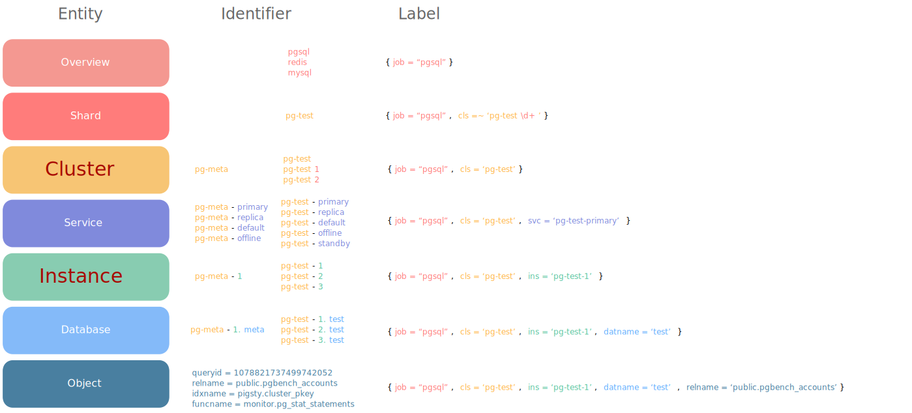

# Service Discovery

Service discovery has various uses, and this article describes the mechanism used by the Pigsty monitoring system Prometheus to discover monitoring objects.

The basis of service discovery is **identity**, for more information about identity, see the section [**entity**](c-entity.md)

Once you have the identity, you also need to associate **monitoring targets** with the identity in the monitoring system, and Pigsty provides two implementations.

* [Static File Service Discovery] (Static File Service Discovery): using an automatically maintained configuration file (default)
* [Consul service discovery](Consul service discovery): uses automatically maintained Consul service registration information

Static file is the default service discovery mechanism. Prior to v1.0.0, Consul was the default service discovery method, and the discovery mechanism can be configured with parameters.


## Identity parameters

All instances have **Identity** and **Identifier** is the **metadata** associated with the instance to identify it.

[**Identity parameter**](v-pg-provision/#identity-parameter) is a unique identifier that must be defined for any cluster with an instance.

| name | variables | abbreviation | type | description |
| :--: | :-----------: | ------ | ---------------- | --------------------------------------------- |
| cluster | `pg_cluster` | `cls` | **Core identity parameters** | Cluster name, top-level namespace for resources within the cluster |
| role | `pg_role` | `role` | **core identity parameters** | instance role, `primary`, `replica`, `offline`,... |
| `pg_seq` | `seq` | **core identity parameters** | Instance serial number, positive integer, unique within the cluster.                | | pg_seq
| instance | `pg_instance` | `ins` | derived identity parameters | `${pg_cluster}-${pg_seq}` |
| service | `pg_service` | `svc` | derived identity parameters | `${pg_cluster}-${pg_role}` |




## Identity association

After naming the objects in the system, you also need to associate **identity information** to specific instances.

Identity information is business-given metadata, and the database instance itself is not aware of this identity information; it does not know who it serves, which business it is subordinate to, or what number of instances it is in the cluster.

Identity assignment can take many forms, and the most rudimentary way to associate identities is **Operator's memory**: the DBA remembers in his mind that the database instance on IP address `10.2.3.4` is the one used for payments, while the database instance on the other one is used for user management. A better way to manage the identity of cluster members is through **profile**, or by using **service discovery**.

Pigsty offers both ways of identity management: based on [**Consul**](. /identity/#consul service discovery), versus [**Profile**](. /identity/#static file service discovery)

Parameters [`prometheus_sd_method (consul|static)`](...) Controls this behavior.

- `consul`: service discovery based on Consul, default configuration
- `static`: service discovery based on local configuration files

Pigsty recommends using `static` service discovery, which is more concise and has more reliability as the monitoring system does not need to rely on Consul.


## Static file service discovery

Static file service discovery is the default way of monitoring object discovery, Pigsty uses the following configuration pulling configuration by default.

```yaml
#------------------------------------------------------------------------------
# job: pgsql (database monitoring)
# node_exporter | pg_exporter | pgbouncer_exporter | haproxy(exporter)
# labels: [cls, ins, instance]
# path: targets/pgsql/*.yml
#------------------------------------------------------------------------------
- job_name: pgsql
  metrics_path: /metrics
  file_sd_configs:
    - refresh_interval: 10s
      files: [ /etc/prometheus/targets/pgsql/*.yml ]
```

The `/etc/prometheus/targets` directory holds the monitoring object definition files generated by Pigsty, and `pgsql` is the name of the default environment.

Each instance is register by a standalone file:

```
/etc/prometheus/targets/pgsql
                     ^-----pg-meta-1.yml
                     ^-----pg-test-1.yml
                     ^-----pg-test-2.yml
                     ^-----pg-test-3.yml
```

Content of these file are monitoring targets and their labels, such as:

```bash
# pg-meta-1 [primary] @ 10.10.10.10
- labels: { cls: pg-meta, ins: pg-meta-1 }
  targets: [10.10.10.10:9630, 10.10.10.10:9100, 10.10.10.10:9631, 10.10.10.10:9101]
```

The advantages of static file service discovery are that there are no additional component dependencies, and it allows for manual intervention for management and tuning, as well as easy integration with third-party systems.

### Maintenance of file service discovery

When using static file service discovery, these configuration files are automatically maintained for all cluster expansion and shrinkage operations.

The configuration files are regenerated for all instances in the environment using the following command

```bash
./pgsql.yml -t register_prometheus
```


## Consul Service Discovery

Pigsty has built-in DCS-based configuration management and automatic service discovery, allowing users to visualize all nodes and services in the system, as well as their health status. all services in Pigsty are automatically registered with DCS, so metadata is automatically corrected when database clusters are created, destroyed, or modified, and the monitoring system can automatically discover monitoring targets, eliminating the need for manual configuration maintenance. The monitoring system can automatically discover the monitoring targets, eliminating the need for manual configuration maintenance.

Users can also use the DNS and service discovery mechanism provided by Consul to achieve automatic DNS-based traffic switching.

Consul adopts a Client/Server architecture, with one to five Consul Servers in the entire environment for the actual metadata storage. The Consul Agent is deployed on all nodes to proxy the communication between the local services and the Consul Server. pigsty registers the services by default by means of the local Consul configuration file.

### Service Registration

On each node, there is a consul agent running, and services are registered to the DCS by the consul agent via JSON configuration files.

The default location of the JSON configuration file is `/etc/consul.d/`, using the naming convention of `svc-<service>.json`, using `postgres` as an example.

```json
{
  "service": {
    "name": "postgres",
    "port": 5432,
    "tags": [
      "pgsql",
      "primary",
      "pg-meta"
    ],
    "meta": {
      "type": "postgres",
      "role": "primary",
      "seq": "1",
      "instance": "pg-meta-1",
      "service": "pg-meta-primary",
      "cluster": "pg-meta",
      "version": "13"
    },
    "check": {
      "args": ["/usr/pgsql/bin/pg_isready", "-p", "5432", "-U", "dbuser_monitor"],
      "interval": "15s",
      "timeout": "1s"
    }
  }
}
```

Where the `meta` and `tags` sections are the metadata of the service and store the **identity information** of the instance.

### Service query

Users can discover **services registered to Consul** through the DNS service provided by Consul, or by calling the Consul API directly

See [Consul documentation](https://www.consul.io/docs/discovery/dns) for ways to consult consul services using the DNS API.

### Service Discovery

Prometheus automatically discovers monitored objects in the environment via `consul_sd_configs`. Services tagged with both `pg` and `exporter` are automatically identified as crawlers:.


```yaml
- job_name: pg
  # https://prometheus.io/docs/prometheus/latest/configuration/configuration/#consul_sd_config
  consul_sd_configs:
    - server: localhost:8500
      refresh_interval: 5s
      tags:
        - pg
        - exporter
```

> Services discovered by Prometheus: with identity information associated to the metric dimension of the instance.


### Service Maintenance

Sometimes, the registered role deviates from the actual role of the database instance because of a database master-slave switch. This is when such anomalies need to be handled through the anti-entropy process. Patroni-based failover can correct the registered roles normally through callback logic, but manually done role switchover requires manual intervention to handle it. Service registrations to the database can be detected and fixed automatically using the following script. It is recommended to configure Crontab on the database instance or set up periodic patrol tasks on the meta-node.


```bash
/pg/bin/pg-register $(pg-role)
```


## Labels

Either through Consul or static file service discovery. 

The end effect is to achieve an association between **identity information** and **collected time series**.

This correlation is achieved through the **dimensional labels** of the monitoring metrics, not all of which have the following labels.

However, all original monitoring metrics related to database clusters in Pigsty must have both `cls` and `ins` tags,
and remain immutable throughout their lifecycle.

| Identity parameters | Dimension labels | Sample values |
| :-----------: | :------: | :---------------: |
| `pg_cluster` | `cls` | `pg-test` |
| `pg_instance` | `ins` | `pg-test-1` |
| `pg_services` | `svc` | `pg-test-primary` |
| `pg_role` | `role` | `primary` |
| `node_ip` | `ip` | `10.10.10.11` |


Read the next section [metrics](m-metric.md) to learn how these metrics are organized by labels.

