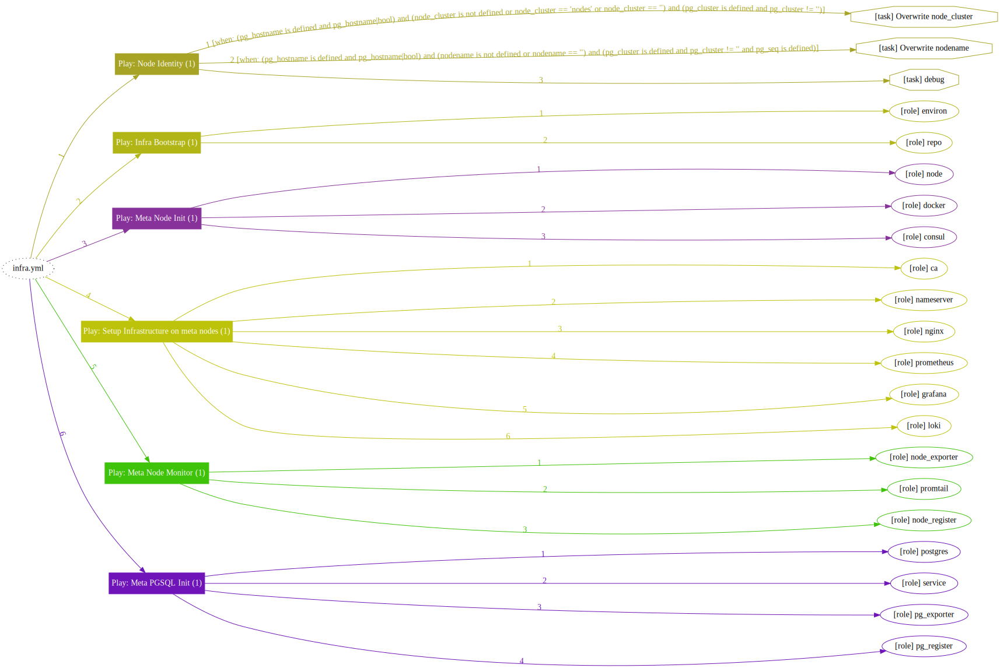
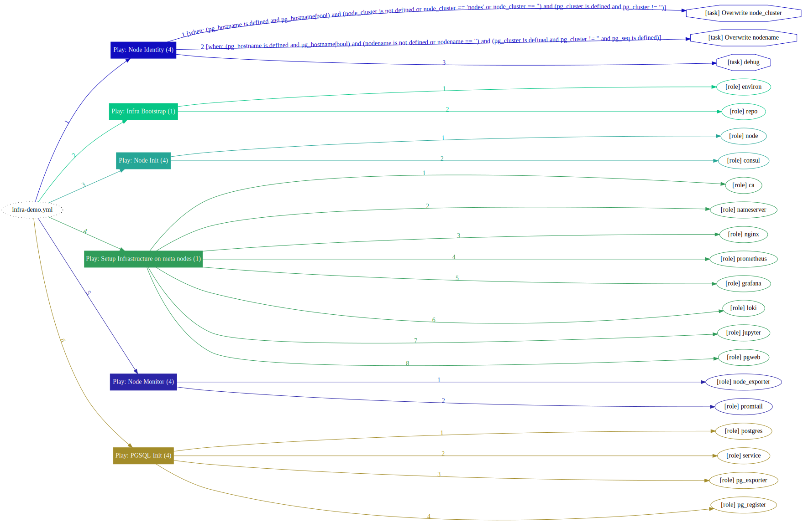
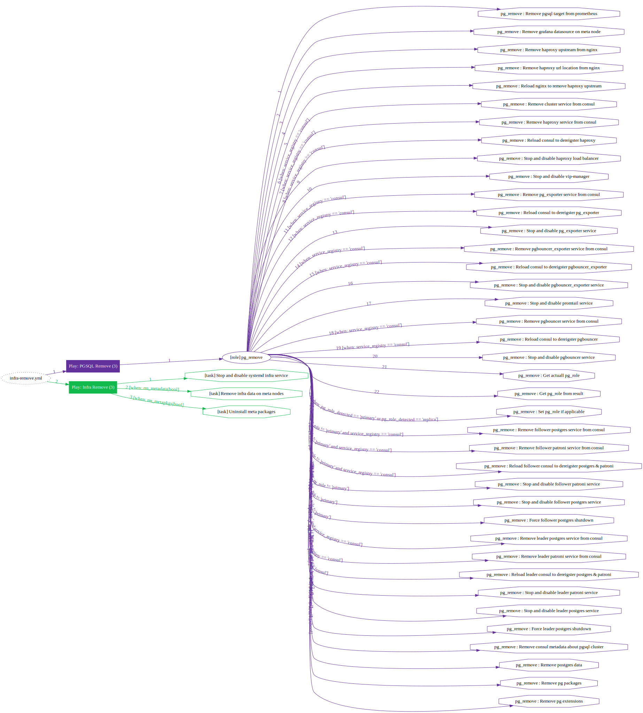

# Playbook：INFRA

> Install pigsty & Add new functionalities to meta node with `INFRA` series [playbooks](p-playbook.md).

| Playbook                                | Function                           | Link                                                                 |
|---------------------------------------------|--------------------------------------|------------------------------------------------------------------------|
| [`infra`](p-infra.md#infra)                 | Install pigsty on meta nodes | [`src`](https://github.com/vonng/pigsty/blob/master/infra.yml)         |
| [`infra-demo`](p-infra.md#infra-demo)       | Special version of `infra`, pull up the 4-node sandbox in one-pass | [`src`](https://github.com/vonng/pigsty/blob/master/infra-demo.yml)    |
| [`infra-remove`](p-infra.md#infra-remove)   | Uninstall pigsty from meta nodes. | [`src`](https://github.com/vonng/pigsty/blob/master/infra-remove.yml)  |
| [`infra-jupyter`](p-infra.md#infra-jupyter) | Install optional JupyterLab on meta nodes | [`src`](https://github.com/vonng/pigsty/blob/master/infra-jupyter.yml) |
| [`infra-pgweb`](p-infra.md#infra-pgweb)     | Install optional PGWeb on meta nodes | [`src`](https://github.com/vonng/pigsty/blob/master/infra-pgweb.yml)   |


---------------

## `infra`

The [`infra.yml`](https://github.com/Vonng/pigsty/blob/master/infra.yml) playbook will install **Pigsty** on the **meta nodes** (Current node by default).

When using Pigsty as a battery-included Postgres, `infra.yml`  itself is sufficient for the installation.



### What

The following tasks will be executed:

* Configure directories and environment variables of meta nodes.
* Download and create a local yum repo. (If [offline](t-offline.md) packages `/tmp/pkg.tgz` exists, skip the download phase)
* Init current meta node as a [common node](p-nodes.md).
* Deploy **infrastructures**, including Prometheus, Grafana, Loki, Alertmanager, Consul Server, etc...
* Init a common [PostgreSQL](p-pgsql.md) singleton on the current node as CMDB

### Where

This playbook works on **meta nodes**.

* Pigsty will use **the node currently executing this playbook** as Pigsty's meta node by default.
* Pigsty will mark the current node as the meta node by default during [`configure`](v-config.md#configure) and replace the placeholder IP address `10.10.10.10` in the config template with the **Current node's primary IP address**.
* **Meta node** can initiate management, and deploy infrastructure. It is not different from a regularly managed pgsql node.
* Pigsty uses meta nodes by default to deploy DCS Servers for PostgreSQL HA. But you can use external DCS Servers, too.
* Using multiple meta nodes is possible. Refer to the [`pigsty-dcs3`](https://github.com/Vonng/pigsty/blob/master/files/conf/pigsty-dcs3.yml#L33) template: 3 meta x 3 nodes, allowing one failure.

### How

Some special notes:

* This playbook is **idempotent**. Play again will erase Consul Server and CMDB (when protection is disabled)
* The full execution of this playbook takes about 5-8 minutes with [offline](t-offline.md) pkgs, depending on your machine spec.
* Download packages directly from the Internet may take 10-20 minutes, depending on your network conditions.
* This playbook treats the meta nod as a common node common PGSQL database, too. If it can be executed successfully, You could be highly confident that  [`nodes.yml`](p-nodes.md) and [`pgsql.yml`](p-pgsql.md) will work on nodes with the same spec.
* The default [`pg-meta`](https://github.com/Vonng/pigsty/blob/master/pigsty.yml#L43) on the meta node will be used as the Pigsty CMDB and supporting advanced features.


### Tasks

The playbook
```bash
./infra.yml --tags=environ                       # Reconfigure envs on the meta node
./infra.yml --tags=repo -e repo_rebuild=true     # Forced re-creation of local repo
./infra.yml --tags=repo_upstream                 # Add upstream yum repos
./infra.yml --tags=prometheus                    # Recreate Prometheus
./infra.yml --tags=nginx_config,nginx_restart    # Regenerate Nginx conf and restart
……
```

Nodes within the `meta` group will be marked with the [`meta_node`](v-nodes#meta_node) flag in Pigsty [Inventory](v-config.md), 


---------------

## `infra-demo`

The [`infra-demo.yml`](https://github.com/Vonng/pigsty/blob/master/infra-demo.yml) is a special playbook for the demo env, which can be used to initialize a 4-node sandbox in one pass by interweaving meta node init procedure & other nodes init procedure. It's useful when trying to deploy multiple meta nodes.

It's equivalent to following commands in the standard 4-node demo.

```bash
./infra.yml              # Install Pigsty on meta node
./infra-pgweb.yml        # Install PgWeb on meta node
./infra-jupyter.yml      # Install Jupyter on meta node
./nodes.yml -l pg-test   # Init 3 nodes of cluster pg-test
./pgsql.yml -l pg-test   # Init pgsql database cluster pg-test
```

USE THIS WITH CAUTION! You could just destroy the entire env with a fat finger & wrong config




---------------

## `infra-remove`

The [`infra-remove.yml`](https://github.com/Vonng/pigsty/blob/master/infra-remove.yml) playbook will uninstall pigsty from the meta node.



Following services will be stopped & removed from meta nodes.

- grafana-server
- prometheus
- alertmanager
- node_exporter
- consul
- jupyter
- pgweb
- loki
- promtail


---------------

## `infra-jupyter`

Playbook [`infra-jupyter.yml`](https://github.com/Vonng/pigsty/blob/master/infra-jupyter.yml) will install JupyterLab on the meta node.

It's a handy data analysis IDE for python. It's also risky because of its web shell functionality. So it's disabled by default. And enabled only in the Demo environment.

Refer to [Config: Jupyter](v-infra.md#JUPYTER) for configuring Jupiter, then just execute this playbook.

```bash
./infra-jupyter.yml
```


 If you have Jupyter enabled in your production environment, Make sure Jupyter's password is changed!


---------------

## `infra-pgweb`

PGWeb is a browser-based PostgreSQL client tool that can be used in small batch personal queries and other scenarios. It is currently a  beta feature and is only enabled by default in the Demo env.

The [`infra-pgweb.yml`](https://github.com/Vonng/pigsty/blob/master/infra-pgweb.yml) playbook is used to install the PGWeb service on the meta node.

Refer to [Config: PGWEB](v-infra.md#PGWEB) to configure PGWEB and just execute this playbook.

```bash
./infra-pgweb.yml
```


