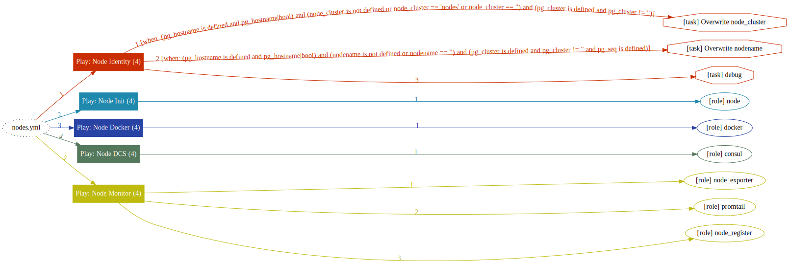
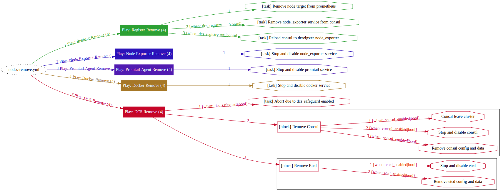

# Playbook：NODES

> Use the `NODES` [playbooks](p-playbook.md) to bring more nodes to Pigsty, adjusting nodes to the state described in the [config](v-nodes.md).

Once pigsty is installed on the meta node with [`infra.yml`](p-infra.md), You can add more nodes to Pigsty with [`nodes.yml`](#nodes), or remove them from Pigsty with [`nodes-remove.yml`](nodes-remove) .

| Playbook                                  | Function                                                     | Link                                                         |
| ----------------------------------------- | ------------------------------------------------------------ | ------------------------------------------------------------ |
| [`nodes`](p-nodes.md#nodes)               | Node Provisioning. Register node into Pigsty and prepare for database deployment | [`src`](https://github.com/vonng/pigsty/blob/master/nodes.yml) |
| [`nodes-remove`](p-nodes.md#nodes-remove) | Node Removal, uninstall DCS & Monitoring & Logging, de-register from Pigsty | [`src`](https://github.com/vonng/pigsty/blob/master/nodes-remove.yml) |


---------------

## `nodes`

The [`nodes.yml`](p-nodes.md) playbook will register nodes to Pigsty.

This playbook adjusts the target nodes to the state described in the [inventory](v-nodes.md), installs the Consul service, and incorporates it into the Pigsty monitoring system. Nodes can be used for database deployment once provisioning is complete.

The behavior of this playbook is determined by the [Config: NODES](v-nodes.md). The full execution of this playbook may take 1 to 3 minutes when using the local yum repo, depending on the machine spec.

```bash
./nodes.yml             # init all nodes in inventory    (danger!)
./nodes.yml -l pg-test  # init nodes under group pg-test (recommended!)
./nodes.yml -l pg-meta,pg-test   # init nodes in both clusters: pg-meta and pg-test
./nodes.yml -l 10.10.10.11       # init node with ip address 10.10.10.11
```




This playbook will run the following tasks:

* Generate node [identity](v-nodes.md#NODE_IDENTITY) parameters
* Provisioning Node
  * Configure the node's hostname
  * Configure static DNS records
  * Configure dynamic DNS resolver
  * Configure yum repo
  * Install specified RPM packages
  * Configure features such as NUMA/SWAP/firewall
  * Configure node tuned tuning templates
  * Configure shortcuts and environment variables for the node
  * Create node admin user and configure its SSH access
  * Configure timezone
  * Configure NTP service
* Initialize the DCS service on the node: Consul
  * Erase existing Consul if exists (with protection disabled)
  * Initialize the Consul Agent or Server service for the current node
* Initialize the node monitoring component and incorporate Pigsty
  * Install Node Exporter
  * Register Node Exporter to Prometheus on meta nodes.


!> Be careful when running this playbook on provisioned nodes. It may lead to database temporarily unavailable because of the removal of the consul service. 

The [`dcs_exists_action`](v-nodes.md#dcs_exists_action) parameter provides a [SafeGuard](#SafeGuard) to avoid accidental purge. When existing Consul Instance is detected during playbook execution. It will take action about it.

!> When using the full `nodes.yml` playbook or just the section on `dcs|consul` therein, please double-check that the `-tags|-t` and `-limit|-l` is correct. Make sure you are running the right tasks on the right targets. 


### SafeGuard

The `nodes.yml` provides a **SafeGuard** config entry [`dcs_exists_action`](v-nodes.md#dcs_exists_action). When there is a running Consul instance on the target node, Pigsty will take action according to its value: `abort|clean|skip`.

* `abort`: Default option. Abort play immediately to avoid purging the consul by accident.
* `clean`: PURGE the existing DCS instance.
* `skip`: Skip this **host** and continue on other hosts.
* Use `./nodes.yml -e pg_exists_action=clean` to overwrite the configuration file option and force the existing instance to be erased.

The [`dcs_disable_purge`](v-nodes.md#dcs_disable_purge) parameter is yet another safeguard, If enabled, the [`dcs_exists_action`](v-nodes.md#dcs_exists_action) will be forcibly set to `abort`, and no running DCS instances will be purged unless  [`nodes-remove.yml`](#nodes-remove) is explicitly used.


### Selective execution

You can **selectively** execute a subset of this playbook through **tags**.

For example, if you want to re-deploy node monitor components only:

```bash
./nodes.yml --tags=node-monitor
```

Common tasks are listed below:

```bash
# play
./nodes.yml --tags=node-id         # generate & print node identity params
./nodes.yml --tags=node-init       # provisoning the node
./nodes.yml --tags=dcs-init        # init dcs on node
./nodes.yml --tags=node-monitor    # init monitor (metrics & logs) on node

# tasks
./nodes.yml --tags=node_name       # Configure node‘s hostname
./nodes.yml --tags=node_dns        # Configure node's static DNS records
./nodes.yml --tags=node_resolv     # Configuring Dynamic DNS Resolver
./nodes.yml --tags=node_repo       # Configure yum repo
./nodes.yml --tags=node_pkgs       # Install specified RPM package
./nodes.yml --tags=node_feature    # Configure NUMA/SWAP/FIREWALL...
./nodes.yml --tags=node_tuned      # Configure tuned tuning templates
./nodes.yml --tags=node_profile    # Configure shortcuts & env variables
./nodes.yml --tags=node_admin      # Create node admin user and configure SSH access
./nodes.yml --tags=node_timezone   # Configure node time zone
./nodes.yml --tags=node_ntp        # Configure NTP service
./nodes.yml --tags=consul          # Configure consul agent/server
./nodes.yml --tags=consul -e dcs_exists_action=clean   # Force node reinit

./nodes.yml --tags=node_exporter   # Configure node_exporter on the node and register it
./nodes.yml --tags=node_register   # Registering node monitoring to a meta node
./nodes.yml --tags=node_deregister # Deregister node monitoring from meta node
```


### Admin User Provision

Admin user provisioning is a chicken-and-egg problem. In order to execute playbooks, you need to have an admin user. In order to create a dedicated admin user, you need to execute this playbook.

Pigsty recommends leaving admin user provisioning to your vendor. It's common to deliver the node with an admin user with ssh & sudo access.

It may require a password to execute ssh & sudo. You can pass them via additional args  `--ask-pass|-k` and `--ask-become-pass|-K`,  Entering SSH and sudo password when prompted. You can create a dedicated admin user (with nopass sudo & ssh) with another admin user (with password sudo & ssh).

The following parameters are used to describe the dedicated admin user.

* [`node_admin_setup`](v-nodes.md#node_admin_setup)
* [`node_admin_uid`](v-nodes.md#node_admin_uid)
* [`node_admin_username`](v-nodes.md#node_admin_username)
* [`node_admin_pks`](v-nodes.md#node_admin_pks)

```bash
./nodes.yml --limit <target_hosts>  --tags node_admin  \
            -e ansible_user=<another_admin> --ask-pass --ask-become-pass 
```

The default admin user is dba (uid=88), please **do not** use `postgres` or `{{ dbsu }}` as the admin user, please try to avoid using root as the admin user directly.

The default user `vagrant` in the local [sandbox](d-sandbox.md) environment has been provisioned with nopass ssh & sudo. You can use `vagrant` to ssh to all other nodes from the sandbox meta node.

Refer to: [Prepare: Admin User](d-prepare.md#Admin-User) for more details.


---------------

## `nodes-remove`

The [`nodes-remove.yml`](#nodes-remove) playbook is the reverse of the [`nodes`](#nodes) playbook, used to remove nodes from Pigsty.

The playbook needs to be executed on **meta nodes** and targeting nodes need to be removed.

```bash
./nodes.yml                      # Remove all nodes (dangerous!)
./nodes.yml -l nodes-test        # Remove nodes under group nodes-test 
./nodes.yml -l 10.10.10.11       # Remove node 10.10.10.11
./nodes.yml -l 10.10.10.10 -e rm_dcs_servers=true # Remove even If there's a DCS Server
```



### Task subset

```bash
# play
./nodes-remove.yml --tags=register      # Remove node registration
./nodes-remove.yml --tags=node-exporter # Remove node metrics collector
./nodes-remove.yml --tags=promtail      # Remove Promtail log agent
./nodes-remove.yml --tags=consul        # Remove Consul Agent service
./nodes-remove.yml --tags=consul -e rm_dcs_servers=true # Remove Consul (Including Server!)
```

