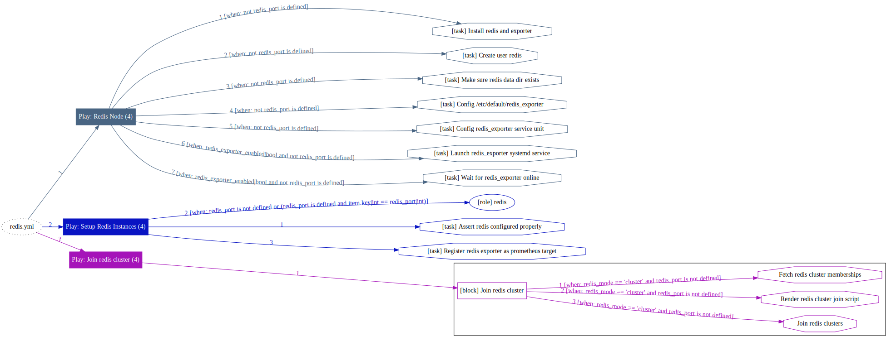
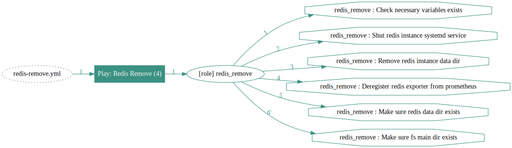

# Playbook：REDIS

> [Playbook](p-playbook.md)，定义并拉起 传统主从、集群、Sentinel模式的Redis数据库。

| 剧本 | 功能                                                         | 链接                                                         |
|--------|--------------------------------------------------------------| ------------------------------------------------------------ |
|  [`redis`](p-redis.md#redis)                        |        部署集群/主从/Sentinel模式的Redis数据库              |        [`src`](https://github.com/vonng/pigsty/blob/master/redis.yml)            |
|  [`redis-remove`](p-redis.md#redis-remove)          |        Redis集群/节点下线                                   |        [`src`](https://github.com/vonng/pigsty/blob/master/redis-remove.yml)     |


------------------

## `redis`

Deploy redis instances on nodes

```bash
./redis.yml -l <redis_cluster>
```



------------------

## `redis-remove`

Remove redis instances from nodes

```bash
./redis-remove.yml -l <redis_cluster>
./redis-remove.yml -l <redis_node>
```



