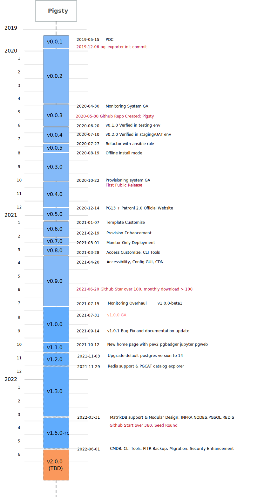

# Roadmap

## History

|    Time    | Description                                             | Release                                                                                             |
| :--------: | ------------------------------------------------------- |-----------------------------------------------------------------------------------------------------|
| 2019-05-15 | POC                                                     | [fa2ade31](https://github.com/Vonng/pg/commit/fa2ade31f8e81093eeba9d966c20120054f0646b) (v0.0.1)    |
| 2020-04-30 | First Commit                                            | [dd64677](https://github.com/Vonng/pigsty/commit/dd646775624ddb33aef7884f4f030682bdc371f8) (v0.0.2) |
| 2020-06-20 | Validation on Testing Environment                       | [v0.1.0](https://github.com/Vonng/pigsty/commit/1cf2ea5ee91db071de00ec805032928ff582453b)           |
| 2020-06-22 | Interface enhancement                                   | [v0.0.3](https://github.com/Vonng/pigsty/commit/4c5c68ccd57bc32a9e9c98aa3f264aa19f45c7ee)           |
| 2020-07-10 | PGSQL Monitoring v6 GA                                  | [v0.2.0](https://github.com/Vonng/pigsty/commit/385e33a62a19817e8ba19997260e6b77d99fe2ba)           |
| 2020-07-27 | Refactor playbooks into ansible roles                   | [v0.0.4](https://github.com/Vonng/pigsty/commit/90b44259818d2c71e37df5250fe8ed1078a883d0)           |
| 2020-08-19 | Offline Installation Mode                               | [v0.0.5](https://github.com/Vonng/pigsty/commit/0fe9e829b298fe5e56307de3f78c95071de28245)           |
| 2020-10-22 | Provisioning Solution GA                                | [v0.3.0](https://github.com/Vonng/pigsty/releases/tag/v0.3.0)                                       |
| 2020-12-14 | PostgreSQL 13 Support, Official Documentation           | [v0.4.0](https://github.com/Vonng/pigsty/releases/tag/v0.4.0)                                       |
| 2021-01-07 | Databaes Customize Template                             | [v0.5.0](https://github.com/Vonng/pigsty/releases/tag/v0.5.0)                                       |
| 2021-02-19 | Architecture Enhancement                                | [v0.6.0](https://github.com/Vonng/pigsty/releases/tag/v0.6.0)                                       |
| 2021-03-01 | Monitor only deployment                                 | [v0.7.0](https://github.com/Vonng/pigsty/releases/tag/v0.7.0)                                       |
| 2021-03-28 | Service Provision                                       | [v0.8.0](https://github.com/Vonng/pigsty/releases/tag/v0.8.0)                                       |
| 2021-04-04 | Pigsty GUI, CLI, Logging Intergration                   | [v0.9.0](https://github.com/Vonng/pigsty/releases/tag/v0.9.0)                                       |
| 2021-04-20 | Accessibility and extensibility enhancement             | [v0.9.1](https://github.com/Vonng/pigsty/releases/tag/v0.9.1)                                       |
| 2021-07-26 | v1 GA, Monitoring System Overhaul                       | [v1.0.0](https://github.com/Vonng/pigsty/releases/tag/v1.0.0)                                       |
| 2021-10-12 | HomePage, JupyterLab, Pgweb, Pev2 & Pgbadger            | [v1.1.0](https://github.com/Vonng/pigsty/releases/tag/v1.1.0)                                       |
| 2021-11-03 | Upgrade default Postgres to 14, monitoring existing pg  | [v1.2.0](https://github.com/Vonng/pigsty/releases/tag/v1.2.0)                                       |
| 2021-11-31 | PGCAT Overhaul & PGSQL Enhancement & Redis Support Beta | [v1.3.0](https://github.com/Vonng/pigsty/releases/tag/v1.3.0)                                       |
| 2021-03-31 | MatrixDB Support, Separated INFRA, NODES, PGSQL, REDIS  | [v1.4.0](https://github.com/Vonng/pigsty/releases/tag/v1.4.0)                                       |
| 2021-04-20 | Docker support & Full translation of English documents. | [v1.4.1](https://github.com/Vonng/pigsty/releases/tag/v1.4.1)                                       |
| 2022-05-31 | Pigsty CLI, Cold backup, Security Enhancement           | v1.5.0 (TBD)                                                                                        |

## Timeline

