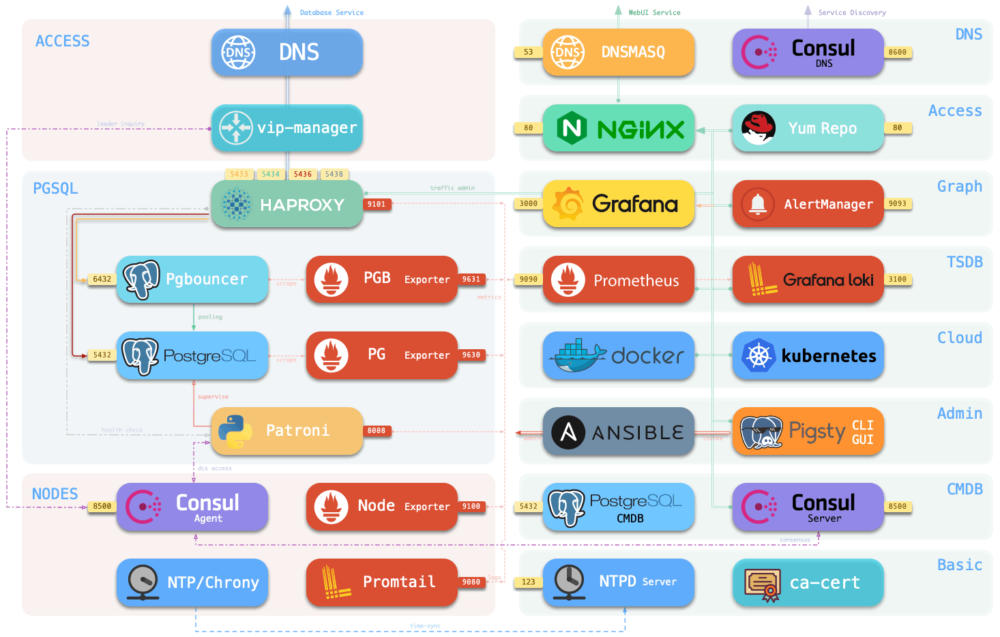

# FAQ: Frequently Asked Questions

> Here are some frequently asked questions. If you have some unlisted questions,  [Contact Us](community.md), or submit an [Issue](https://github.com/Vonng/pigsty/issues/new).


---------------------------------

* [Preparation](#Preparation)
* [Download](#Download)
* [Configuration](#Configuration)
* [Installation](#Installation)
* [Sandbox](#Sandbox)
* [Monitoring](#Monitoring)
* [INFRA](#INFRA)
* [NODES](#NODES)
* [PGSQL](#PGSQL)

## Preparation

> It would help if you ensured that the machine node hardware specifications and OS meet the installation requirements, see: [preparation](d-prepare.md).


### Node Requirement

!> At least **1Core/2GB** is required from [singleton meta](c-arch.md#singleton-deploy) installation. An **x86_64** Processor is needed. ARM is not supported yet.

Pigsty installation requires at least one node: a minimum specification of 1 core and 2 GB.

If you wish to deploy a self-managed HA PostgreSQL database cluster, it is recommended to use a minimum of 3 nodes with the exact specifications.


### OS requirements

!> **Pigsty strongly recommends using CentOS 7.8 to avoid meaningless efforts. **

Pigsty development, testing, and packaging are based on CentOS 7.8 by default. CentOS 7.6 is also fully validated. Other CentOS 7. x and its equivalents RHEL7 and Oracle Linux 7 are theoretically OK but have not been tested and verified.


### Versioning Policy

!> Please use a **version-specific** Release, not the Github **Master** branch directly, which may be in an inconsistent state.

Pigsty follows the semantic version numbering rule: `<major>. <minor>. <release>`.

Major updates imply major fundamental architectural changes, minor version number increases imply package version updates, minor API changes, and other incremental feature changes, and usually include a note on upgrade considerations.
The release is usually used for bug fixes and doc updates, and Release version increases do not change package versions (i.e., v1.0.1 and v1.0.0 correspond to the same `pkg.tgz`).

Pigsty plans to release a Minor Release every 1-3 months and a Major Release every 1-2 years.


### Sandbox provisioning

!> Use Vagrant to pull up the [local sandbox](d-sandbox.md#local-sandbox) with one click, or use Terraform to create a [cloud sandbox](d-sandbox.md#cloud-sandbox) at public cloud vendors.

Deploying Pigsty requires physical/VM nodes, and you can provide physical/VMs. However, Pigsty provides IaaS tier resource templates based on Vagrant and HashiCorp to get the VM resources needed to deploy Pigsty 4-node sandbox in one click.

A sandbox is an environment with configuration specifications, object identifiers, IP, and default database **predetermined**, consisting of a meta node and three nodes, consistent for both local and cloud versions, for development/testing/demo/explanation. Pull up the Vagrant local sandbox using the following command.

```bash
make deps    # Install homebrew, and install vagrant and virtualbox via homebrew (requires reboot)
make dns     # Write a static domain name to local /etc/hosts (requires sudo password)
make start   # Pull up a single meta node using Vagrant (4 nodes for start4)
```


## Download

> The Pigsty source package is mandatory for installing Pigsty. The offline package is recommended. Please refer to the [software download](d-prepare.md#software-provisioning).

### Where to download Pigsty source code?

!> `bash -c "$(curl -fsSL http://download.pigsty.cc/get)"`

Executing the above command will automatically download the latest stable version of `pigsty.tgz` and extract it to the `~/pigsty` dir. You can also manually download a specific version of Pigsty [source code](d-prepare.md#Pigsty-source-code) from the following location. If you need to install it in an environment without Internet, you can download it in advance and upload it to the production server via scp/sftp, etc.


```bash
https://github.com/Vonng/pigsty/releases/download/v1.5.0-beta/pigsty.tgz   # Github Release 
http://download.pigsty.cc/v1.5.0-beta/pigsty.tgz                           # China CDN
https://pan.baidu.com/s/1DZIa9X2jAxx69Zj-aRHoaw?pwd=8su9              # Baidu Yun
```


### Where to download other Pigsty packages?

!> `./download pigsty pkg app matrix`

A `download` script is provided inside the Pigsty source package for downloading Pigsty-related resources: Pigsty source package: `pigsty.tgz` / Offline software package: `pkg.tgz` / MatrixDB/Greenplum package: `matrix.tgz` / Some SaaS Mirroring and visualization application examples: `app.tgz`. The source package is mandatory, and the offline package `pkg.tgz` is recommended `. /download pkg` will automatically download and extract offline packages.

```bash
# download to /tmp/*.tgz
./download pigsty.tgz   # download pigsty source tarball
./download pkg.tgz      # download pigsty offline pkgs
./download app.tgz      # download extra pigsty apps
./download matrix.tgz   # download matrixdb packages
# download and extract
./download pigsty       # download and extract pigsty to ~/pigsty
./download pkg          # download and extract pkg    to /www/pigsty
./download app          # download and extract app    to ~/app
./download matrix       # download and extract matrix to /www/matrix
```


### Where to download Pigsty offline software packages?

!> `. /download pkg` or download it automatically when prompted during configuration.

Pigsty's [offline package](d-prepare.md#Pigsty-offline-package) `pkg.tgz` packs the required software dependencies.

In [`. /configure`](v-config.md#configure), if the offline package `/tmp/pkg.tgz` does not exist, the wizard will prompt the user to download it, "Y" will automatically download it from Github or CDN; "N ", the download will be skipped. You can also download the offline package manually from the following location and place it in `/tmp/pkg.tgz`. Then, it will be used automatically when installing.

```bash
curl https://github.com/Vonng/pigsty/releases/download/v1.5.0-beta/pkg.tgz -o /tmp/pkg.tgz
curl http://download.pigsty.cc/v1.5.0-beta/pkg.tgz -o /tmp/pkg.tgz         # China CDN
https://pan.baidu.com/s/1DZIa9X2jAxx69Zj-aRHoaw?pwd=8su9              # Baidu Yun
```


### Download RPMs too slow

!> Download from upstream without offline packages, or just remove the problem package and fill in the gaps from available sources

Pigsty offline packages are made based on CentOS 7.8. Otherwise, there may be RPM package dependency issues.

If it is only an isolated RPM dependency issue, you can remove the RPM package in `/www/pigsty` and delete the marker file `/www/pigsty/repo_complete`. 

And then, when performing the normal installation process, Pigsty will download the missing dependent RPM packages from the upstream or other locally available source specified by [`repo_upsteram`](v-infra.md#repo_upstream). If there is no available Internet access or local source, please use the same OS environment with a networked node to [make an offline package,](t-offline.md#make-offline-pkg) and then copy it to the production environment for use.


## Configuration

> Pigsty's installation, configuration, and deployment are all one-click, with the only [configuration](#v-config.md) being the core of Pigsty.

### What is the configured doing?

!> Detect the environment, generate the configuration, enable the offline package (optional), and install the essential tool Ansible.

After downloading the Pigsty source package and unpacking it, you need first to execute `. /configure` to complete the environment [configure](v-config.md#configure).

Pigsty will check if the current environment meets the installation requirements and generate the recommended config file `pigsty.yml` based on the current machine environment. In the `files/conf/` directory, there are a series of config files named `pigsty-*.yml` that can be used as reference templates for configuration in different scenarios, specified by `-m`.

The Configure installs Ansible, which generally comes with this package as the default source for the node, or from within the offline pkg if it exists.


### Where is Pigsty's config file?

!> The source root `pigsty.yml` is the default, unique config source.

Pigsty has one and only one [config file](v-config.md#config-file): [`pigsty.yml`](https://github.com/Vonng/pigsty/blob/master/pigsty.yml) in the source root dir, which describes the state of the entire environment.

In `ansible.cfg` in the same dir: `inventory = pigsty.yml` specifies this file as the default config file, or you can use the `-i` parameter when executing the playbook, restricting the use of a config file from another location. In addition, if you use [CMDB](t-cmdb.md) as the config source, please modify the config in CMDB.


### Placeholder IP in the config file

!> Pigsty uses `10.10.10.10` as a placeholder for the current node IP, which will be replaced with the primary IP of the current node during the configure.

When the configure detects multiple NICs with multiple IPs on the current node, the config wizard will prompt for the **primary** IP to be used, i.e., **the IP used by the user to access the node from the internal network**. Note that please do not use the public IP.

This IP will be used to replace `10.10.10.10` in the config file template.


### Does the user need to modify any config?

!> Usually, in a singleton installation, there is no need to make any adjustments to the config files.

Pigsty provides 220+ config parameters to customize the entire infra/platform/database.  However, there are a few parameters that can be adjusted in advance if needed:

* When accessing web service components, the domain name is [`nginx_upstream`](v-infra.md#nginx_upstream) (some services can only be accessed using the domain name through the Nginx proxy).
* Pigsty assumes that a `/data` dir exists to hold all data; you can adjust these paths if the data disk mount point differs from this.


## Installation


### What was executed during installation?

!> When running `make install`, `ansible-playbook` is called to perform the preconfigured playbook [`infra.yml`](infra.yml) to complete the installation on the meta node.

The `configure` generates the config file by default and marks the current node as a [meta node](c-nodes.md#meta-node). And `make install` executes the Pigsty meta node initialization playbook [`infra.yml`](infra.yml), deploys the infra components, and initializes the meta node like a normal node on which a singleton PostgreSQL is deployed as CMDB.


### Downloading RPM packages is too slow

!> It is best to use [offline packages](t-offline.md) or configure a [proxy server](v-infra.md#CONNECT) or a local repo.

Pigsty has used domestic yum repos for downloads whenever possible. However, a few packages are still affected by **GFW**, resulting in slow downloads, such as related software downloaded directly from Github. The following solutions are available.

1. Pigsty provides an [offline package](t-offline.md), which pre-packages all software and its dependencies, and can skip the step of downloading software from the Internet.

2. Specify a proxy server via [`proxy_env`](v-infra.md#proxy_env) to download via proxy server.

3. Use other domestic available repos via [`repo_upsteram`](v-infra.md#repo_upstream).


### Remote nodes are not accessible via SSH commands

!> Specify a different port via the host instance-level [`ansible connection parameters`](v-infra.md#ansible_host).

Consider using **Ansible connection parameters** if the target machine is hidden behind an SSH springboard machine or if some customizations have been made that cannot be accessed directly using `ssh ip`. Additional SSH ports can be specified with `ansible_port` or `ansible_host` for SSH Alias.

```bash
pg-test:
  vars: { pg_cluster: pg-test }
  hosts:
    10.10.10.11: {pg_seq: 1, pg_role: primary, ansible_host: node-1 }
    10.10.10.12: {pg_seq: 2, pg_role: replica, ansible_port: 22223, ansible_user: admin }
    10.10.10.13: {pg_seq: 3, pg_role: offline, ansible_port: 22224 }
```


### Password required for remote node SSH and SUDO

!> Use the `-k` and `-K` parameters, enter the password at the prompt, and refer to [admin provisioning](d-prepare.md#admin-provisioning).

**When performing deployments and changes**, the admin user used **must** have `ssh` and `sudo` privileges for all nodes. Password-free is not required. You can pass in ssh and sudo passwords via the `-k|-K` parameter when executing the playbook or even use another user to run the playbook via `-e`[`ansible_host`](v-infra.md#connect)`=<another_user>`. However, Pigsty strongly recommends configuring SSH **passwordless login** with passwordless `sudo` for the admin user.


## Sandbox

> The Pigsty sandbox provides a standard development/test/demo environment that can be quickly pulled up locally with Vagrant or in the cloud with Terraform.


### Vagrant sandbox is too slow to start for the first time

!> The first time you use Vagrant to pull up a particular OS repo, it will download the corresponding BOX.

Pigsty sandboxes use CentOS 7 by default, and Vagrant will download the `CentOS/7` ISO repo Box the first time the VM is started.

Using a proxy may increase the download speed. Downloading CentOS7 Box only needs to be done the first time the sandbox is started, and will be reused directly when the sandbox is subsequently rebuilt.

Users can also choose to create the required VM manually by downloading the CentOS 7 installation ISO repos.


### **RPMs error on Aliyun CentOS 7.8 VM**

!> Aliyun CentOS 7.8 server has DNS caching service `nscd` installed by default. Just remove it.

Aliyun's CentOS 7.8 repo has `nscd` installed by default, locking out the glibc version, which can cause RPM dependency errors during installation.

```bash
"Error: Package: nscd-2.17-307.el7.1.x86_64 (@base)"
```

Run `yum remove -y nscd` on all nodes to resolve this issue, and with Ansible, you can batch.

```bash
ansible all -b -a 'yum remove -y nscd'
```


-----------

### Virtual machine time out of sync

!> `sudo ntpdate -u pool.ntp.org` or use `make sync4`.

The time within the VM may not be consistent with the host after the Virtualbox shutdown. You can try the following command: `make sync` to force NTP time sync.

```bash
sudo ntpdate -u pool.ntp.org
make sync4 # Use NTP POOL
make ss    # Synchronize with Aliyun NTP server
```

It can solve the problem of no data on the monitoring system after a long hibernation or shutdown and reboot. In addition, restarting the VM can also force a time reset without Internet access: `make dw4; make up4`.


### Why not use containers to hold the database?

!> Using Docker/Kubernetes to bloom databases is not mature.

While Docker is good for improving environment compatibility, databases are not among the best scenarios for container use. Docker and Kubernetes have usage thresholds. Pigsty uses bare-metal deployment.

Pigsty was designed initially with a containerized cloud in mind, which is reflected in its declarative implementation of config definitions. It does not require much modification to migrate and transform to a cloud-native solution. It will be refactored using the Kubernetes Operator approach.


## Monitoring

### How much is the performance storage overhead?

!> The monitoring query overhead is negligible, on the order of 100 ms, once every 10 seconds, and a typical instance generates about 2k ~ 5k time series.

Storage depends on the complexity of the user database (workload). For reference: 200 production database instances produce about 16GB of monitoring data in 1 day. Pigsty keeps two weeks of monitoring data by default, which parameters can adjust.


### Can you monitor existing PG instances?

!> Pigsty does not commit to the quality of monitoring of external instances: PostgreSQL created by Pigsty performs significantly better than hand-crafted instances in most cases.

External databases created by non-Pigsty provisioning modes can be deployed using [monly mode](d-monly.md).

If Pigsty can manage the instance, consider deploying components such as `node_exporter`, `pg_exporter`, and `promtail` on the target node in the same way as the standard deployment.

Suppose only the URL to access that database (e.g., RDS cloud database instance) is available; in this case, you can use the **Monly Deployment** mode, where Pigsty monitors the remote PG instance through the `pg_exporter` instance deployed locally on the meta node.


### How do we monitor existing PG instances?

!> 

### Why can you still see the removed monitoring objects?

!> Use [`pgsql-remove.yml`](p-pgsql.md#pgsql-remove) playbook to remove the monitor target.


## INFRA

### What components are included in the infra?

!> Pigsty provides a complete PaaS environment. Please refer to [**System Architecture: Infra**](c-infra.md#infrastructure) for more details.



Ansible/Pigsty CLI for launch management and deployment; PostgreSQL on meta nodes as CMDB; Consul Server as meta DB for HA; NTPD and DNS for time and domain name resolution base services; Docker as stateless application deployment base; Prometheus for monitoring metrics, Loki for log collection, Grafana for monitoring/visualization, AlertManager for aggregated alerts, YumRepo for providing local software sources, and Nginx for collecting all WebUI class service access portals externally.

### Can you use an existing DCS cluster?

!> Pigsty will provide DCS services on a meta node by default, but it is more recommended to use an external cluster of multiple nodes for HA DCS services.

Fill in the [`dcs_servers`](v-infra.md#dcs_servers) with the corresponding cluster, i.e., the external DCS cluster.

There is no correspondence between DCS Server and the meta node: by default, Pigsty installs a single-node Consul Server on the meta node. If the IP of the current node is defined in `dcs_servers` when performing node initialization, the node is configured with DCS Server services. DCS is used for HA, the primary selection of another database. It is recommended to use a dedicated external DCS cluster of 3 to 5 nodes in a production environment.


## NODES


-----------

### Abort because consul instance already exists

!> Pigsty provides a DCS misdeletion protection mechanism, configuring `dcs_clean = true`.

When the Consul service of the target node already exists, [`nodes.yml`](p-nodes.md#nodes) will act on the [`dcs_clean`](v-nodes.md#dcs_clean) parameter, and if true, the existing Consul will be erased during initialization.

Pigsty also provides the corresponding [SafeGuard](p-nodes.md#SafeGuard) parameter: [`dcs_safeguard`](v-nodes.md#dcs_safeguard).

These parameters can be modified in the config file `pigsty.yml` or specified at playbook execution time with the extra parameter mechanism.

```bash
./nodes.yml -e dcs_clean=clean
```


-----------


## PGSQL

-----------

### Abort because Postgres instance already exists

!> Pigsty provides a DCS misdeletion protection mechanism, configuring `dcs_clean = true`.

When the Consul service of the target node already exists, [`nodes.yml`](p-nodes.md#nodes) will act on the [`dcs_clean`](v-nodes.md#dcs_clean) parameter, and if true, the existing Consul will be erased during initialization.

Pigsty also provides the corresponding [SafeGuard](p-nodes.md#SafeGuard) parameter: [`dcs_safeguard`](v-nodes.md#dcs_safeguard).

These parameters can be modified in the config file `pigsty.yml` or can be specified at playbook execution time with the extra parameter mechanism.

```bash
./pgsql.yml -e pg_clean=clean
```


-----------


### How to ensure HA of PostgreSQL?

!> Patroni as HA Agent, Consul as DCS, Haproxy as default traffic distributor, see [HA Cluster](c-pgsql.md#High-Availability).

Pigsty uses Patroni to host Postgres, and Patroni uses Consul to reach a consensus on the leader. When the primary fails beyond a threshold (30 seconds), a new election is triggered, and the winner becomes the new cluster primary, with all other replicas following the new cluster primary. The original failed primary is automatically demoted to replica and follows the new primary when it comes online.

The client uses the HAProxy service to access the database, and HAproxy uses an HTTP health check to get the primary-replica role information from Patroni and distribute the traffic accordingly. Pigsty's database cluster members are idempotent, so as long as anyone instance of the cluster is still alive, read-write and read-only traffic can continue to work and access port 5433 of any one instance. Access to port 5433 of any instance ensures access to the cluster's central database read and write services.

The availability of DCS is guaranteed by multi-node consensus, so deploying three or more multi-nodes in production environments or using external DCS clusters is recommended.


### How to ensure PostgreSQL cluster failure without data loss?

!> Use the `pg_conf: crit.yml` template, or enable sync replication manually.

Crit templates are optimized for data consistency and persistence, with sync commits and data checksums enabled by default. It can ensure no data loss during failover and timely detection of reported silent data corruption due to storage failure, power failure, and other abnormal conditions.


### Data corruption causes replica failure

!> Find the machine in question, modify the patroni config file `clonefrom: false` and reload it to take effect.

Pigsty enables the `cloneform: true` feature by default for all the PGSQL clusters. Suppose an instance cannot complete replica production because of corrupt data files. You can modify the Patroni config file on that instance to set `clonefrom` to `false` to avoid pulling data from the evil instance.
