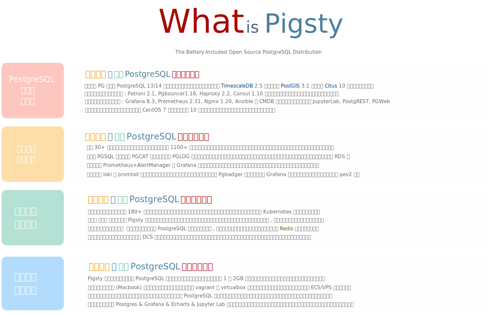

# Pigsty

## v1.0.0 中文文档

**开箱即用**的**开源**PostgreSQL**发行版**

[](/)

?> 此文档可通过浏览器获得更佳阅览效果：`make doc` 或 `make docsify`。[在线中文文档](http://doc.pigsty.cc/#/zh-cn/) / [EN](http://doc.pigsty.cc/)

> Pigsty (/ˈpɪɡˌstaɪ/) 是 PostgreSQL In Graphic STYle 的缩写，即 “图形化Postgres”。

## Pigsty是什么？

* Pigsty是**开箱即用的PostgreSQL[发行版](#发行版)**

* Pigsty是**全面专业的PostgreSQL[监控系统](#监控系统)**

* Pigsty是**简单易用的PostgreSQL高可用[部署方案](#部署方案)**

* Pigsty是**便捷全能的[本地沙箱](#沙箱环境)与[数据分析可视化环境](#数据分析与可视化)**

* Pigsty是**自由免费的开源软件，基于Apache 2.0协议开源**





## 亮点特性

* **开箱即用**的软件系统，一键拉起生产环境所需的功能套件，**开源免费**。
* 全面专业的[**监控系统**](#监控系统)，基于 [Grafana](https://grafana.com/)、[Prometheus](https://prometheus.io/)与[pg_exporter](https://github.com/Vonng/pg_exporter) 等开源组件。
* 简单易用的[**部署方案**](#部署方案)，基于[Ansible](https://docs.ansible.com/ansible/latest/index.html)的裸机部署，却提供类似Kubernetes的使用体验。
* **高可用**数据库集群架构，基于Patroni实现，具有秒级故障自愈能力，久经生产环境考验。集成负载均衡，成员对外表现等价，提供类似分布式数据库的体验。
* 基于DCS的**服务发现**与配置管理，维护管理自动化，智能化，无需人工维护元数据。
* 无需互联网访问与代理的**离线安装**模式，快速、安全、可靠。
* **代码定义**的基础设施，可配置，可定制，可扩展。
* 基于PostgreSQL13（支持14beta），打包PostGIS，Timescale，Citus等强力扩展。 
* 集成Echarts，Jupyterlab等工具，可作为数据分析与可视化的集成开发环境。
* 架构方案经过长时间大规模的生产环境验证（200余节点，64C|400GB|3TB，18个月）


### 发行版

**发行版（Distribution）** 指的是由内核及其一组软件包组成的整体解决方案。例如Linux是一个操作系统内核，而RedHat，Debian，SUSE则是基于此内核的操作系统发行版。

Pigsty将集群部署，扩容缩容，主从复制，故障切换，流量代理，连接池，服务发现，访问控制，监控系统，告警系统，日志采集等生产级成熟**解决方案**封装为发行版，一次性解决在生产环境使用PostgreSQL数据库的问题，真正做到**开箱即用**。


### 监控系统

监控系统提供了对系统状态的度量，是运维管理工作的基石。PostgreSQL是世界上最好的开源关系型数据库，但其生态中却缺少一个**足够好**的监控系统。Pigsty旨在解决这一问题：交付最好的**PostgreSQL监控系统**。


Pigsty带有一个针对大规模数据库集群管理而设计的专业级PostgreSQL监控系统。包括约1200**类**指标，20+监控面板，上千个监控仪表盘，覆盖了从全局大盘到单个对象的详细信息。与同类产品相比在指标的覆盖率与监控面板丰富程度上一骑绝尘，为专业用户提供无可替代的价值。

Pigsty监控系统由目前由三个紧密联系的应用共同组成：间接收集并呈现监控 **指标（Metrics）** 数据的 `pgsql`，直接浏览数据库系统 **目录（Catalog）** 的 `pgcat`，以及呈现Loki与Promtail收集日志并分析CSVLOG样本的 `pglog`。

Pigsty监控系统基于业内最佳实践，采用Prometheus、Grafana作为监控基础设施。开源开放，定制便利，可复用，可移植，没有厂商锁定。可与已有PostgreSQL数据库实例集成，亦可用于其他数据库或应用的监控。


### 部署方案

数据库是管理数据的软件，管控系统是管理数据库的软件。

Pigsty内置了一套以Ansible为核心的数据库管控方案，并基于此封装了命令行工具与图形界面。它集成了数据库管理中的核心功能：包括数据库集群的创建，销毁，扩缩容；用户、数据库、服务的创建等。

Pigsty采纳 *Infra as Code* 的设计哲学，使用类似 Kubernetes 的声明式配置，通过大量可选的配置选项对数据库与运行环境进行描述，并通过幂等的预置剧本自动创建所需的数据库集群，提供私有云般的使用体验。

用户只需要通过配置文件或图形界面描述“自己想要什么样的数据库”，而无需关心Pigsty如何去创建或修改它。Pigsty会根据用户的配置文件清单，在几分钟内从裸机节点上创造出所需的数据库集群。

例如，在三台机器上创建一主两从的数据库集群`pg-test`，只需要几行配置与一行命令`pgsql.yml -l pg-test`，即可创建出如下一节所介绍的高可用数据库集群。

```yaml
pg-test:
  hosts:
    10.10.10.11: {pg_seq: 1, pg_role: primary}
    10.10.10.12: {pg_seq: 2, pg_role: replica}
    10.10.10.13: {pg_seq: 3, pg_role: replica}
  vars: 
    pg_cluster: pg-test
    vip_address: 10.10.10.3
```


<details>
<summary>使用更多参数对数据库集群进行定制</summary>


```yaml
#----------------------------------#
# cluster: pg-test (3-node)        #
#----------------------------------#
pg-meta:                                # required, ansible group name , pgsql cluster name. should be unique among environment
  hosts:                                # `<cluster>.hosts` holds instances definition of this cluster
    10.10.10.11: {pg_seq: 1, pg_role: primary}   # primary instance, leader of cluster
    10.10.10.12: {pg_seq: 2, pg_role: replica}   # replica instance, follower of leader
    10.10.10.13: {pg_seq: 3, pg_role: offline}   # offline instance, replica that allow offline access

    #---------------
    # mandatory                         # all configuration above (`ip`, `pg_seq`, `pg_role`) and `pg_cluster` are mandatory
    #---------------
  vars:                                 # `<cluster>.vars` holds CLUSTER LEVEL CONFIG of this pgsql cluster
    pg_cluster: pg-meta                 # required, pgsql cluster name, unique among cluster, used as namespace of cluster resources

    #---------------
    # optional                          # all configuration below are OPTIONAL for a pgsql cluster (Overwrite global default)
    #---------------
    pg_version: 13                      # pgsql version to be installed (use global version if missing)
    node_tune: tiny                     # node optimization profile: {oltp|olap|crit|tiny}, use tiny for vm sandbox
    pg_conf: tiny.yml                   # pgsql template:  {oltp|olap|crit|tiny}, use tiny for sandbox
    patroni_mode: pause                 # entering patroni pause mode after bootstrap  {default|pause|remove}
    patroni_watchdog_mode: off          # disable patroni watchdog on meta node        {off|require|automatic}
    pg_lc_ctype: en_US.UTF8             # use en_US.UTF8 locale for i18n char support  (required by `pg_trgm`)

    #---------------
    # biz databases                     # Defining Business Databases (Optional)
    #---------------
    pg_databases:                       # define business databases on this cluster, array of database definition
      # define the default `meta` database
      - name: meta                      # required, `name` is the only mandatory field of a database definition
        baseline: cmdb.sql              # optional, database sql baseline path, (relative path among ansible search path, e.g files/)
        # owner: postgres               # optional, database owner, postgres by default
        # template: template1           # optional, which template to use, template1 by default
        # encoding: UTF8                # optional, database encoding, UTF8 by default. (MUST same as template database)
        # locale: C                     # optional, database locale, C by default.  (MUST same as template database)
        # lc_collate: C                 # optional, database collate, C by default. (MUST same as template database)
        # lc_ctype: C                   # optional, database ctype, C by default.   (MUST same as template database)
        # tablespace: pg_default        # optional, default tablespace, 'pg_default' by default.
        # allowconn: true               # optional, allow connection, true by default. false will disable connect at all
        # revokeconn: false             # optional, revoke public connection privilege. false by default. (leave connect with grant option to owner)
        # pgbouncer: true               # optional, add this database to pgbouncer database list? true by default
        comment: pigsty meta database   # optional, comment string for this database
        connlimit: -1                   # optional, database connection limit, default -1 disable limit
        schemas: [pigsty]               # optional, additional schemas to be created, array of schema names
        extensions:                     # optional, additional extensions to be installed: array of schema definition `{name,schema}`
          - {name: adminpack, schema: pg_catalog}    # install adminpack to pg_catalog and install postgis to public
          - {name: postgis, schema: public}          # if schema is omitted, extension will be installed according to search_path.

      # define an additional database named grafana & prometheus (optional)
      - { name: grafana,    owner: dbuser_grafana    , revokeconn: true , comment: grafana    primary database }
      - { name: prometheus, owner: dbuser_prometheus , revokeconn: true , comment: prometheus primary database }

    #---------------
    # biz users                         # Defining Business Users (Optional)
    #---------------
    pg_users:                           # define business users/roles on this cluster, array of user definition
      # define admin user for meta database (This user are used for pigsty app deployment by default)
      - name: dbuser_meta               # required, `name` is the only mandatory field of a user definition
        password: md5d3d10d8cad606308bdb180148bf663e1  # md5 salted password of 'DBUser.Meta'
        # optional, plain text and md5 password are both acceptable (prefixed with `md5`)
        login: true                     # optional, can login, true by default  (new biz ROLE should be false)
        superuser: false                # optional, is superuser? false by default
        createdb: false                 # optional, can create database? false by default
        createrole: false               # optional, can create role? false by default
        inherit: true                   # optional, can this role use inherited privileges? true by default
        replication: false              # optional, can this role do replication? false by default
        bypassrls: false                # optional, can this role bypass row level security? false by default
        pgbouncer: true                 # optional, add this user to pgbouncer user-list? false by default (production user should be true explicitly)
        connlimit: -1                   # optional, user connection limit, default -1 disable limit
        expire_in: 3650                 # optional, now + n days when this role is expired (OVERWRITE expire_at)
        expire_at: '2030-12-31'         # optional, YYYY-MM-DD 'timestamp' when this role is expired  (OVERWRITTEN by expire_in)
        comment: pigsty admin user      # optional, comment string for this user/role
        roles: [dbrole_admin]           # optional, belonged roles. default roles are: dbrole_{admin,readonly,readwrite,offline}
        parameters: {}                  # optional, role level parameters with `ALTER ROLE SET`
        # search_path: public         # key value config parameters according to postgresql documentation (e.g: use pigsty as default search_path)
      - {name: dbuser_view , password: DBUser.Viewer  ,pgbouncer: true ,roles: [dbrole_readonly], comment: read-only viewer for meta database}

      # define additional business users for prometheus & grafana (optional)
      - {name: dbuser_grafana    , password: DBUser.Grafana    ,pgbouncer: true ,roles: [dbrole_admin], comment: admin user for grafana database }
      - {name: dbuser_prometheus , password: DBUser.Prometheus ,pgbouncer: true ,roles: [dbrole_admin], comment: admin user for prometheus database }
```

</details>


### 高可用集群

Pigsty创建的数据库集群是**分布式**、高可用的数据库集群。从效果上讲，**只要集群中有任意实例存活，集群就可以对外提供完整的读写服务与只读服务**。数据库集群中的每个数据库实例在**使用**上都是**幂等**的，任意实例都可以通过内建负载均衡组件提供完整的读写服务。数据库集群可以自动进行故障检测与主从切换，普通故障能在几秒到几十秒内自愈，且期间只读流量不受影响。


Pigsty使用Patroni + Consul（`etcd`为可选）进行故障检测、Fencing、以及自动切换，通过HAProxy、VIP或DNS实现流量的自动切换。

Pigsty提供多种可选的**数据库接入**模式，用户可根据自身基础设施情况灵活选择。例如，Pigsty沙箱默认使用基于如上图所示的二层VIP+Haproxy的接入层方案，Haproxy**幂等**地部署在集群的每个实例上，任何一个或多个Haproxy实例都可以作为集群的负载均衡器，并通过健康检查进行流量分发，对外屏蔽集群成员的区别。


### 沙箱环境

尽管Pigsty是针对大规模生产环境PostgreSQL数据库管理的解决方案，但它也可以完整运行于1核1GB的微型虚拟机中。

**Pigsty沙箱** 是基于 Vagrant 与 Virtualbox 的本地实例，您可以在自己的笔记本电脑或云虚拟机一键拉起Pigsty沙箱环境（与minikube拉起kubernetes沙箱类似）。
除机器规格与少量配置参数，沙箱环境可与生产环境部署保持高度一致，因此非常适合构建本地Devbox，公共测试环境，进行开发、测试与仿真、进行通过自带的监控系统获取实时的数据反馈。

Pigsty提供两种规格的沙箱：**单节点**，与**四节点**。四节点沙箱可以完整演示Pigsty的功能，充分探索高可用架构与监控系统的能力。单节点沙箱则适合用于个人开发、实验、学习；作为数据分析与可视化的环境；以及设计、演示、分发交互式数据应用。


<details>
<summary>沙箱所需机器规格</summary>

**系统要求**

* Linux内核，x86_64处理器架构
* 使用 CentOS 7 / RedHat 7 / Oracle Linux 7 或其他等效操作系统发行版
* 强烈推荐使用 CentOS 7.8.2003 x86_64 ，这是经过长时间生产环境的测试的操作系统环境

**单节点基本规格**

* 最低规格：1核，1GB （容易OOM，建议内存至少2GB）
* 推荐规格：2核，4GB （沙箱默认配置）
* 将部署一个单机PostgreSQL实例`pg-meta-1`
* 在沙箱中，该节点的IP固定为`10.10.10.10`

**四节点基本规格**

* 管理节点要求同**单节点**
* 将部署一个额外的三节点PostgreSQL数据库集群`pg-test`
* 普通数据库节点，最低规格：1核，1GB，建议使用2GB内存。

</details>


### 数据分析与可视化

Pigsty带有完善的数据分析工具集，如Jupyterlab，IPython，PostgreSQL，Grafana，Echarts。用户可以将Pigsty单机沙箱用作数据分析与可视化的集成开发环境：使用SQL与Python进行数据处理，并通过Grafana与Echarts快速制作交互式数据应用。

Pigsty自带有两个样例：新冠疫情数据可视化 `covid`，全球地表气象站数据查询 `isd` 。 


### 开源软件

Pigsty基于Apache 2.0协议开源，可以免费用于商业目的。

改装与衍生需遵守[Apache License 2.0 ](https://raw.githubusercontent.com/Vonng/pigsty/master/LICENSE)的显著声明条款。


## 快速上手

拉起Pigsty最少只需要三条命令：**下载**，**配置**与**安装**。


准备新机器一台：Linux x86_64 CentOS 7.8，配置免密码`sudo`与`ssh`登陆权限。

```bash
# 离线下载
# curl -SL https://github.com/Vonng/pigsty/releases/download/v1.0.0/pigsty.tgz -o ~/pigsty.tgz  
# curl -SL https://github.com/Vonng/pigsty/releases/download/v1.0.0/pkg.tgz    -o /tmp/pkg.tgz

# 常规安装
git clone https://github.com/Vonng/pigsty && cd pigsty
./configure
make install
```

细节请参考[快速开始](s-install.md)；如需运行[本地沙箱](s-sandbox.md)，可运行以下命令（MacOS）

```bash
make deps   # 安装homebrew，并通过homebrew安装vagrant与virtualbox（需重启）
make dns    # 向本机/etc/hosts写入静态域名 (需sudo输入密码)
make start  # 使用Vagrant拉起单个meta节点 (start4则为4个节点)
make demo   # 使用单节点Demo配置并安装    (demo4则为4节点demo)
```

## Demo

[http://g.pigsty.cc](http://g.pigsty.cc) 提供了公开的演示。您可以在这里浏览**Pigsty监控系统**提供的功能。

Pigsty部署方案与其他功能则可以通过[**沙箱环境**](s-sandbox.md)体验。


## 关于

作者：[冯若航](https://vonng.com) (rh@vonng.com)

