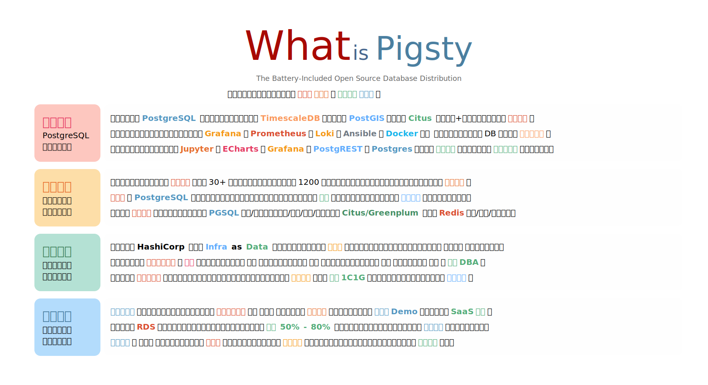
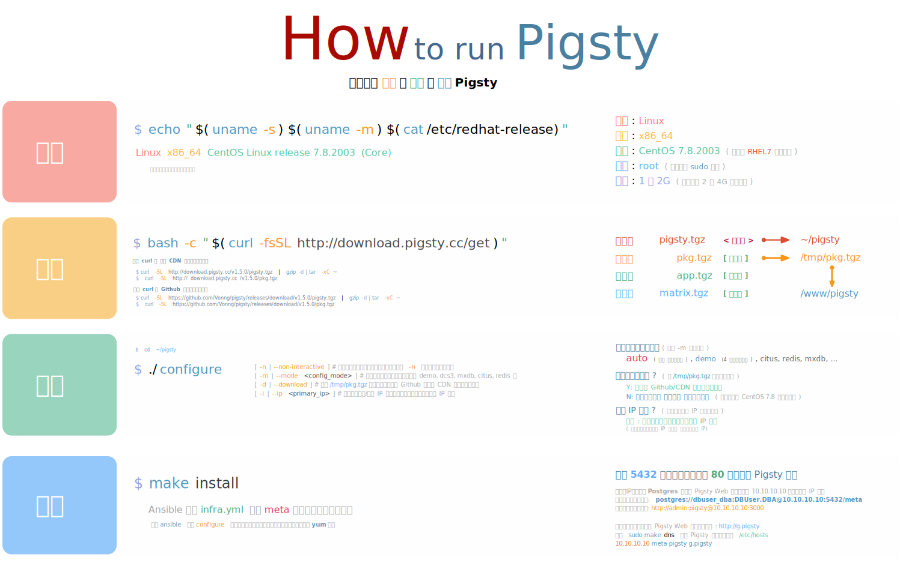

# Pigsty

## v1.5.0 中文文档

**开箱即用的开源数据库发行版**

[](/)

> 最新版本: [v1.5.0-rc](https://github.com/Vonng/pigsty/releases/tag/v1.5.0-rc)  |  [Github项目](https://github.com/Vonng/pigsty) | [公开Demo](http://home.pigsty.cc)
>
> 文档地址: [英文文档](https://pigsty.cc/) | [中文文档](https://pigsty.cc/#/zh-cn/) | [Github Pages文档](https://vonng.github.io/pigsty/#/)


## Pigsty是什么？

[](s-feature.md)

**Pigsty**是开箱即用的开源数据库[发行版](s-feature.md#PostgreSQL数据库发行版)，以 [PostgreSQL](https://www.postgresql.org/) 为核心，打包[TimescaleDB](https://www.timescale.com/)，[PostGIS](https://postgis.net/)，[Citus](https://www.citusdata.com/)与上百余+生态扩展插件，整合了大规模生产环境所需的[PaaS基础设施](c-infra.md#基础设施) 与[数据分析](s-feature.md#数据分析与可视化应用)组件：将顶级DBA的经验沉淀为软件，一次性解决使用数据库时会遇到的各类问题。

Pigst还是自动驾驶的[运维解决方案](s-feature.md#智能监控管控运维解决方案)，带有全面专业的[监控系统](s-feature.md#极致入微可观测)，与简单易用的[高可用](s-feature.md#自动驾驶高可用)数据库部署管控方案。用户只需声明自己想要什么样的数据库，即可将其一键创建：[PostgreSQL](c-pgsql.md) / [Redis](c-redis.md) / [Greenplum](d-matrixdb.md) 。

Pigsty是简单易用的[开发者工具箱](s-feature.md#数据库即代码开发者工具箱)，无论是下载、安装、还是部署迁移备份恢复扩缩容，都能一键完成。基于[Vagrant](d-sandbox.md#Vagrant)的[本地沙箱](d-sandbox.md)与[Terraform](d-sandbox.md#terraform)的多云部署能力，让Pigsty在所有环境中都能一键拉起，带来统一的使用体验。

Pigsty用途广泛，可支持各类上层[SaaS应用](s-feature.md#SaaS软件应用)或制作[大屏/Demo](s-feature.md#数据分析与可视化应用)。相比使用云数据库，数据安全[自主可控](s-feature.md#自主可控)，简运维、低成本、全功能、优体验，可以显著节省数据库运维人力，并节约 **50% ~ 80%** 的数据库[综合成本](s-feature.md#降本增效)。对各类企业用户、ISV、个人用户都具有显著的价值与吸引力。

请参考 [亮点特性](s-feature.md) 一节，获取更多关于Pigsty产品功能特点的介绍。


## 快速上手

准备全新机器节点一台，**Linux x86_64 CentOS 7.8**，确保您可以登陆该节点并免密码执行`sudo`命令。

```bash
bash -c "$(curl -fsSL http://download.pigsty.cc/get)" # 下载
cd ~/pigsty && ./configure                            # 配置
make install                                          # 安装
```

更多安装细节，请参考 [快速上手](s-install.md)。

[](s-install.md)


## 协议

Pigsty基于Apache 2.0协议开源，可以免费用于商业目的，但改装与衍生需遵守[Apache License 2.0](https://raw.githubusercontent.com/Vonng/pigsty/master/LICENSE)的显著声明条款。如需帮助或专业支持，请参阅[社区交流](community.md)。


## 关于

[](https://github.com/Vonng/pigsty)

作者: [冯若航](https://vonng.com/en/) ([rh@vonng.com](mailto:rh@vonng.com))

协议: [Apache 2.0 License](https://github.com/Vonng/Capslock/blob/master/LICENSE)

备案: [浙ICP备15016890-2号](https://beian.miit.gov.cn/)
