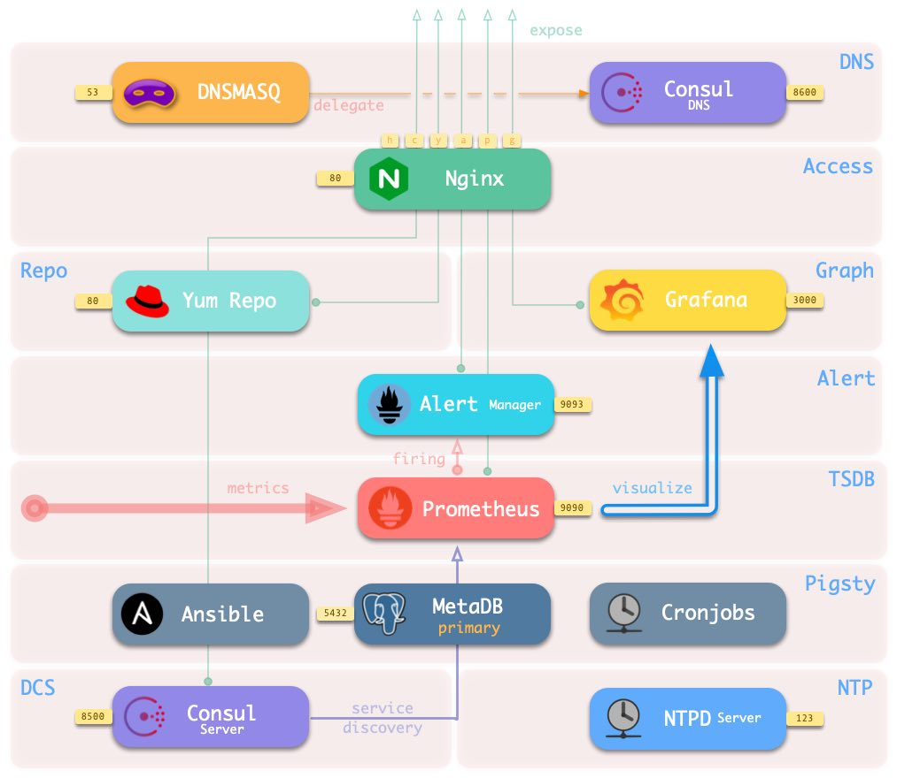
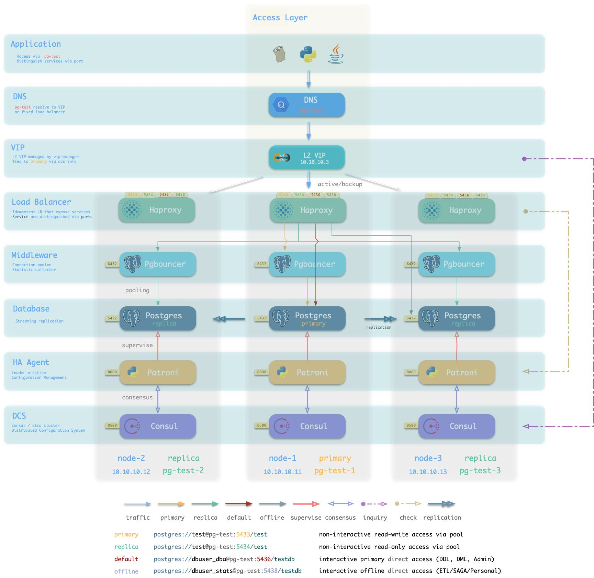
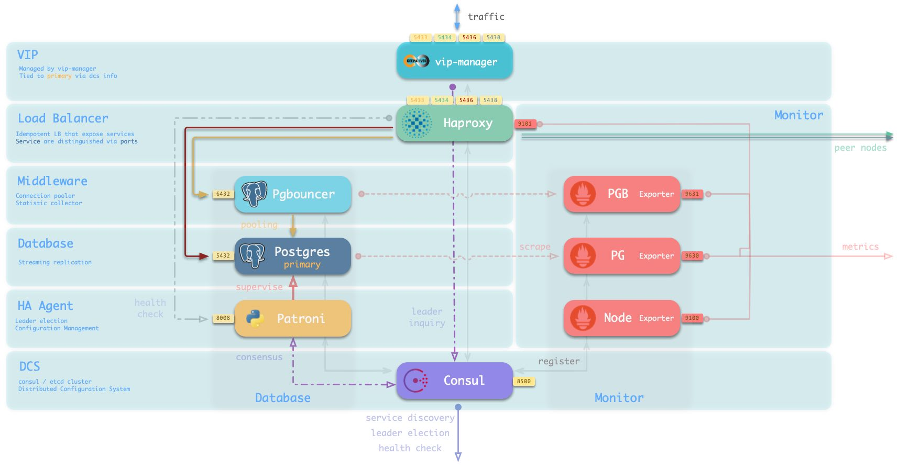

## 系统架构

**一套Pigsty部署在架构上分为两个部分：一套基础设施，与多套数据库集群**

* **[基础设施](#基础设施)（Infra）** ：部署于**管理节点**上，监控，DNS，NTP，DCS，Yum源等**基础服务**。
* **[数据库集群](#数据库集群)（PgSQL）**：部署于**数据库节点**上，以集群为单位对外提供**数据库服务**。

基础设施与数据库集群都是**松耦合**关系，移除基础设施不会影响数据库集群的运行（DCS除外）。

!> DCS用于支持数据库高可用的故障检测与选主，**在默认模式停止DCS服务会导致所有数据库集群拒绝写入**，因此请务必确保DCS服务的可靠性（增加管理节点数量，或使用外部独立维护的高可用DCS集群）。


**同时用于Pigsty部署的节点（物理机，虚拟机，Pod）也分为两种**：

* [管理节点](#管理节点)（Meta）：部署基础设施，执行控制逻辑，每个Pigsty部署至少需要一个管理节点。
* [数据库节点](#数据库节点)（Node）：用于部署数据库集群/实例，PG实例通常与节点一一对应。

**管理节点亦可复用为普通数据库节点**，在管理节点上默认运行有名为 `pg-meta` 的PostgreSQL数据库集群。
提供额外的扩展功能：CMDB，巡检报告，扩展应用，日志分析，数据分析与处理等


以Pigsty附带的四节点沙箱环境为例，组件在节点上的分布如下图所示：


沙箱由一个[元节点](#元节点)与四个[数据库节点](#数据库节点)组成（元节点也被复用为一个数据库节点），部署有一套[基础设施](#基础设施)与两套[数据库集群](#数据库集群)。 `meta` 为元节点，部署有**基础设施**组件，同时被复用为普通数据库节点，部署有单主数据库集群`pg-meta`。 `node-1`，`node-2`，`node-3` 为普通数据库节点，部署有数据库集群`pg-test`。


----------


## 基础设施


每一套 Pigsty **部署**（Deployment） 中，都需要有一些基础设施，才能使整个系统正常工作。

基础设施通常由专业的运维团队或云厂商负责，但Pigsty作为一个开箱即用的产品解决方案，将基本的基础设施集成至供给方案中。

* 域名基础设施：Dnsmasq（部分请求转发至Consul DNS处理）
* 时间基础设施：NTP
* 监控基础设施：Prometheus
* 报警基础设施：AlterManager
* 可视化基础设施：Grafana
* 本地源基础设施：Yum/Nginx
* 分布式配置存储：etcd/consul
* 元数据库/CMDB：`pg-meta`  
* 远程节点管控组件：Ansible
* 数据分析可视化套件：Jupyterlab, Echarts等
* 其他：定时任务，巡检脚本，备份脚本，命令行工具，配置GUI，其他扩展应用

基础设施之间的主要关系如下：

* Nginx对外**暴露**所有Web服务，通过域名进行区分转发。
* Dnsmasq提供环境内的DNS**解析**服务
  * DNS服务为可选，可使用已有DNS服务器
  * 部分DNS解析将**转交**由Consul DNS进行
* Yum Repo是Nginx的默认服务器，为环境中所有节点提供从离线安装软件的能力。
* Grafana是Pigsty监控系统的载体，用于**可视化**Prometheus与CMDB中的数据。
* Prometheus是监控用时序数据库。
  * Prometheus默认通过本地静态文件服务发现获取监控对象，并为其关联身份信息。
  * Prometheus可以选择使用Consul服务发现，自动获取监控对象。
  * Prometheus从Exporter拉取监控指标数据，进行预计算加工后存入自己的TSDB中。
  * Prometheus计算报警规则，将报警事件发往Alertmanager处理。
* Consul Server用于保存DCS的状态，达成共识，提供元数据查询服务。
* NTP服务用于同步环境内所有节点的时间（可选用外部NTP服务）
* Pigsty相关组件：
  * 用于支持各种高级功能的MetaDB（亦是一个标准的数据库集群，由Ansible拉起）
  * 用于执行剧本，发起控制的Ansible，使用动态Inventory时会访问CMDB
  * 定时任务控制器（支持备份，清理，统计，巡检，等特性），会访问CMDB
  * 命令行工具 pigsty-cli 会调用Ansible Playbook



基础设施部署于 [**管理节点**](#管理节点) 上。一套环境中包含一个或多个管理节点，用于基础设施部署。
除了 **分布式配置存储（DCS）** 之外，所有基础设施组件都采用副本式部署。

?> 若配置有多个管理节点，管理节点上的DCS（etcd/consul）会共同作为DCS服务器集群。


## 管理节点

在每套环境中，**Pigsty最少需要一个管理节点，该节点将作为整个环境的控制中心**。管理节点负责各种管理工作：保存状态，管理配置，发起任务，收集指标，等等。整个环境的基础设施组件，Nginx，Grafana，Prometheus，Alertmanager，NTP，DNS Nameserver，DCS都将部署在管理节点上。

同时，管理节点也将用于部署元数据库 （Consul 或 Etcd），用户也可以使用已有的**外部DCS集群**。如果将DCS部署至管理节点上，建议在**生产环境**使用3个管理节点，以充分保证DCS服务的可用性。DCS外的基础设施组件都将以对等副本的方式部署在所有管理节点上。管理节点的数量要求最少1个，推荐3个，建议不超过5个。

管理节点上默认运行的服务如下所示：

|     组件      | 端口 |   默认域名   | 说明                            |
| :-----------: | :--: | :----------: | ------------------------------- |
|    Grafana    | 3000 |  `g.pigsty`  | Pigsty监控系统图形界面          |
|  Prometheus   | 9090 |  `p.pigsty`  | 监控时序数据库                  |
| AlertManager  | 9093 |  `a.pigsty`  | 报警聚合管理组件                |
|    Consul     | 8500 |  `c.pigsty`  | 分布式配置管理，服务发现        |
|  Consul DNS   | 8600 |      -       | Consul提供的DNS服务             |
|     Nginx     |  80  |   `pigsty`   | 所有服务的入口代理              |
|   Yum Repo    |  80  | `yum.pigsty` | 本地Yum源                       |
| Haproxy Index |  80  |  `h.pigsty`  | 所有Haproxy管理界面的访问代理   |
|      NTP      | 123  |  `n.pigsty`  | 环境统一使用的NTP时间服务器     |
|    Dnsmasq    |  53  |      -       | 环境统一使用的DNS域名解析服务器 |
|    Loki       | 3100 |      -       | 实时日志收集基础设施（选装） |


## 数据库集群

生产环境的数据库以**集群**为单位进行组织，**集群**是一个由**主从复制**所关联的一组数据库**实例**所构成的**逻辑实体**。每个**数据库集群**是一个**自组织**的业务服务单元，由至少一个**数据库实例**组成。

集群是基本的业务服务单元，下图展示了沙箱环境中的复制拓扑。其中`pg-meta-1`单独构成一个数据库集群`pg-meta`，而`pg-test-1`，`pg-test-2`，`pg-test-3`共同构成另一个逻辑集群`pg-test`。

```
pg-meta-1
(primary)

pg-test-1 -------------> pg-test-2
(primary)      |         (replica)
               |
               ^-------> pg-test-3
                         (replica)
```

下图从数据库集群的视角重新排列`pg-test`集群中相关组件的位置。




Pigsty是数据库供给方案，可以按需创建**高可用数据库集群**。只要集群中有任意实例存活，集群就可以对外提供完整的读写服务与只读服务。Pigsty可以**自动进行故障切换**，业务方只读流量不受影响；读写流量的影响视具体配置与负载，通常在几秒到几十秒的范围。

在Pigsty中，每个“数据库实例”在**使用**上是**幂等**的，采用类似NodePort的方式对外暴露 [**数据库服务**](c-service.md)。默认情况下，访问**任意实例**的5433端口即可访问主库，访问任意实例的5434端口即可访问从库。用户也可以灵活地同时使用不同的方式访问数据库，详情请参考：[**数据库接入**](c-access.md)。


## 数据库节点

**数据库节点**负责运行**数据库实例**， 在Pigsty中数据库实例固定采用**独占式部署**，一个节点上有且仅有一个数据库实例，因此节点与数据库实例可以互用唯一标识（IP地址与实例名）。

一个典型的数据库节点上运行的服务如下所示：

|         组件         | 端口 | 说明                                                    |
| :------------------: | :--: | ----------------------------------------------------- |
|       Postgres       | 5432 | Postgres数据库服务                              |              
|      Pgbouncer       | 6432 | Pgbouncer连接池服务                             |              
|       Patroni        | 8008 | Patroni高可用组件                               |              
|        Consul        | 8500 | 分布式配置管理，服务发现组件Consul的本地Agent               |              
|   Haproxy Primary    | 5433 | 集群读写服务（主库连接池）代理                            |              
|   Haproxy Replica    | 5434 | 集群只读服务（从库连接池）代理                            |              
|   Haproxy Default    | 5436 | 集群主库直连服务（用于管理，DDL/DML变更）                   |              
|   Haproxy Offline    | 5438 | 集群离线读取服务（直连离线实例，用于ETL，交互式查询）               | 
| Haproxy `service` | 543x | *集群提供的额外自定义服务将依次分配端口*                      |              
|    Haproxy Admin     | 9101 | Haproxy监控指标与流量管理页面        |              
|     PG Exporter      | 9630 | Postgres监控指标导出器              |              
|  PGBouncer Exporter  | 9631 | Pgbouncer监控指标导出器             |              
|    Node Exporter     | 9100 | 机器节点监控指标导出器                |              
|       promtail      |  9080   | 实时收集Postgres，Pgbouncer，Patroni日志 （选装）  |
|      Consul DNS      | 8600 | Consul提供的DNS服务                             |              
|     vip-manager      |  x   | 将VIP绑定至集群主库上                               |




主要交互关系如下：

* vip-manager通过**查询**Consul获取集群主库信息，将集群专用L2 VIP绑定至主库节点（默认沙箱接入方案）。
* Haproxy是数据库**流量**入口，用于对外暴露服务，使用不同端口（543x）区分不同的服务。
    * Haproxy的9101端口暴露Haproxy的内部监控指标，同时提供Admin界面控制流量。
    * Haproxy 5433端口默认指向集群主库连接池6432端口
    * Haproxy 5434端口默认指向集群从库连接池6432端口
    * Haproxy 5436端口默认直接指向集群主库5432端口
    * Haproxy 5438端口默认直接指向集群离线实例5432端口
* Pgbouncer用于**池化**数据库连接，缓冲故障冲击，暴露额外指标。
    * 生产服务（高频非交互，5433/5434）必须通过Pgbouncer访问。
    * 直连服务（管理与ETL，5436/5438）必须绕开Pgbouncer直连。
* Postgres提供实际数据库服务，通过流复制构成主从数据库集群。
* Patroni用于**监管**Postgres服务，负责主从选举与切换，健康检查，配置管理。
    * Patroni使用Consul达成**共识**，作为集群领导者选举的依据。
* Consul Agent用于下发配置，接受服务注册，服务发现，提供DNS查询。
    * 所有使用端口的进程服务都会**注册**至Consul中
* PGB Exporter，PG Exporter， Node Exporter分别用于**暴露**数据库，连接池，节点的监控指标
* Promtail是可选的日志收集组件，用于向基础设施Loki发送采集到的PG，PGB，Patroni日志


## 节点与管理节点交互

以单个 [管理节点](#管理节点) 和 单个 [数据库节点](#数据库节点) 构成的环境为例，架构如下图所示：


> 图：单个管理节点与单个数据库节点（点击查看大图）

管理节点与数据库节点之间的交互主要包括：
* 数据库集群/节点的域名依赖管理节点的Nameserver进行**解析** （可选）。
* 数据库节点软件**安装**需要用到管理节点上的Yum Repo。
* 数据库集群/节点的监控**指标**会被管理节点的Prometheus收集。
* 数据库集群中Postgres，Patroni，Pgbouncer的日志会被Promtail收集并发往Loki。
* Pigsty会从管理节点上发起对数据库节点的**管理**:
  
    * 执行集群创建，扩缩容，实例/集群回收
    * 创建业务用户、业务数据库、修改服务、HBA修改；
    * 执行日志采集、垃圾清理，备份，巡检等

* 数据库节点的Consul会向管理节点的DCS同步本地注册的服务，并代理状态读写操作。
* 数据库节点会从管理节点（或其他NTP服务器）同步时间
