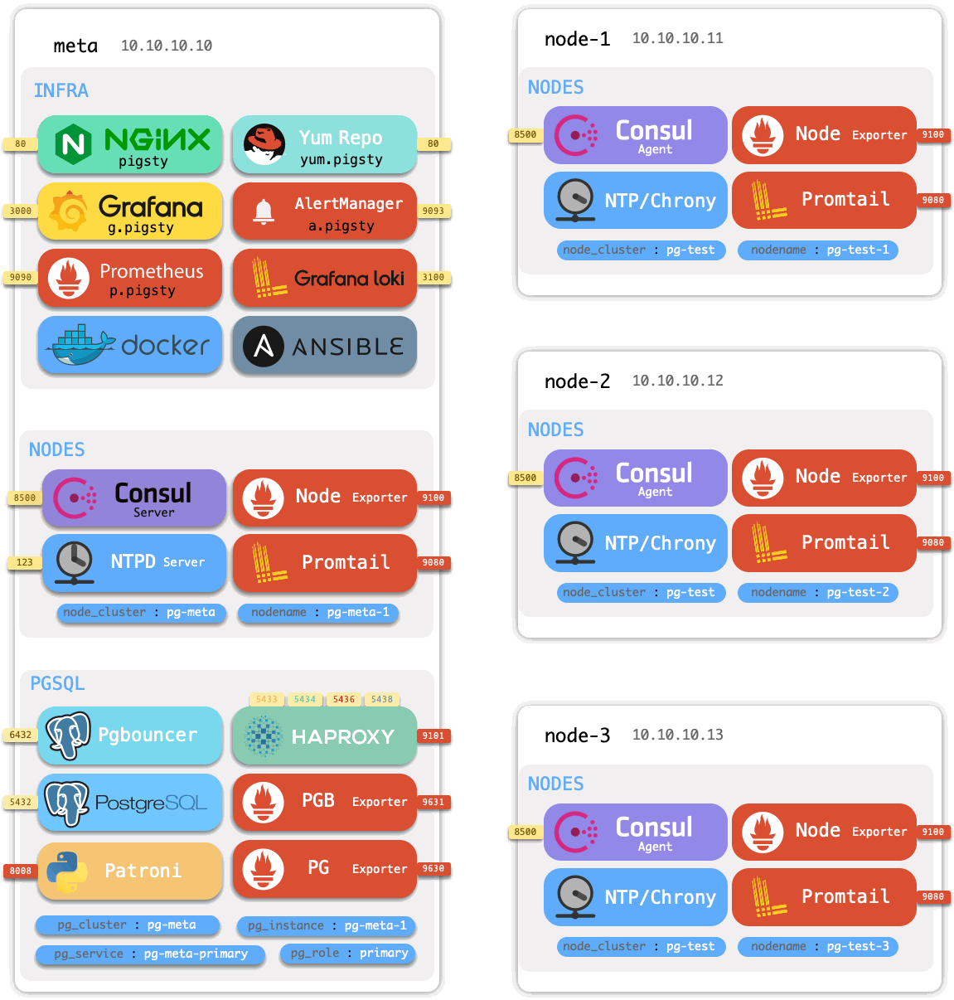
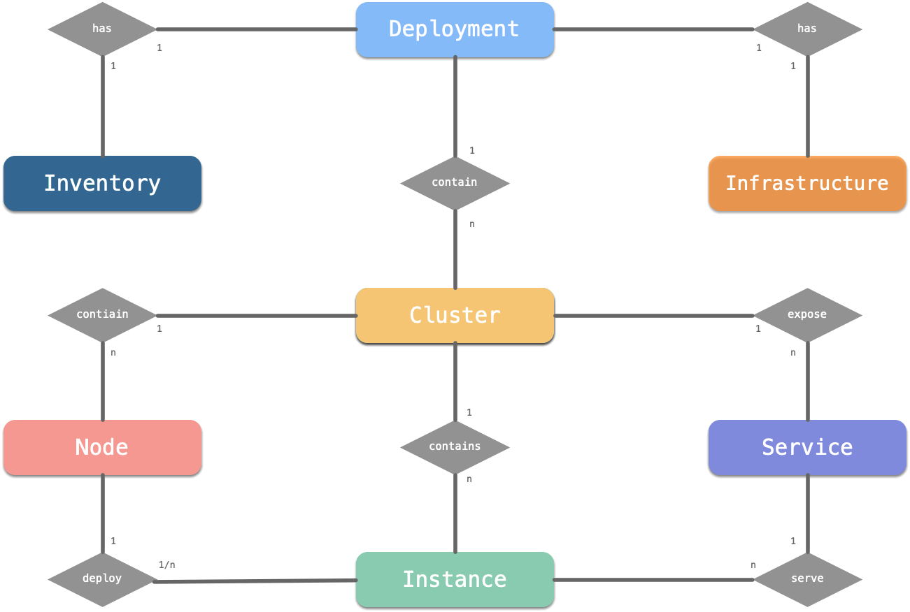

# 架构

> Pigsty在逻辑由几个独立**模块**组成，可以根据不同的场景自由排列组合。

## 模块

Pigsty目前提供四个功能模块：

* [`INFRA`](c-infra.md) 是Pigsty的基础设施部分，包括监控/告警/可视化/日志/DNS/NTP等公共组件。
* [`NODES`](c-nodes.md) 是主机节点管理模块，用于配制节点，安装软件，收集监控指标与日志。
* [`PGSQL`](c-pgsql.md)是PostgreSQL数据库部署管控模块，包括各种类型的PG集群部署与监控。
* [`REDIS`](c-redis.md)是Redis数据库部署管控模块，包括Redis 主从/集群/哨兵[部署](d-redis.md)与监控

| [模块](c-arch.md#模块) |   [概念](c-concept.md)    |    [部署](d-deploy.md)    |    [配置](v-config.md)    |   [剧本](p-playbook.md)   |
| :--------------------: | :-----------------------: | :-----------------------: | :-----------------------: | :-----------------------: |
|        `INFRA`         | [概念: INFRA](c-infra.md) | [部署: INFRA](d-infra.md) | [配置: INFRA](v-infra.md) | [剧本: INFRA](p-infra.md) |
|        `NODES`         | [概念: NODES](c-nodes.md) | [部署: NODES](d-nodes.md) | [配置: NODES](v-nodes.md) | [剧本: NODES](p-nodes.md) |
|        `PGSQL`         | [概念: PGSQL](c-pgsql.md) | [部署: PGSQL](d-pgsql.md) | [配置: PGSQL](v-pgsql.md) | [剧本: PGSQL](p-pgsql.md) |
|        `REDIS`         | [概念: REDIS](c-redis.md) | [部署: REDIS](d-redis.md) | [配置: REDIS](v-redis.md) | [剧本: REDIS](p-redis.md) |

## 用法

> 您可以自行选择在哪些节点上启用哪些模块，适配不同的需求场景。

默认情况下，Pigsty将执行单机安装，将当前节点初始化为一个加装了 **INFRA**，**NODES**，与**PGSQL**的[元节点](c-nodes.md#元节点)。

您可以进一步加入其他[节点](c-nodes.md#节点)，并在其上加装不同的数据库模块。

### 单机部署

如果您想将Pigsty当作开箱即用的**单机PostgreSQL发行版**来使用，那么在一台机器上依次安装 **INFRA**, **NODES**, **PGSQL** 三个模块，就会有一个立即可用的，自我监控管理的数据库实例。

执行 [`infra.yml`](p-infra.md) 剧本在单机上安装Pigsty，在该节点上部署**基础设施** ，并拉起一个单节点PostgreSQL[数据库集群](#数据库集群)。个人用户、简单场景、小微企业可以直接开箱使用此数据库。完整安装Pigsty的节点称为[元节点](#元节点)（Meta）。

但Pigsty的能力不只于此，它还可以用于监控管理更多的节点与数据库。

### 主机监控

如果您想要一个生产环境的大规模**主机监控系统**，那么在一台机器上安装**INFRA**模块，在所有被监控的机器节点上安装**NODES**模块即可。所有的主机节点会配置有软件源，软件包，DNS，NTP，节点监控，日志收集，DCS Agent这些生产环境所需的组件。纳入Pigsty管理的主机节点会带有详细的监控信息，并可以用于进一步部署各式各样的数据库模块。

在元节点上通过 [`nodes.yml`](p-nodes.md#nodes) 剧本为更多节点加装**NODES**模块，纳入Pigsty管理中。

### 数据库集群

当您将节点纳入Pigsty后，这些节点可以用于进一步部署各种**数据库集群**。

如果您想**部署管理大量的PostgreSQL集群**，在这些纳入Pigsty管理的节点上再加装 **PGSQL **模块即可。您可以一键[部署](d-pgsql.m)各种各样的PGSQL集群：单实例，一主N从的高可用集群，同步集群，法定人数提交的同步集群，带有离线ETL角色的集群，异地容灾的备集群，延迟复制集群，Citus分布式集群，TimescaleDB集群，MatrixDB数据仓库集群。

如果你想部署并监控管理很多Redis集群，也只要在Pigsty托管的节点上加装**REDIS**模块即可。

使用 [`pgsql.yml`](p-pgsql.md#pgsql) 创建高可用的PostgreSQL数据库集群，使用 [`redis.yml`](p-redis.md#redis)创建主从、集群、哨兵模式的Redis集簇，使用 [`pigsty-matrix.yml`](p-pgsql.md#pgsql-matrix) 部署 Greenplum/MatrixDB 数据仓库。

Pigsty后续会按需逐步添加新类型的数据库功能模块：**KAFKA**, **MINIO**, **MONGO**等。

## 模型

一套完整的Pigsty系统，可称为一个**部署（Deployment）**/ **环境（Environment）** 。

> 例如：生产环境，测试环境，预发环境等。

**一套Pigsty部署在架构上分为两个部分：一套基础设施，与多套集群**，两者均通过一份[配置清单](v-config.md#配置文件)（Inventory）进行描述。

* [基础设施](c-infra.md)（Infra） ：部署于[元节点](c-nodes.md#元节点)上，监控，DNS，NTP，DCS，Yum源等。
* [集群](#数据库集群)：自治的（数据库）服务单元，部署于[节点](c-nodes.md#节点)上。

集群包含有**节点**，**实例**，**服务**三种核心资源：一个集群会包含多个实例，部署于多个 [节点](c-nodes.md#节点)（Node）上，提供多种不同的 [服务](c-service.md)（Service），每个数据库实例之下又会有更细分的ER模型。

