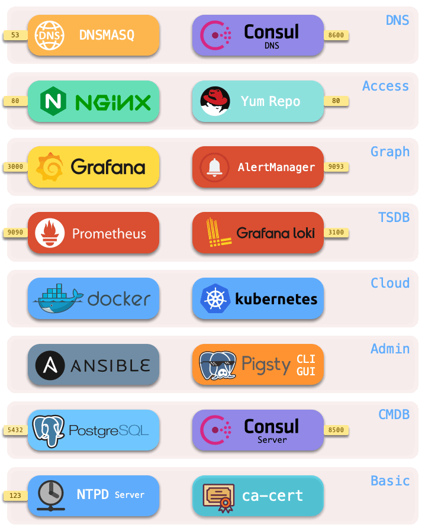

# 基础设施

> Pigsty在提供了一套完整的，开箱即用的PaaS基础设施。

每一套 Pigsty **部署**（Deployment） 中，都需要有一些基础设施，才能使整个系统正常工作。基础设施通常由专业的运维团队或云厂商负责，但Pigsty作为一个开箱即用的PaaS解决方案，将基本的基础设施集成至供给方案中。


## 概览

Pigsty会在[元节点](c-nodes.md#元节点)（默认为当前安装的节点）上部署一套完整的基础设施，包括：

|     组件     | 端口 |   默认域名   | 说明                        |
| :----------: | :--: | :----------: | --------------------------- |
| [Nginx](#Nginx) |  80  |   `pigsty`   | 所有Web服务的入口，文件服务器 |
| [Yum Repo](#Yum-Repo) |  80  | `yum.pigsty` | 本地YUM软件源               |
| [Grafana](#Grafana) | 3000 |  `g.pigsty`  | 监控系统/可视化平台         |
| [AlertManager](#AlertManager) | 9093 |  `a.pigsty`  | 报警聚合管理组件            |
| [Prometheus](#Prometheus) | 9090 |  `p.pigsty`  | 监控时序数据库              |
| [Loki](#Loki) | 3100 |  `l.pigsty`  | 实时日志收集基础设施        |
| [Consul](#Consul) | 8500 |  `c.pigsty`  | 分布式配置管理与服务发现    |
| [Docker](#Docker) | 2375 |      -       | 运行无状态服务的容器平台    |
| [PostgreSQL](#PostgreSQL) | 5432 |      -       | Pigsty CMDB                 |
| [Ansible](#Ansible) |  -   |      -       | 用于发起管理命令的组件      |
| [Consul DNS](#Consul) | 8600 |      -       | Consul提供的DNS服务（可选） |
| [Dnsmasq](#Dnsmasq) |  53  |      -       | DNS域名解析服务器（可选）   |
| [NTP](#NTP) | 123  |      -       | NTP时间服务器（可选）       |



基础设施部署于 [**元节点**](#元节点) 上。一套环境中包含一个或多个元节点，用于基础设施部署。除了 **分布式配置存储（DCS）** 之外，所有基础设施组件都采用副本式部署。

?> 若配置有多个元节点，元节点上的DCS（etcd/consul）会共同作为DCS服务器集群。


## Nginx

Nginx是Pigsty所有WebUI类服务的访问入口，默认使用管理节点80端口。

有许多带有WebUI的基础设施组件通过Nginx对外暴露服务，例如Grafana，Prometheus，AlertManager，Consul，以及HAProxy流量管理页等。
此外，YumRepo，文档，执行计划可视化器等静态文件资源也通过Nginx对外提供服务。

Nginx会根据 [`nginx_upstream`](v-infra.md) 的内容，通过**域名**的方式，将访问请求转发至对应的上游组件处理。
Pigsty强烈建议使用域名访问Pigsty UI系统，而不是直接通过IP+端口的方式访问，基于以下几个理由：
* 一些组件默认只监听 127.0.0.1 ，因此只能通过Nginx代理访问
* 通过域名访问可以将访问收拢至Nginx，审计一切请求，并方便地集成认证机制。
* 域名更容易记忆，并提供了配置灵活性。

如果您没有可用的互联网域名或本地DNS解析，您可以在 `/etc/hosts`或`C:\Windows\System32\drivers\etc\hosts`中添加本地静态解析记录。

Nginx相关配置参数位于：[配置：INFRA - NGINX](v-infra.md#NGINX)


## Yum Repo

Pigsty会在安装时首先建立一个本地Yum软件源，以加速后续软件安装。

该Yum源由Nginx提供服务，默认位于为 `/www/pigsty`，可以访问 `http://yum.pigsty/pigsty` 获取。Pigsty的离线软件包即是将已经建立好的Yum Repo目录整个打成压缩包。

当Pigsty尝试构建本地源时，如果发现本地源目录 `/www/pigsty` 已经存在，且带有 `/www/pigsty/repo_complete` 标记文件，则会认为本地源已经构建完成，从而跳过从原始上游下载软件的步骤，消除了对互联网访问的依赖。

Repo文件位于 `/www/pigsty.repo`，默认可以通过`http://yum.pigsty/pigsty.repo` 获取

```bash
curl http://yum.pigsty/pigsty.repo -o /etc/yum.repos.d/pigsty.repo
```

您也可以在没有Nginx的情况下直接使用文件本地源：

```ini
[pigsty-local]
name=Pigsty local $releasever - $basearch
baseurl=file:///www/pigsty/
enabled=1
gpgcheck=0
```

Yum Repo相关配置参数位于：[配置：INFRA - REPO](v-infra.md#REPO)


## Grafana

Grafana是开源的可视化/监控平台，是Pigsty WebUI的核心，默认监听3000端口，可以直接通过`IP:3000`或域名`http://g.pigsty`访问。

Pigsty的监控系统基于Dashboard构建，通过URL进行连接与跳转。您可以快速地在监控中下钻上卷，快速定位故障与问题。

此外，Grafana还可以用作通用的低代码前后端平台，制作交互式可视化数据应用。因此，Pigsty使用的Grafana带有一些额外的可视化插件，例如ECharts面板。


Grafana相关配置参数位于：[配置：INFRA - GRAFANA](v-infra.md#GRAFANA)


## AlertManager

AlertManager是与Prometheus配套的告警平台，默认监听9093端口，可以直接通过`IP:9093`或域名`http://a.pigsty`访问。

Prometheus的告警事件会发送至AlertManager，但如果需要进一步处理，用户需要进一步对其进行配置，例如提供SMTP服务配置以发送告警邮件。


## Prometheus

Prometheus是监控时序数据库，默认监听9090端口，可以直接通过`IP:9090`或域名`http://p.pigsty`访问。

Prometheus是监控用时序数据库。

* Prometheus默认通过本地静态文件服务发现获取监控对象，并为其关联身份信息。
* Prometheus可以选择使用Consul服务发现，自动获取监控对象。
* Prometheus从Exporter拉取监控指标数据，进行预计算加工后存入自己的TSDB中。
* Prometheus计算报警规则，将报警事件发往Alertmanager处理。

Prometheus相关配置参数位于：[配置：INFRA - PROMETHEUS](v-infra.md#PROMETHEUS)


## Loki

Prometheus是监控时序数据库，默认监听3100端口。

Loki是用于日志收集的日志数据库，节点上的Promtail向元节点上的Loki推送日志。

LOKI相关配置参数位于：[配置：INFRA - LOKI](v-infra.md#LOKI)


## Consul

Consul Server用于保存DCS的状态，达成共识，提供元数据查询服务，亦提供基于DCS的服务发现。

Consul相关配置参数位于：[配置：INFRA - DCS](v-infra.md#DCS)


## Docker

Pigsty默认在元节点上安装Docker，您可以拉起各式各样的无状态应用，并使用外部数据库获得生产级的持久性。Docker相关配置参数位于：[配置：INFRA - DOCKER](v-infra.md#DOCKER)


## PostgreSQL

PostgreSQL相关配置参数位于：[配置：PGSQL](v-infra.md#PGSQL)，使用CMDB作为配置源，请参考[CMDB教程](t-cmdb.md)。

* 用于支持各种高级功能的MetaDB（亦是一个标准的数据库集群，由Ansible拉起）

* 用于执行剧本，发起控制的Ansible，使用动态Inventory时会访问CMDB
* 定时任务控制器（支持备份，清理，统计，巡检，等特性），会访问CMDB


## Ansible

Pigsty默认会在元节点上安装Ansible，Ansible是一个流行的运维工具，采用声明式的配置风格与幂等的剧本设计，可以极大降低系统维护的复杂度。命令行工具 pigsty-cli 会调用Ansible Playbook发起管控

Ansible相关配置参数位于：[配置：INFRA - CONNECT](v-infra.md#CONNECT)


## Dnsmasq

Dnsmasq提供环境内的DNS**解析**服务（可选）

* DNS服务为可选，可使用已有DNS服务器
* 部分DNS解析将**转交**由Consul DNS进行

DNSMASQ相关配置参数位于：[配置：INFRA - Nameserver](v-infra.md#NAMESERVER)


## NTP

NTP服务用于同步环境内所有节点的时间（可选）

NTP相关配置参数位于：[配置：NODES - NTP](v-infra.md#NTP)

