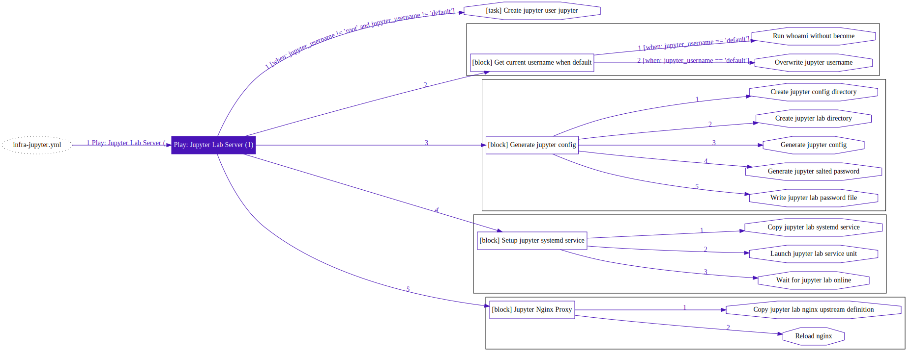

# 剧本：INFRA

> 使用 `infra` 系列[剧本](p-playbook.md)在当前元节点上安装Pigsty，并加装可选功能。

| 剧本                                          | 功能                                   | 链接                                                                     |
|---------------------------------------------|--------------------------------------|------------------------------------------------------------------------|
| [`infra`](p-infra.md#infra)                 | 在元节点上完整安装Pigsty                     | [`src`](https://github.com/vonng/pigsty/blob/master/infra.yml)         |
| [`infra-demo`](p-infra.md#infra-demo)       | 一次性完整初始化四节点演示沙箱环境的特殊剧本               | [`src`](https://github.com/vonng/pigsty/blob/master/infra-demo.yml)    |
| [`infra-remove`](p-infra.md#infra-remove)   | 在元节点上卸载Pigsty | [`src`](https://github.com/vonng/pigsty/blob/master/infra-remove.yml)  |
| [`infra-jupyter`](p-infra.md#infra-jupyter) | 在元节点上加装**可选**数据分析服务组件组件Jupyter Lab  | [`src`](https://github.com/vonng/pigsty/blob/master/infra-jupyter.yml) |
| [`infra-pgweb`](p-infra.md#infra-pgweb)     | 在元节点上加装**可选**的Web客户端工具PGWeb         | [`src`](https://github.com/vonng/pigsty/blob/master/infra-pgweb.yml)   |


---------------

## `infra`

[`infra.yml`](https://github.com/Vonng/pigsty/blob/master/infra.yml) 剧本会在**元节点** （默认为当前节点）上完成**Pigsty**的安装与部署。

当您将Pigsty用作开箱即用的数据库时，只要在本节点上直接执行 `infra.yml` ，即可完成安装。


### What

执行该剧本将完成以下任务

* 配置元节点的目录与环境变量
* 下载并建立一个本地yum软件源，加速后续安装。（若使用离线软件包，则跳过下载阶段）
* 将当前元节点作为一个[普通节点](p-nodes.md)纳入 Pigsty 管理
* 部署**基础设施**组件，包括 Prometheus, Grafana, Loki, Alertmanager, Consul Server等
* 在当前节点上部署一个普通的[PostgreSQL](p-pgsql.md)单实例集群，纳入监控。

### Where

该剧本默认针对**元节点**执行

* Pigsty默认将使用**当前执行此剧本的节点**作为Pigsty的元节点。
* Pigsty在[配置过程](v-config.md#配置过程)中默认会将当前节点标记为元节点，并使用**当前节点首要IP地址**替换配置模板中的占位IP地址`10.10.10.10`。
* **元节点**除了可以发起管理，部署有基础设施外。与一个部署了PG的普通托管节点并无区别。
* Pigsty默认使用元节点部署DCS Server，用于数据库高可用，但您完全可以选用外部DCS集群。
* 使用多个元节点是可能的，参考 [DCS3](https://github.com/Vonng/pigsty/blob/master/files/conf/pigsty-dcs3.yml#L33) 配置模板：部署3节点的DCS Server，允许其中一台宕机。

### How

执行该剧本的一些注意事项

* 本剧本为幂等剧本，重复执行会抹除元节点上的Consul Server与CMDB（关闭保护选项情况下）
* 使用离线软件包时，完整执行该剧本耗时约5-8分钟，视机器配置而异。
* 不使用离线软件包而直接从互联网原始上游下载软件时，可能耗时10-20分钟，根据您的网络条件而异。
* 本剧本会将元节点作为一个普通节点纳入管理，并部署PG数据库，覆盖了[`nodes.yml`](p-nodes.md) 与[`pgsql.yml`](p-pgsql.md)的所有内容，因此`infra.yml`如果可以在元节点上成功执行完毕，那么则在相同状态的普通节点上一定可以成功完成数据库部署。
* 元节点上默认的[`pg-meta`](https://github.com/Vonng/pigsty/blob/master/pigsty.yml#L43)将用作Pigsty元数据库，用于承载高级特性。


### Tasks

该剧本
```bash
./infra.yml --tags=environ                       # 重新在元节点上配置环境
./infra.yml --tags=repo -e repo_rebuild=true     # 强制重新创建本地源
./infra.yml --tags=repo_upstream                 # 加入上游YumRepo
./infra.yml --tags=prometheus                    # 重新创建Prometheus
./infra.yml --tags=nginx_config,nginx_restart    # 重新生成Nginx配置文件并重启
……
```


在[配置清单](v-config.md)中，隶属于 `meta`分组下的节点将被设置 [`meta_node`](v-infra.md#meta_node) 标记，用作 Pigsty 的元节点。


---------------

## `infra-demo`

[`infra-demo.yml`](https://github.com/Vonng/pigsty/blob/master/infra-demo.yml) 是用于演示环境的特殊剧本，通过交织元节点与普通节点初始化的方式，可以一次性完成4节点沙箱环境的初始化。
在四节点沙箱中，本剧本可等效为

```bash
./infra.yml              # 在元节点安装 Pigsty
./infra-pgweb.yml        # 在元节点加装 PgWeb
./nodes.yml -l pg-test   # 将 pg-test 所属三节点纳入管理
./pgsql.yml -l pg-test   # 在 pg-test 三节点上部署数据库集群
```

此外，当您尝试部署复数个元节点时，如果选择默认将DCS Server部署在所有元节点上时，也可以使用此剧本一次性拉起所有元节点以及其上的DCS与数据库集群。

!> 请注意，配置不当的情况下，此剧本有一次性抹平整个环境的奇效，在生产环境可以移除以避免 "Fat Finger" 的风险。


---------------

## `infra-remove`

[`infra-remove.yml`](https://github.com/Vonng/pigsty/blob/master/infra-remove.yml) 剧本是 [infra](#infra) 剧本的反向操作。

会将Pigsty从元节点卸载，剧本会依次卸载下列组件。


- grafana-server
- prometheus
- alertmanager
- node_exporter
- consul
- pgweb
- loki
- promtail


---------------

## `infra-jupyter`

[`infra-jupyter.yml`](https://github.com/Vonng/pigsty/blob/master/infra-jupyter.yml) 剧本用于在元节点上加装 Jupyter Lab服务

详细教程请参考 [教程：启用Jupyter Lab服务](t-jupyter.md)。



