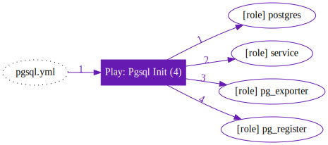
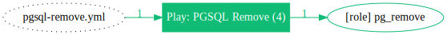
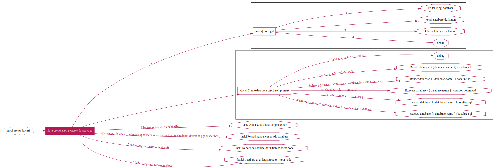
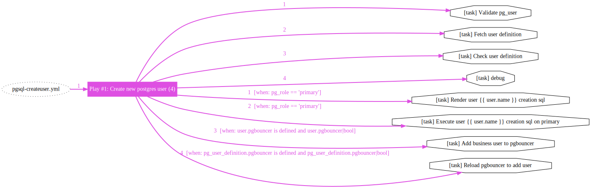
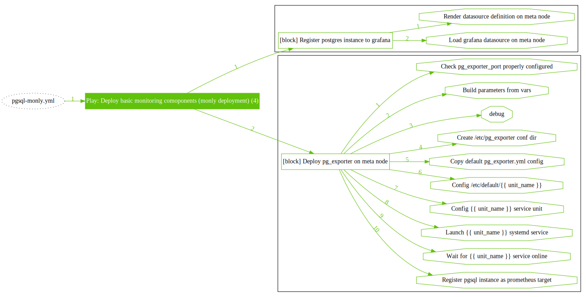
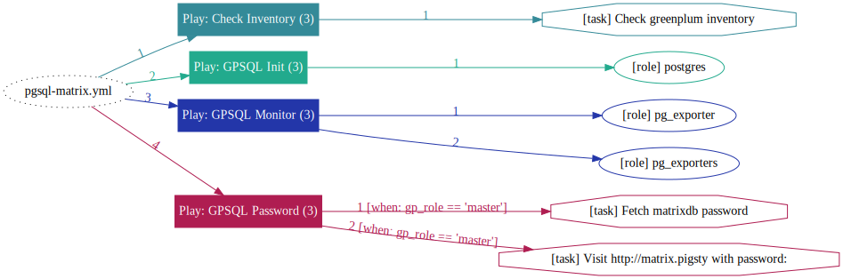
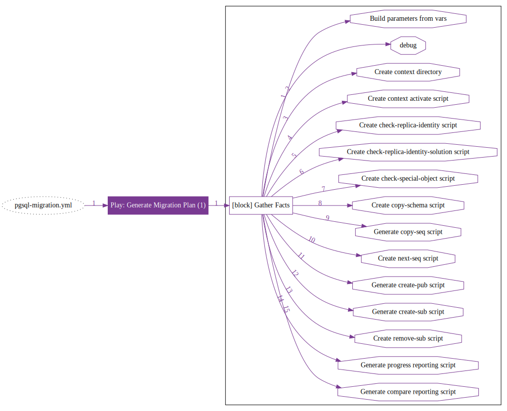

# 剧本：PGSQL

> 使用PGSQL系列[剧本](p-playbook.md)，拉起定义好的高可用PostgreSQL数据库集群

## 剧本概览

| 剧本 | 功能                                                           | 链接                                                         |
|--------|----------------------------------------------------------------| ------------------------------------------------------------ |
|  [`pgsql`](p-pgsql.md#pgsql)                        |        **部署PostgreSQL集群，或集群扩容**                             |        [`src`](https://github.com/vonng/pigsty/blob/master/pgsql.yml)            |
|  [`pgsql-remove`](p-pgsql.md#pgsql-remove)          |        下线PostgreSQL集群，或集群缩容                             |        [`src`](https://github.com/vonng/pigsty/blob/master/pgsql-remove.yml)     |
|  [`pgsql-createuser`](p-pgsql.md#pgsql-createuser)  |        创建PostgreSQL业务用户                                 |        [`src`](https://github.com/vonng/pigsty/blob/master/pgsql-createuser.yml) |
|  [`pgsql-createdb`](p-pgsql.md#pgsql-createdb)      |        创建PostgreSQL业务数据库                                |        [`src`](https://github.com/vonng/pigsty/blob/master/pgsql-createdb.yml)   |
|  [`pgsql-monly`](p-pgsql.md#pgsql-monly)            |        仅监控模式，接入现存PostgreSQL实例或RDS                       |        [`src`](https://github.com/vonng/pigsty/blob/master/pgsql-monly.yml)      |
|  [`pgsql-migration`](p-pgsql.md#pgsql-migration)    |        生成PostgreSQL半自动数据库迁移方案（Beta）                     |        [`src`](https://github.com/vonng/pigsty/blob/master/pgsql-migration.yml)  |
|  [`pgsql-audit`](p-pgsql.md#pgsql-audit)            |        生成PostgreSQL审计合规报告（Beta）                         |        [`src`](https://github.com/vonng/pigsty/blob/master/pgsql-audit.yml)      |
|  [`pgsql-matrix`](p-pgsql.md#pgsql-matrix)          |        复用PG角色部署一套MatrixDB数据仓库集群（Beta）                   |        [`src`](https://github.com/vonng/pigsty/blob/master/pgsql-matrix.yml)     |


------------------

## `pgsql`

完成了[**基础设施初始化**](p-infra.md)后，用户可以[ `pgsql.yml`](https://github.com/Vonng/pigsty/blob/master/pgsql.yml) 完成数据库集群的**初始化**。

首先在 **Pigsty配置文件** 中完成数据库集群的定义，然后通过执行`pgsql.yml`将变更应用至实际环境中。

```bash
./pgsql.yml                      # 在所有清单中的机器上执行数据库集群初始化操作（危险！）
./pgsql.yml -l pg-test           # 在 pg-test 分组下的机器执行数据库集群初始化（推荐！）
./pgsql.yml -l pg-meta,pg-test   # 同时初始化pg-meta与pg-test两个集群
./pgsql.yml -l 10.10.10.11       # 初始化10.10.10.11这台机器上的数据库实例
```

本剧本主要完成以下工作：

* 安装、部署、初始化PostgreSQL， Pgbouncer， Patroni（`postgres`）
* 安装PostgreSQL监控系统（`monitor`）
* 安装部署Haproxy与VIP，对外暴露服务（`service`）
* 将数据库实例注册至基础设施，接受监管（`register`）

**该剧本使用不当存在误删数据库的风险，因为初始化数据库会抹除原有数据库的痕迹**。
[保险参数](#保护机制)提供了避免误删的选项作为保险，以在初始化过程中，当检测到已有运行中实例时，允许自动中止或跳过高危操作，避免最坏情况发生。尽管如此，在**使用`pgsql.yml`时，请再三检查`--tags|-t` 与 `--limit|-l` 参数是否正确。确保自己在正确的目标上执行正确的任务。使用不带参数的`pgsql.yml`在生产环境中是一个高危操作，务必三思而后行。**





### 注意事项

* 强烈建议在执行时添加`-l`参数，限制命令执行的对象范围。

* **单独**针对某一集群从库执行初始化时，用户必须自行确保**主库已经完成初始化**

* 集群扩容时，如果`Patroni`拉起从库的时间过长，Ansible剧本可能会因为超时而中止。（但制作从库的进程会继续，例如制作从库需超过1天的场景）。
* 您可以在从库自动制作完毕后，通过Ansible的`--start-at-task`从`Wait for patroni replica online`任务继续执行后续步骤。详情请参考[SOP](r-sop.md)。


### 保护机制

`pgsql.yml`提供**保护机制**，避免误删运行中的PostgreSQL数据库，包括了两个相关参数：

* [`pg_safeguard`](v-pgsql.md#pg_safeguard)：默认关闭，只要打开，在任意情况下该数据库实例不会被清理。
* [`pg_clean`](v-pgsql.md#pg_clean)：默认关闭，当打开时，初始化PostgreSQL/[`pgsql.yml`](#pgsql) 会抹除掉现有实例（危险）

当遇到现存实例时，[`pgsql.yml`](#pgsql) 剧本会有以下行为表现：

| `pg_safeguard` / `pg_clean` | `pg_clean=true` | `pg_clean=false` |
| :-------------------------: | :-------------: | :--------------: |
|     `pg_safeguard=true`     |    中止执行     |     中止执行     |
|    `pg_safeguard=false`     |  **抹除实例**   |     中止执行     |

当遇到现存实例时， [`pgsql-remove.yml`](#pgsql-remove) 剧本会有以下行为表现：

| `pg_safeguard` / `pg_clean` | `pg_clean=true` | `pg_clean=false` |
| :-------------------------: | :-------------: | :--------------: |
|     `pg_safeguard=true`     |    中止执行     |     中止执行     |
|    `pg_safeguard=false`     |  **抹除实例**   |   **抹除实例**   |


### 选择性执行

用户可以通过ansible的标签机制，可以选择执行剧本的一个子集。

举个例子，如果只想执行服务初始化的部分，则可以通过以下命令进行

```bash
./pgsql.yml --tags=service      # 刷新集群的服务定义
```

常用的命令子集如下：

```bash
# 基础设施初始化
./pgsql.yml --tags=infra        # 完成基础设施的初始化，包括机器节点初始化与DCS部署


# 数据库初始化
./pgsql.yml --tags=pgsql        # 完成数据库部署：数据库、监控、服务

./pgsql.yml --tags=postgres     # 完成数据库部署
./pgsql.yml --tags=monitor      # 完成监控的部署
./pgsql.yml --tags=service      # 完成负载均衡的部署，（Haproxy & VIP）
./pgsql.yml --tags=register     # 将服务注册至基础设施
```


### 日常管理任务

日常管理也可以使用`./pgsql.yml`来修改数据库集群的状态，常用的命令子集如下：

```bash
./pgsql.yml --tags=node_admin           # 在目标节点上创建管理员用户

# 如果当前管理员没有ssh至目标节点的权限，可以使用其他具有ssh的用户创建管理员（输入密码）
./pgsql.yml --tags=node_admin -e ansible_user=other_admin -k 

./pgsql.yml --tags=pg_scripts           # 更新/pg/bin/目录脚本
./pgsql.yml --tags=pg_hba               # 重新生成并应用集群HBA规则
./pgsql.yml --tags=pgbouncer            # 重置Pgbouncer
./pgsql.yml --tags=pg_user              # 全量刷新业务用户
./pgsql.yml --tags=pg_db                # 全量刷新业务数据库

./pgsql.yml --tags=register_consul      # 在目标实例本地注册Consul服务(本地执行)
./pgsql.yml --tags=register_prometheus  # 在Prometheus中注册监控对象(代理至所有Meta节点执行)
./pgsql.yml --tags=register_grafana     # 在Grafana中注册监控对象(只注册一次)
./pgsql.yml --tags=register_nginx       # 在Nginx注册负载均衡器(代理至所有Meta节点执行)

# 使用二进制安装的方式重新部署监控
./pgsql.yml --tags=monitor -e exporter_install=binary

# 刷新集群的服务定义（当集群成员或服务定义发生变化时执行）
./pgsql.yml --tags=haproxy_config,haproxy_reload
```


------------------

## `pgsql-remove`


数据库下线：可以**移除**现有的数据库集群或实例，回收节点：[`pgsql-remove.yml`](https://github.com/Vonng/pigsty/blob/master/pgsql-remove.yml)

`pgsql-remove.yml`是[`pgsql.yml`](p-pgsql.md)的反向操作，会依次完成

* 将数据库实例从基础设施取消注册（`register`）
* 停止负载均衡器，服务组件（`service`）
* 移除监控系统组件（`monitor`）
* 移除Pgbouncer，Patroni，Postgres（`postgres`）
* 移除数据库目录（`rm_pgdata: true`）
* 移除软件包（`rm_pkgs: true`）

该剧本有两个命令行选项，可用于移除数据库目录与软件包（默认下线不会移除数据与安装包）

```
rm_pgdata: false        # remove postgres data? false by default
rm_pgpkgs: false        # uninstall pg_packages? false by default
```




### 日常管理

```bash
./pgsql-remove.yml -l pg-test          # 下线 pg-test 集群
./pgsql-remove.yml -l 10.10.10.13      # 下线实例 10.10.10.13 (实际上是pg-test.pg-test-3)
./pgsql-remove.yml -l 10.10.10.13 -e rm_pgdata=true # 下线，一并移除数据目录（可能较慢）
./pgsql-remove.yml -l 10.10.10.13 -e rm_pkgs=true   # 下线，一并移除安装的PG相关软件包
```


------------------

## `pgsql-createdb`

[**创建业务数据库**](pgsql-createdb)：可以在现有集群中创建新的数据库或修改现有**数据库**：[`pgsql-createdb.yml`](https://github.com/Vonng/pigsty/blob/master/pgsql-createdb.yml)



强烈建议通过剧本或包装脚本与工具在已有集群中创建新数据库，这样可以确保：

* 配置文件清单与实际情况保持一致
* Pgbouncer连接池与数据库保持一致
* Grafana中所注册的数据源与实际情况保持一致。


### 日常管理

数据库的创建请参考 [数据库](c-pgdbuser.md#创建数据库) 一节。

```bash
# 在 pg-test 集群创建名为 test 的数据库
./pgsql-createdb.yml -l pg-test -e pg_database=test
```

可以使用包装脚本简化命令：

```bash
bin/createdb <pg_cluster> <dbname>
```


------------------

## `pgsql-createuser`

[**创建业务用户**](pgsql-createuser)：可以在现有集群中创建新的用户或修改现有**用户**：[`pgsql-createuser.yml`](https://github.com/Vonng/pigsty/blob/master/pgsql-createuser.yml)



### 日常管理

业务用户的创建请参考 [用户](c-user.md#创建用户) 一节

```bash
# 在 pg-test 集群创建名为 test 的用户
./pgsql-createuser.yml -l pg-test -e pg_user=test
```

可以使用包装脚本简化命令：

```bash
bin/createuser <pg_cluster> <username>
```

请注意，`pg_user` 指定的用户，**必须**已经存在于集群`pg_users`的定义中，否则会报错。这意味着用户必须先定义，再创建。


------------------

## `pgsql-monly`

用于执行仅监控部署的专用剧本，详情请参考：[仅监控部署](d-monly.md)





------------------

## `pgsql-matrix`

用于部署MatrixDB的专用剧本，详情请参考：[部署MatrixDB集群](d-matrixdb.md)




------------------

## `pgsql-migration`

用于数据库自动化迁移的剧本，目前仍处于Beta状态，详情请参考：[数据库集群迁移](t-migration.md)

