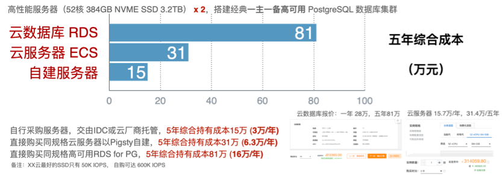

# Pigsty亮点特性

> 开箱即用的数据库发行版：用得上，用的好，用着简单还省钱！


* 开箱即用的PostgreSQL[数据库发行版](#PostgreSQL数据库发行版)
* 自动驾驶的智能监控管控[运维解决方案](#智能监控管控运维解决方案)
* 简单易用的数据库即代码[开发者工具箱](#数据库即代码开发者工具箱)
* 降本增效的开源云数据库[PaaS替代方案](#开源云数据库PaaS替代方案)

[自动驾驶高可用](#自动驾驶高可用) / [极致入微可观测](#极致入微可观测) / [简单易用门槛低](#简单易用门槛低) / [自由部署体验齐](#自由部署体验齐) / [应用广泛生态全](#应用广泛生态全) / [自主可控更省钱](#自主可控更省钱) 


## PostgreSQL数据库发行版

> RedHat for Linux! 开箱即用！ 从无到有，让用户**用得上**！

Pigsty将高可用集群部署，扩容缩容，主从复制，故障切换，流量代理，连接池，服务发现，访问控制，监控系统，告警系统，日志采集等生产级成熟**解决方案**封装为发行版。一次性解决在生产环境与各类场景下使用 **世界上最先进的开源关系型数据库 —— [PostgreSQL](https://www.postgresql.org/)** 时会遇到的各种问题，真正做到开箱即用。

* Pigsty深度整合最新 [PostgreSQL](https://www.postgresql.org/) 内核 (14) 与强力扩展：时序数据 [TimescaleDB](https://www.timescale.com/) 2.6，地理空间 [PostGIS](https://postgis.net/) 3.2，分布式 [Citus](https://www.citusdata.com/) 10，及上百+海量扩展插件，全部开箱即用。

* Pigsty打包了大规模生产环境所需的基础设施：[Grafana](https://grafana.com/)，[Prometheus](https://prometheus.io/)，[Loki](https://grafana.com/oss/loki/)，[Ansible](https://docs.ansible.com/)，[Consul](https://www.consul.io/)，[Docker](https://www.docker.com/)等， 亦可作为部署监控其他数据库与应用的运行时/PaaS。

* Pigsty集成了数据分析生态的常用工具：[Jupyter](https://jupyter.org/)，[ECharts](https://echarts.apache.org/zh/index.html)，[Grafana](https://grafana.com/)，[PostgREST](https://postgrest.org/)，[Postgres](https://www.postgresql.org/)，可作为[数据分析](#应用广泛生态全)环境，或低代码数据可视化应用开发平台。

[](c-infra.md#概览)


## 智能监控管控运维解决方案

> Auto-Pilot for Postgres! 自动驾驶！ 从有到优，让用户**用的爽**！

* Pigsty带有一个无可比拟的数据库[监控系统](#极致入微可观测)，通过30+精心设计组织的监控面板呈现超1200类指标，从全局概览到单个库内对象一览无余，提供终极的可观测性！

* Pigsty提供[高可用](#自动驾驶高可用)的 PostgreSQL 数据库集群，任意成员存活即可正常对外提供服务；各实例幂等，提供类分布式数据库的体验；故障自愈，极大简化运维工作！

* Pigsty支持部署不同种类的数据库集群与实例：经典 [PGSQL](d-pgsql.md) [主从复制集群](d-pgsql.md#主从集群)/[灾备集群](d-pgsql.md#备份集群)，[同步](d-pgsql.md#同步从库)/[延迟](d-pgsql.md#延迟从库)/[离线](d-pgsql.md#离线从库)/[级联实例](d-pgsql.md#级联复制)，[Citus](v-pgsql.md#Citus集群部署)/[Greenplum集群](d-matrixdb.md)，[Redis](d-redis.md) [主从](d-redis.md#redis普通主从实例定义)/[哨兵](d-redis.md#redis-sentinel集群定义)/[原生集群](d-redis.md#redis原生集群定义)。

[](c-arch.md)


## 数据库即代码开发者工具箱

> HashiCorp for Database! 简单易用！从优到易，让用户**省心**！

* Pigsty秉持 [Infra as Data](#简单易用门槛低) 的设计理念，用户只需用几行声明式的[配置](v-config.md#配置文件)文件描述自己想要的数据库，即可使用幂等[剧本](p-playbook.md)，一键将其创建。Just like Kubernetes!

* Pigsty向开发者交付[简单易用](#简单易用门槛低)的数据库工具箱：一键下载[安装](s-install.md#单机安装)，自动[配置](v-config.md#配置过程)；一键部署各类开源数据库，一键迁移备份、扩容缩容，极大拉低数据库管理使用门槛，量产DBA！

* Pigsty能够简化数据库部署与交付、解决环境配置统一的难题：无论是上千套数据库几万核的生产环境，还是本地1C1G的笔记本均可完整运行；基于Vagrant的[本地沙箱](d-sandbox.md)与基于Terraform的[多云部署](d-sandbox.md#多云部署)，云上云下，一键拉起！

[](s-install.md)


## 开源云数据库PaaS替代方案

> Alternative for RDS! [安全可控](#自主可控)，[降本增效](#降本增效)！从易到廉，给用户**省钱**！

* Pigsty相比云厂商RDS，在拥有更低使用⻔槛与更丰富功能的前提下，可节约 50% - 80% 的数据库软硬件成本，初级研发人员即可自主管理成百上千套数据库。

* Pigsty采用模块化设计，可自由组合，按需定制扩展。可在生产环境[部署](d-deploy.md)[管理](r-sop.md)各种数据库，或仅仅将其当成主机监控；可用于开发数[据库可视化Demo](t-application.md)、或支撑各类[SaaS应用](t-docker.md)。

* 开源免费的生产级数据库解决方案，用于补全云原生生态缺失的最后一块拼图。稳定可靠，经过长时间大规模生产部署验证，提供可选的专业技术支持服务。

[](http://demo.pigsty.cc)


## 自动驾驶高可用

> 故障自愈，高枕无忧

以PostgreSQL为例，Pigsty创建的数据库集群是**分布式**、[高可用](c-pgsql.md#高可用)的[数据库集群](c-pgsql.md#高可用)。只要集群中有任意实例存活，集群就可以对外提供完整的[读写服务](c-service.md#primary服务)与[只读服务](c-service.md#replica服务)。

Pigsty的高可用架构久经生产环境考验，Pigsty使用 Patroni + Consul 进行故障检测、Fencing与自动故障切换，通过HAProxy、VIP或DNS实现流量的自动切换，以极低的复杂度代价实现了完整的高可用方案，让主从架构的数据库能用出了布式数据库般的体验。

数据库集群可以自动进行故障检测与主从切换，普通故障能在几秒到几十秒内自愈：主库故障RTO < 1min，只读流量几乎无影响，[同步集群](d-pgsql.md#同步从库) RPO = 0 不丢数据。

数据库集群中的每个数据库实例在使用上都是幂等的，任意实例都可以通过内建负载均衡组件HAProxy提供完整的读写服务。任何一个或多个Haproxy实例都可以作为集群的负载均衡器，并通过健康检查进行流量分发，对外屏蔽集群成员的区别。用户可以通过配置灵活定义[服务](c-service.md#服务)，并通过多种可选方式[接入](c-service.md#接入)。

[](c-pgsql.md#高可用)


## 极致入微可观测

> You can't manage you don't measure.

监控系统提供了对系统状态的度量，是运维管理工作的基石。【[DEMO](http://demo.pigsty.cc)】

Pigsty带有一个针对大规模数据库集群管理而设计的专业级监控系统，基于业内最佳实践，采用Prometheus、Alertmanager、Grafana、Loki作为监控基础设施。开源开放，定制便利，可复用，可移植，没有厂商锁定。

Pigsty在PostgreSQL监控上做到无可比拟，通过30+监控面板与上千仪表盘综合呈现约1200+类指标，覆盖从全局大盘到单个对象的详细信息，从数据库目录到节点日志全部一览无遗。与同类产品相比在指标的覆盖率与监控面板丰富程度上一骑绝尘，为专业用户提供无可替代的价值。详略得当的层次设计，为业余用户带来直观便捷的管理体验。

Pigsty的监控系统可用于监控原生部署的各类数据库实例：PGSQL，REDIS，GPSQL等，也可以[独立使用](d-monly.md)，监控已有的数据库实例或远端云厂商RDS，或仅仅作为主机监控使用，它还可以用作数据可视化作品的展示平台。

[](http://demo.pigsty.cc)


## 简单易用门槛低

> HashiCorp for Database! Database as Code, Infra as Data!

Pigsty采纳 *Database as Data* 的设计哲学，使用类似 Kubernetes 的声明式配置，通过大量可选的配置选项对数据库与运行环境进行描述，并通过幂等的预置剧本自动创建所需的数据库集群，提供私有云般的使用体验。

用户只需要通过配置文件或图形界面描述“自己想要什么样的数据库”，而无需关心Pigsty如何去创建或修改它。Pigsty会根据用户的配置文件清单，在几分钟内从裸机节点上创造出所需的数据库集群。

例如，在三台机器上创建一主两从的数据库集群`pg-test`，只需要几行配置与一行命令`pgsql.yml -l pg-test`，即可创建出如下一节所介绍的高可用数据库集群。

[](v-config.md)

<details>
<summary>使用更多参数对数据库集群进行定制</summary>

```yaml
#----------------------------------#
# cluster: pg-meta (on meta node)  #
#----------------------------------#
# pg-meta is the default SINGLE-NODE pgsql cluster deployed on meta node (10.10.10.10)
# if you have multiple n meta nodes, consider deploying pg-meta as n-node cluster too

pg-meta:                                # required, ansible group name , pgsql cluster name. should be unique among environment
  hosts:                                # `<cluster>.hosts` holds instances definition of this cluster
    10.10.10.10:                        # INSTANCE-LEVEL CONFIG: ip address is the key. values are instance level config entries (dict)
      pg_seq: 1                         # required, unique identity parameter (+integer) among pg_cluster
      pg_role: primary                  # required, pg_role is mandatory identity parameter, primary|replica|offline|delayed
      pg_offline_query: true            # instance with `pg_offline_query: true` will take offline traffic (saga, etl,...)
      # some variables can be overwritten on instance level. e.g: pg_upstream, pg_weight, etc...
    #---------------
    # mandatory                         # all configuration above (`ip`, `pg_seq`, `pg_role`) and `pg_cluster` are mandatory
    #---------------
  vars:                                 # `<cluster>.vars` holds CLUSTER LEVEL CONFIG of this pgsql cluster
    pg_cluster: pg-meta                 # required, pgsql cluster name, unique among cluster, used as namespace of cluster resources

    #---------------
    # optional                          # all configuration below are OPTIONAL for a pgsql cluster (Overwrite global default)
    #---------------
    pg_version: 14                      # pgsql version to be installed (use global version if missing)
    node_tune: tiny                     # node optimization profile: {oltp|olap|crit|tiny}, use tiny for vm sandbox
    pg_conf: tiny.yml                   # pgsql template:  {oltp|olap|crit|tiny}, use tiny for sandbox
    patroni_mode: default               # entering patroni pause mode after bootstrap  {default|pause|remove}
    patroni_watchdog_mode: off          # disable patroni watchdog on meta node        {off|require|automatic}
    pg_lc_ctype: en_US.UTF8             # use en_US.UTF8 locale for i18n char support  (required by `pg_trgm`)

    #---------------
    # biz databases                     # Defining Business Databases (Optional)
    #---------------
    pg_databases:                       # define business databases on this cluster, array of database definition
      # define the default `meta` database
      - name: meta                      # required, `name` is the only mandatory field of a database definition
        baseline: cmdb.sql              # optional, database sql baseline path, (relative path among ansible search path, e.g files/)
        # owner: postgres               # optional, database owner, postgres by default
        # template: template1           # optional, which template to use, template1 by default
        # encoding: UTF8                # optional, database encoding, UTF8 by default. (MUST same as template database)
        # locale: C                     # optional, database locale, C by default.  (MUST same as template database)
        # lc_collate: C                 # optional, database collate, C by default. (MUST same as template database)
        # lc_ctype: C                   # optional, database ctype, C by default.   (MUST same as template database)
        # tablespace: pg_default        # optional, default tablespace, 'pg_default' by default.
        # allowconn: true               # optional, allow connection, true by default. false will disable connect at all
        # revokeconn: false             # optional, revoke public connection privilege. false by default. (leave connect with grant option to owner)
        # pgbouncer: true               # optional, add this database to pgbouncer database list? true by default
        comment: pigsty meta database   # optional, comment string for this database
        connlimit: -1                   # optional, database connection limit, default -1 disable limit
        schemas: [pigsty]               # optional, additional schemas to be created, array of schema names
        extensions:                     # optional, additional extensions to be installed: array of schema definition `{name,schema}`
          - { name: adminpack, schema: pg_catalog }    # install adminpack to pg_catalog
          - { name: postgis, schema: public }          # if schema is omitted, extension will be installed according to search_path.
          - { name: timescaledb }                      # some extensions are not relocatable, you can just omit the schema part

      # define an additional database named grafana & prometheus (optional)
      # - { name: grafana,    owner: dbuser_grafana    , revokeconn: true , comment: grafana    primary database }
      # - { name: prometheus, owner: dbuser_prometheus , revokeconn: true , comment: prometheus primary database , extensions: [{ name: timescaledb }]}

    #---------------
    # biz users                         # Defining Business Users (Optional)
    #---------------
    pg_users:                           # define business users/roles on this cluster, array of user definition
      # define admin user for meta database (This user are used for pigsty app deployment by default)
      - name: dbuser_meta               # required, `name` is the only mandatory field of a user definition
        password: md5d3d10d8cad606308bdb180148bf663e1  # md5 salted password of 'DBUser.Meta'
        # optional, plain text and md5 password are both acceptable (prefixed with `md5`)
        login: true                     # optional, can login, true by default  (new biz ROLE should be false)
        superuser: false                # optional, is superuser? false by default
        createdb: false                 # optional, can create database? false by default
        createrole: false               # optional, can create role? false by default
        inherit: true                   # optional, can this role use inherited privileges? true by default
        replication: false              # optional, can this role do replication? false by default
        bypassrls: false                # optional, can this role bypass row level security? false by default
        pgbouncer: true                 # optional, add this user to pgbouncer user-list? false by default (production user should be true explicitly)
        connlimit: -1                   # optional, user connection limit, default -1 disable limit
        expire_in: 3650                 # optional, now + n days when this role is expired (OVERWRITE expire_at)
        expire_at: '2030-12-31'         # optional, YYYY-MM-DD 'timestamp' when this role is expired  (OVERWRITTEN by expire_in)
        comment: pigsty admin user      # optional, comment string for this user/role
        roles: [dbrole_admin]           # optional, belonged roles. default roles are: dbrole_{admin,readonly,readwrite,offline}
        parameters: {}                  # optional, role level parameters with `ALTER ROLE SET`
        # search_path: public         # key value config parameters according to postgresql documentation (e.g: use pigsty as default search_path)
      - {name: dbuser_view , password: DBUser.Viewer  ,pgbouncer: true ,roles: [dbrole_readonly], comment: read-only viewer for meta database}

      # define additional business users for prometheus & grafana (optional)
      - {name: dbuser_grafana    , password: DBUser.Grafana    ,pgbouncer: true ,roles: [dbrole_admin], comment: admin user for grafana database }
      - {name: dbuser_prometheus , password: DBUser.Prometheus ,pgbouncer: true ,roles: [dbrole_admin], comment: admin user for prometheus database , createrole: true }

    #---------------
    # hba rules                                         # Defining extra HBA rules on this cluster (Optional)
    #---------------
    pg_hba_rules_extra:                                 # Extra HBA rules to be installed on this cluster
      - title: reject grafana non-local access          # required, rule title (used as hba description & comment string)
        role: common                                    # required, which roles will be applied? ('common' applies to all roles)
        rules:                                          # required, rule content: array of hba string
          - local   grafana         dbuser_grafana                          md5
          - host    grafana         dbuser_grafana      127.0.0.1/32        md5
          - host    grafana         dbuser_grafana      10.10.10.10/32      md5

    vip_mode: l2                        # setup a level-2 vip for cluster pg-meta
    vip_address: 10.10.10.2             # virtual ip address that binds to primary instance of cluster pg-meta
    vip_cidrmask: 8                     # cidr network mask length
    vip_interface: eth1                 # interface to add virtual ip

```

</details>

<details>
<summary>Pigsty 1.3+：定制不同类型的Redis集群</summary>

```yaml
#----------------------------------#
# redis sentinel example           #
#----------------------------------#
redis-meta:
  hosts:
    10.10.10.10:
      redis_node: 1
      redis_instances:  { 6001 : {} ,6002 : {} , 6003 : {} }
  vars:
    redis_cluster: redis-meta
    redis_mode: sentinel
    redis_max_memory: 128MB

#----------------------------------#
# redis cluster example            #
#----------------------------------#
redis-test:
  hosts:
    10.10.10.11:
      redis_node: 1
      redis_instances: { 6501 : {} ,6502 : {} ,6503 : {} ,6504 : {} ,6505 : {} ,6506 : {} }
    10.10.10.12:
      redis_node: 2
      redis_instances: { 6501 : {} ,6502 : {} ,6503 : {} ,6504 : {} ,6505 : {} ,6506 : {} }
  vars:
    redis_cluster: redis-test           # name of this redis 'cluster'
    redis_mode: cluster                 # standalone,cluster,sentinel
    redis_max_memory: 64MB              # max memory used by each redis instance
    redis_mem_policy: allkeys-lru       # memory eviction policy

#----------------------------------#
# redis standalone example         #
#----------------------------------#
redis-common:
  hosts:
    10.10.10.13:
      redis_node: 1
      redis_instances:
        6501: {}
        6502: { replica_of: '10.10.10.13 6501' }
        6503: { replica_of: '10.10.10.13 6501' }
  vars:
    redis_cluster: redis-common         # name of this redis 'cluster'
    redis_mode: standalone              # standalone,cluster,sentinel
    redis_max_memory: 64MB              # max memory used by each redis instance
```

</details>

<details>
<summary>Pigsty 1.4+：安装并监控一套MatrixDB集群</summary>

```yaml
#----------------------------------#
# cluster: mx-mdw (gp master)
#----------------------------------#
mx-mdw:
  hosts:
    10.10.10.10: { pg_seq: 1, pg_role: primary , nodename: mx-mdw-1 }
  vars:
    gp_role: master          # this cluster is used as greenplum master
    pg_shard: mx             # pgsql sharding name & gpsql deployment name
    pg_cluster: mx-mdw       # this master cluster name is mx-mdw
    pg_databases:
      - { name: matrixmgr , extensions: [ { name: matrixdbts } ] }
      - { name: meta }
    pg_users:
      - { name: meta , password: DBUser.Meta , pgbouncer: true }
      - { name: dbuser_monitor , password: DBUser.Monitor , roles: [ dbrole_readonly ], superuser: true }
    
    pgbouncer_enabled: true                # enable pgbouncer for greenplum master
    pgbouncer_exporter_enabled: false      # enable pgbouncer_exporter for greenplum master
    pg_exporter_params: 'host=127.0.0.1&sslmode=disable'  # use 127.0.0.1 as local monitor host

#----------------------------------#
# cluster: mx-sdw (gp master)
#----------------------------------#
mx-sdw:
  hosts:
    10.10.10.11:
      nodename: mx-sdw-1        # greenplum segment node
      pg_instances:             # greenplum segment instances
        6000: { pg_cluster: mx-seg1, pg_seq: 1, pg_role: primary , pg_exporter_port: 9633 }
        6001: { pg_cluster: mx-seg2, pg_seq: 2, pg_role: replica , pg_exporter_port: 9634 }
    10.10.10.12:
      nodename: mx-sdw-2
      pg_instances:
        6000: { pg_cluster: mx-seg2, pg_seq: 1, pg_role: primary , pg_exporter_port: 9633  }
        6001: { pg_cluster: mx-seg3, pg_seq: 2, pg_role: replica , pg_exporter_port: 9634  }
    10.10.10.13:
      nodename: mx-sdw-3
      pg_instances:
        6000: { pg_cluster: mx-seg3, pg_seq: 1, pg_role: primary , pg_exporter_port: 9633 }
        6001: { pg_cluster: mx-seg1, pg_seq: 2, pg_role: replica , pg_exporter_port: 9634 }
  vars:
    gp_role: segment               # these are nodes for gp segments
    pg_shard: mx                   # pgsql sharding name & gpsql deployment name
    pg_cluster: mx-sdw             # these segment clusters name is mx-sdw
    pg_preflight_skip: true        # skip preflight check (since pg_seq & pg_role & pg_cluster not exists)
    pg_exporter_config: pg_exporter_basic.yml                             # use basic config to avoid segment server crash
    pg_exporter_params: 'options=-c%20gp_role%3Dutility&sslmode=disable'  # use gp_role = utility to connect to segments

```

</details>


## 自由部署体验齐

> 无论是几万核的生产环境，还是1核2G的本地虚拟机，云上云下，用哪个云，体验如一！

无论是生产环境、预发环境、还是本地开发测试环境，对Pigsty来说，只有配置文件的内容差异。无论在哪里部署，都能带来统一的使用体验。

Pigsty可以利用Vagrant与Virtualbox，在您自己的笔记本电脑上拉起安装所需的虚拟机[沙箱环境](d-sandbox.md)，或通过Terraform，自动向云服务商申请ECS/VPC资源，一键创建，一键销毁，自动获取多云部署的能力。

沙箱环境中的虚拟机具有固定的资源名称与IP地址，非常适于软件开发测试、实验演示。 沙箱配置默认为2核4GB的单节点，IP地址 10.10.10.10，部署有一个名为`pg-meta-1`的单机数据库实例。
此外还有四节点版本的完整版沙箱，带有额外三个数据库节点，可用于充分展现Pigsty高可用架构与监控系统的能力。

[](d-sandbox.md)

<details><summary>沙箱所需机器规格</summary>

**系统要求**

* Linux内核，x86_64处理器架构
* 使用 CentOS 7 / RedHat 7 / Oracle Linux 7 或其他等效操作系统发行版
* 强烈推荐使用 CentOS 7.8.2003 x86_64 ，这是经过长时间生产环境的测试的操作系统环境

**单节点基本规格**

* 最低规格：1核，1GB （容易OOM，建议内存至少2GB）
* 推荐规格：2核，4GB （沙箱默认配置）
* 将部署一个单机PostgreSQL实例`pg-meta-1`
* 在沙箱中，该节点的IP固定为`10.10.10.10`

**四节点基本规格**

* 元节点要求同**单节点**所述
* 部署一个额外的三节点PostgreSQL数据库集群`pg-test`
* 普通数据库节点，最低规格：1核，1GB，建议使用2GB内存。
* 三节点的IP地址固定为：`10.10.10.11`, `10.10.10.12`, `10.10.10.13`

</details>


## 应用广泛生态全

> 一键拉起生产级SaaS应用，数据分析快速上手，低代码开发可视化大屏

#### SaaS软件应用

Pigsty在元节点上默认安装了Docker，您可以一键拉起各类SaaS应用：开源私有代码托管平台Gitlab，开源论坛Discourse，开源社交网络Mastodon，开源ERP软件Odoo，以及用友、金蝶等软件。
您可以使用Docker拉起无状态的部分，修改其数据库连接串使用外部数据库，获取丝滑的云原生管理体验与生产级的数据持久性。详情请参考 [教程:Docker应用](t-docker.md)。

#### 数据分析与可视化应用

Pigsty既是开箱即用的PostgreSQL发行版，也可以用做数据分析环境，或制作低代码的可视化应用。您可以直接从SQL数据处理到Echarts绘图一步到位，也可以使用更精细的工作流：例如使用PG作为主数据库，存储数据并用SQL实现业务逻辑；使用内置的PostgREST自动生成后端API，使用内置的JupyterLab用Python进行复杂数据分析，并使用Echarts进行数据可视化，并通过Grafana获得交互能力。

[](t-application.md)

Pigsty自带有几个应用样例作为参考：

* 分析PG CSV日志样本[`pglog`](http://demo.pigsty.cc/d/pglog-overview)
* 新冠疫情数据可视化 [`covid`](http://demo.pigsty.cc/d/covid-overview)
* 全球地表气象站数据查询 [`isd`](http://demo.pigsty.cc/d/isd-overview) 
* 数据库流行度排行趋势 [`dbeng`](http://demo.pigsty.cc/d/dbeng-overview) 
* 查询大厂工作上下班安排 [`worktime`](http://demo.pigsty.cc/d/worktime-query) 


## 自主可控更省钱

> Pigsty可将数据库的综合持有成本降低 50% ～ 80% ，并让数据真正掌控在用户自己的手中！

公有云数据库/RDS，是一种所谓"开箱即用"的解决方案，但它交出的答卷离让用户满意还有很长路要走：相比自建数据库成本昂贵，许多需要超级用户权限的功能被阉割，愚笨的UI与大锅饭式的功能，但在所有问题中，最重要的问题莫过于云软件的**安全**与**成本**问题：

#### 自主可控

- 运行在你自己的电脑上的软件，即使软件供应商倒闭也可以继续运行下去。但如果提供云软件的公司/部门倒闭或决定停止支持，这些软件就没法工作了，而你用这些软件创造的数据就被锁死了。因为数据只存储在云端，而不是你自己服务器的磁盘上，而您能指望的补偿通常只有鸡肋的代金券。
- 无法定制或扩展的问题在云数据库中进一步加剧。云数据库通常不向用户提供数据库超级用户，这将锁死一大批高级功能，以及自行加装扩展功能的能力。与此相对应，'流复制'，'高可用'这些本该是数据库标配的东西往往作为增值项向用户出售。
- 云服务可能在没有警告和追索手段的情况下突然暂停你的账户。您可能在完全无辜的情况下，被自动化系统判定为违反服务条款：未备案使用80与53端口，账户被爆破并用于发送恶意软件或钓鱼邮件，触发违背服务条款。或因为一些政治原因被云厂商锤翻，例如Parler。
- 国内不用SaaS坚持自研或开源自建的习惯，是被恶劣的生态产业环境真金白银教育出来的。在信息时代把核心资产 — 数据放在别人的硬盘上，就像把金条放在超市存包柜中一样。您无法避免，无法监督、甚至无法意识到利益冲突的云厂商，或者仅仅是怀有恶意或好奇的运维与DBA人员偷窥盗窃您的珍贵数据。

Pigsty则不然，它可以部署在任意地方，包括您自己的服务器上。它开源免费，无需License，无需互联网访问，不收集任何用户数据。您可以在自己的服务器运行它直到海枯石烂。

#### 降本增效

云数据库的成本则是另一个问题：省钱是用户的刚需。公有云厂商的RDS相比传统商业数据库也许有优势，但在自建开源数据库前仍然是暴利天价。据统计，RDS的综合持有成本比起基于云服务器自建要高达 **2~3倍**，比起IDC托管自建更是高出 **5～10倍**。

[](https://www.aliyun.com/product/rds/postgresql)

Pigsty相比使用云数据库有显著成本优势。例如，您可以使用云数据库一半的开销购买**同规格的云服务器**，并使用Pigsty自行部署数据库。在这种情况下，您既可以享受公有云的绝大部份管理之快捷便利（IaaS），又可以立竿见影节省一半以上的开销。

更重要的是，Pigsty能显著提高用户效能：它允许一两个高级DBA将所有琐碎杂务交由软件处理，轻松管理几百套数据库集群；也可以让一个初级研发人员，经过简单的学习培训后，即可迅速达到一个高级DBA的廉价七成正确水平。

**Pigsty开源免费，在提供类似甚至超过云厂商RDS使用体验的前提下，可将数据库的综合持有成本降低 50% ～ 80% ，并让数据真正掌控在用户自己的手中！**
